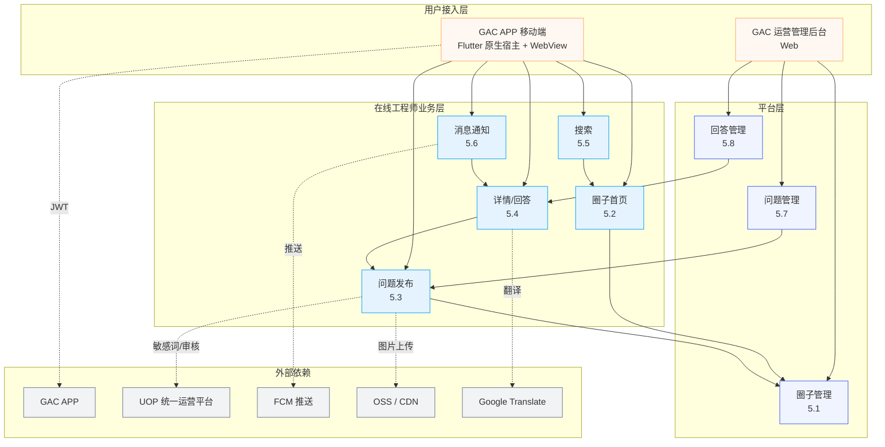

# Engineer Online — 技术方案

> **用途**：承接 `standard/技术架构.md`（项目级技术栈、规范、基础设施），针对本次需求集合（5.1~5.9）落到具体的数据建模、部署拓扑与技术决策。
>
> **文档边界**：
>
> | 视角 | 文档 | 寿命 |
> |------|------|------|
> | 项目级技术栈 / 编码规范 / 跨需求复用 | `standard/技术架构.md` | 长（年） |
> | 当前需求的具体方案（实体字段、部署细节、决策依据） | **本文 + 子文档** | 中（季） |
> | 模块详细需求（BR/EX/AC/API） | `requirement/modules/05.01~05.09` | 短（迭代） |
> | 产品全貌（角色、流程、信息架构） | `requirement/00-需求总览.md` | 中（季） |
>
> **子文档索引**：
>
> | 文档 | 内容 | 权威源 |
> |------|------|--------|
> | [`design/数据模型.md`](数据模型.md) | ER 图 + 字段类型 + 索引 + 状态机 | SSOT |
> | [`design/权限设计.md`](权限设计.md) | Permission Code 完整注册表 + 角色矩阵 | SSOT |
> | [`design/部署设计.md`](部署设计.md) | 物理部署 + 容量规划 + 扩缩容 + 上线 Checklist | SSOT |
> | [`design/UI设计.md`](UI设计.md) | 业务组件规格 + 页面模板 | — |

---

## 1. 平台分层结构（架构图）

---

## 2. 数据实体设计（含字段类型）

> ⚠️ **本节已独立为 [`design/数据模型.md`](数据模型.md)**，包含完整 ER 图、字段详表、索引策略、状态机。
>
> 以下仅保留实体速览供快速参考：

| 实体 | 表名 | 核心字段 | 关联模块 |
|---|---|---|---|
| Group | `t_community_group` | name, type, access_roles, is_enabled | 5.1 |
| GroupTranslation | `t_community_group_translation` | group_id, locale, name | 5.1 |
| Question | `t_community_question` | title, content, review_status, is_hot | 5.2/5.3/5.7 |
| Answer | `t_community_answer` | content, parent_id, is_accepted, sync_to_uop_status | 5.4/5.8 |
| Vote | `t_community_vote` | user_id, answer_id, vote_type | 5.4 |
| Notification | `t_community_notification` | user_id, type, target_id, is_read | 5.6 |
| AuditLog | `t_community_audit_log` | action_type, target_type, target_id | 5.7/5.8 |

> 完整 DDL 见 `.kiro/skills/db-design.md` 调用产物；字段命名规范、索引规范见 `standard/技术架构.md` 第 6 章。

---

## 3. 部署拓扑

> ⚠️ **本节已独立为 [`design/部署设计.md`](部署设计.md)**，包含完整拓扑图、容量规划、扩缩容策略、环境矩阵、上线 Checklist。
>
> 核心要点：
> - 唯一新增微服务：`community-service`（3 Pod，2C 2Gi / 4C 4Gi）
> - 数据层全部复用公司既有中间件（MySQL 主从 / Redis Cluster / RabbitMQ / ES）
> - 发布策略：滚动更新 + 灰度 10%，回滚 < 5 分钟

---

## 4. 关键技术决策

| 决策点 | 选择 | 理由 |
|--------|------|------|
| 移动端架构 | Flutter 原生（5.2/5.3/5.5/5.6）+ H5 WebView（仅 5.4） | 复用 GAC APP 主壳；H5 详情页便于运营快速发布与样式迭代 |
| 后台架构 | Vue 3 + Ant Design Vue | 与 GAC 既有运营管理后台风格统一 |
| 微服务编排 | Spring Cloud + Nacos | 与公司既有体系一致，复用 user / message / file 服务 |
| 分页策略 | 移动端 cursor，后台 page/pageSize | 移动端无限滚动避免数据漂移；后台需要跳页定位 |
| 搜索引擎 | ES 主 + MySQL 降级 | 体验优先，故障兜底 |
| 多语言 | Vue I18n + 圈子内容多语言表 + 翻译 API | UI 文本走 i18n key；UGC 走异步翻译缓存 |
| 推送通道 | FCM | 跨平台，泰国市场可用 |
| 缓存策略 | Cache-Aside（写后删） | 一致性与性能平衡 |

> 上述决策的实现细节（编码规范、组件版本、目录结构）见 `standard/技术架构.md` 第 1.2 节及第 3-7 章。

---

## 5. Permission Code（权限码）

> ⚠️ **本节已独立为 [`design/权限设计.md`](权限设计.md)**，包含完整权限码清单、角色矩阵、实现约定、变更流程。
>
> 速查：
> - 命名规则：`{资源}:{动作}:{范围}`（如 `question:create:any`）
> - 当前共 **19 条** Permission Code
> - 后端注解：`@SaCheckPermission("xxx:yyy:zzz")`
> - 前端指令：`v-permission="['xxx:yyy:zzz']"`
> - `:own` 范围需 Service 层额外校验资源归属
>
> 高频码速查：
>
> | Code | 含义 |
> |---|---|
> | `question:create:any` | 发布问题 |
> | `question:audit:any` | 审核问题 |
> | `answer:create:any` | 回答问题（仅官方号） |
> | `answer:accept:own` | 采纳回答 |
> | `vote:cast:any` | 投票 |
> | `group:manage:any` | 管理圈子 |

---

## 6. 演进预留

随着业务增长，以下技术升级需提前规划但不在本期实现：

- **多机房容灾**：当前单机房，V2 阶段评估 MySQL 双活与 Redis 跨机房复制
- **链路追踪**：ELK + SkyWalking 接入（公司基础设施已具备，按需接入）
- **服务网格**：当前 Istio Ingress，V2 评估全链路 mTLS 与流量镜像
- **AI 推荐**：V2 阶段引入向量数据库支持回答推荐（见 `requirement/00-需求总览.md` 演进路径）

> 项目级演进策略（如多 Region、Service Mesh 全面落地）由公司架构团队主导。
