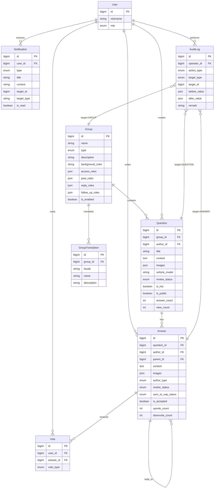

# Engineer Online — 数据模型（ER + 字段类型）

> **用途**：定义本期需求的实体关系与字段类型，驱动数据库建库、代码生成、API 契约对齐。
>
> **关联文档**：
> - 业务字段语义见 `requirement/modules/05.x-xxx.md` §5.x.6 数据对象
> - 字段命名规范、索引规范见 `standard/技术架构.md` §6
> - 完整 DDL 生成由 `.kiro/skills/db-design.md` 驱动

---

## 1. 命名规范

| 对象 | 规范 | 示例 |
|---|---|---|
| 表名 | `t_{业务}_{实体}` 小写蛇形 | `t_community_question` |
| 字段名 | 小写蛇形 | `author_id` / `review_status` |
| 主键 | `id` bigint 自增 | - |
| 外键 | `{ref_table}_id` | `group_id` / `question_id` |
| 时间字段 | `created_at` / `updated_at` / `deleted_at` | `deleted_at` 记录删除时间，`is_deleted` 标记软删除状态 |
| 布尔字段 | `is_{xxx}` | `is_hot` / `is_accepted` |
| 枚举字段 | 使用 VARCHAR + CHECK 约束，禁止 ENUM 类型 | `review_status VARCHAR(20)` |
| JSON 字段 | `access_roles` / `images` | MySQL 5.7+ 原生 JSON |

---

## 2. ER 图（实体关系）



---

## 3. 实体字段详表

### 3.1 Group（圈子）

表名：`t_community_group`

| 字段 | 类型 | 约束 | 说明 |
|---|---|---|---|
| `id` | BIGINT | PK, auto_inc | - |
| `name` | VARCHAR(200) | NOT NULL | 圈子名（默认语言） |
| `type` | VARCHAR(20) | NOT NULL | ENUM: `ENGINEER_ONLINE`（当前版本仅使用此值，其余 `PRODUCT_COMMUNITY` / `MODEL` / `OTHER` 为预留） |
| `description` | VARCHAR(1000) | NULL | 圈子介绍 |
| `background_color` | VARCHAR(16) | NULL | 品牌色 Hex，如 `#FF5500` |
| `cover_url` | VARCHAR(500) | NOT NULL | 封面图 OSS URL（≤3MB）；PRD 中对应 `cover_image`，API 中对应 `coverImage` |
| `access_roles` | JSON | NOT NULL | 访问角色数组，如 `["ALL"]` / `["CAR_OWNER","AUTH_OWNER"]` |
| `post_roles` | JSON | NOT NULL | 发帖角色数组 |
| `reply_roles` | JSON | NOT NULL | 回答角色数组（控制一级回答权限） |
| `follow_up_roles` | JSON | NOT NULL | 追问角色数组 |
| `enabled_features` | JSON | NOT NULL | 启用的功能项：`["reply","image","video","vehicle","mileage"]` |
| `is_enabled` | TINYINT(1) | NOT NULL, default 1 | 启用状态 |
| `sort_order` | INT | NOT NULL, default 0 | 排序 |
| `content_count` | INT | NOT NULL, default 0 | 冗余计数，圈子下问题数 |
| `reply_count` | INT | NOT NULL, default 0 | 冗余计数，圈子下回答数 |
| `is_deleted` | TINYINT(1) | NOT NULL, default 0 | 软删除标记 |
| `deleted_at` | DATETIME | NULL | 删除时间 |
| `created_at` | DATETIME | NOT NULL | - |
| `updated_at` | DATETIME | NOT NULL | - |

**索引**：
- `idx_enabled_sort (is_enabled, sort_order)` — 前台列表查询
- `idx_deleted (is_deleted)` — 软删除过滤

### 3.2 GroupTranslation（圈子多语言）

表名：`t_community_group_translation`

| 字段 | 类型 | 约束 | 说明 |
|---|---|---|---|
| `id` | BIGINT | PK | - |
| `group_id` | BIGINT | NOT NULL, FK | - |
| `locale` | VARCHAR(10) | NOT NULL | `zh_CN` / `en_US` / `th_TH` |
| `name` | VARCHAR(200) | NOT NULL | 本地化名称 |
| `description` | VARCHAR(1000) | NULL | 本地化介绍 |

**索引**：
- `uk_group_locale (group_id, locale)` UNIQUE

### 3.3 Question（问题）

表名：`t_community_question`

| 字段                   | 类型            | 约束                             | 说明                                                                                                                                                                           |
| -------------------- | ------------- | ------------------------------ | ---------------------------------------------------------------------------------------------------------------------------------------------------------------------------- |
| `id`                 | BIGINT        | PK                             | -                                                                                                                                                                            |
| `group_id`           | BIGINT        | NOT NULL, FK                   | -                                                                                                                                                                            |
| `author_id`          | BIGINT        | NOT NULL, FK                   | -                                                                                                                                                                            |
| `title`              | VARCHAR(4000) | NOT NULL                       | 5-4000 字符                                                                                                                                                                    |
| `content`            | TEXT          | NULL                           | ≤10,000 字符（BR-5.3-02）                                                                                                                                                        |
| `media`              | JSON          | NULL                           | 媒体对象数组 `[{"type":"image","url":"...","coverUrl":"..."}, {"type":"video","url":"...","coverUrl":"...","duration":32}]`，图片+视频合计 ≤9 个，保留用户上传顺序；缩略图由客户端生成（450×450px 居中裁剪，质量 75%） |
| `vehicle_model`      | VARCHAR(100)  | NULL                           | 选中的车型                                                                                                                                                                        |
| `mileage`            | INT           | NULL                           | 车辆累计公里数；PRD/API 字段名为 `total_mileage`，前端传带单位字符串（如 "1203km"），后端提取数字存入                                                                                                          |
| `review_status`      | VARCHAR(20)   | NOT NULL                       | ENUM: `PENDING`/`APPROVED`/`REJECTED`                                                                                                                                        |
| `is_hot`             | TINYINT(1)    | NOT NULL, default 0            | 热门标记                                                                                                                                                                         |
| `is_public`          | TINYINT(1)    | NOT NULL, default 0            | 公开标记，管理员控制前台可见性                                                                                                                                                              |
| `sync_to_uop_status` | VARCHAR(20)   | NOT NULL, default `NOT_SYNCED` | ENUM: `NOT_SYNCED`/`SYNCED`/`SYNC_FAILED`/`UPDATE_FAILED`                                                                                                                    |
| `answer_count`       | INT           | NOT NULL, default 0            | 冗余计数                                                                                                                                                                         |
| `view_count`         | INT           | NOT NULL, default 0            | 冗余计数                                                                                                                                                                         |
| `is_deleted`         | TINYINT(1)    | NOT NULL, default 0            | 软删除标记                                                                                                                                                                        |
| `deleted_at`         | DATETIME      | NULL                           | 删除时间                                                                                                                                                                         |
| `created_at`         | DATETIME      | NOT NULL                       | -                                                                                                                                                                            |
| `updated_at`         | DATETIME      | NOT NULL                       | -                                                                                                                                                                            |

**索引**：
- `idx_group_status_created (group_id, review_status, created_at)` — 圈子首页列表
- `idx_author_created (author_id, created_at)` — 我的问题
- `idx_hot_created (is_hot, created_at)` — 热门列表
- `idx_is_public (is_public, review_status)` — 后台筛选
- `idx_deleted (is_deleted)` — 软删除过滤

### 3.4 Answer（回答 + 回复，统一表）

表名：`t_community_answer`

| 字段                   | 类型          | 约束                             | 说明                                                                                                                         |
| -------------------- | ----------- | ------------------------------ | -------------------------------------------------------------------------------------------------------------------------- |
| `id`                 | BIGINT      | PK                             | -                                                                                                                          |
| `question_id`        | BIGINT      | NOT NULL, FK                   | -                                                                                                                          |
| `author_id`          | BIGINT      | NOT NULL, FK                   | -                                                                                                                          |
| `parent_id`          | BIGINT      | NULL, FK                       | NULL=顶层回答；非空=嵌套回复，仅支持一层（BR-5.4-13）                                                                                         |
| `content`            | TEXT        | NOT NULL                       | -                                                                                                                          |
| `media`              | JSON        | NULL                           | 媒体对象数组 `[{"type":"image","url":"..."}, {"type":"video","url":"...","coverUrl":"...","duration":32}]`，图片+视频合计 ≤9 个，保留用户上传顺序 |
| `author_type`        | VARCHAR(20) | NOT NULL                       | ENUM: `REGULAR_USER`/`OFFICIAL_ENGINEER`/`OFFICIAL_PM`                                                                     |
| `review_status`      | VARCHAR(20) | NOT NULL                       | ENUM: `PENDING`/`APPROVED`/`REJECTED`                                                                                      |
| `sync_to_uop_status` | VARCHAR(20) | NOT NULL, default `NOT_SYNCED` | ENUM: `NOT_SYNCED`/`SYNCED`/`SYNC_FAILED`/`UPDATE_FAILED`                                                                  |
| `is_accepted`        | TINYINT(1)  | NOT NULL, default 0            | 采纳标记                                                                                                                       |
| `upvote_count`       | INT         | NOT NULL, default 0            | 冗余计数                                                                                                                       |
| `downvote_count`     | INT         | NOT NULL, default 0            | 冗余计数                                                                                                                       |
| `is_deleted`         | TINYINT(1)  | NOT NULL, default 0            | 软删除标记                                                                                                                      |
| `deleted_at`         | DATETIME    | NULL                           | 删除时间                                                                                                                       |
| `created_at`         | DATETIME    | NOT NULL                       | -                                                                                                                          |
| `updated_at`         | DATETIME    | NOT NULL                       | -                                                                                                                          |

**索引**：
- `idx_question_accepted_created (question_id, is_accepted, created_at)` — 详情页列表（已采纳优先）
- `idx_parent_created (parent_id, created_at)` — 嵌套回复
- `idx_author_created (author_id, created_at)` — 作者维度
- `idx_review_status (review_status, created_at)` — 审核队列
- `idx_deleted (is_deleted)` — 软删除过滤

### 3.5 Vote（投票）

表名：`t_community_vote`

| 字段 | 类型 | 约束 | 说明 |
|---|---|---|---|
| `id` | BIGINT | PK | - |
| `user_id` | BIGINT | NOT NULL, FK | - |
| `answer_id` | BIGINT | NOT NULL, FK | - |
| `vote_type` | VARCHAR(10) | NOT NULL | ENUM: `UPVOTE`/`DOWNVOTE`；同一用户对同一回答仅一条，切换则更新 |
| `created_at` | DATETIME | NOT NULL | - |
| `updated_at` | DATETIME | NOT NULL | - |

**索引**：
- `uk_user_answer (user_id, answer_id)` UNIQUE — 唯一约束（BR-5.4-04）

### 3.6 Notification（通知）

表名：`t_community_notification`

| 字段 | 类型 | 约束 | 说明 |
|---|---|---|---|
| `id` | BIGINT | PK | - |
| `user_id` | BIGINT | NOT NULL, FK | 接收者 |
| `type` | VARCHAR(20) | NOT NULL | ENUM: `SYSTEM_MESSAGE`（v1.4.0 起统一） |
| `title` | VARCHAR(200) | NOT NULL | - |
| `content` | TEXT | NOT NULL | 含占位符，由模板渲染 |
| `target_id` | BIGINT | NULL | 跳转目标 ID |
| `target_type` | VARCHAR(20) | NULL | ENUM: `QUESTION`/`ANSWER` |
| `is_read` | TINYINT(1) | NOT NULL, default 0 | - |
| `created_at` | DATETIME | NOT NULL | - |

**索引**：
- `idx_user_read_created (user_id, is_read, created_at)` — 未读列表（cursor 分页）

### 3.7 AuditLog（操作审计）

表名：`t_community_audit_log`

| 字段 | 类型 | 约束 | 说明 |
|---|---|---|---|
| `id` | BIGINT | PK | - |
| `operator_id` | BIGINT | NOT NULL | - |
| `action_type` | VARCHAR(40) | NOT NULL | ENUM: `APPROVE`/`REJECT`/`DELETE`/`HOT`/`UNHOT`/`SET_PUBLIC`/`SET_UNPUBLIC`/`PUSH_UOP`/`SET_OFFICIAL`/... |
| `target_type` | VARCHAR(20) | NOT NULL | ENUM: `QUESTION`/`ANSWER`/`GROUP`/`USER` |
| `target_id` | BIGINT | NOT NULL | - |
| `before_value` | JSON | NULL | 变更前快照 |
| `after_value` | JSON | NULL | 变更后快照 |
| `remark` | VARCHAR(500) | NULL | 备注 |
| `created_at` | DATETIME | NOT NULL | - |

**索引**：
- `idx_target (target_type, target_id)` — 按目标追溯
- `idx_operator_created (operator_id, created_at)` — 操作人维度

---

## 4. 状态机

### 4.1 Question.review_status

```
         create
           ↓
       PENDING ──approve──→ APPROVED
           │                    │
         reject               delete
           ↓                    ↓
       REJECTED             DELETED
                                ↑
                          Rejected 30 天清理
```

### 4.2 Answer 双状态机

**审核状态机 `review_status`**：同 Question。

**UOP 同步状态机 `sync_to_uop_status`**：

```
NOT_SYNCED ──push──→ SYNCED
      │                  │
   error             update
      ↓                ↓
SYNC_FAILED        UPDATE_FAILED
      │                  │
   resync            resync
      └──────→ 成功 ────┘
```

**组合矩阵**：

| review_status | sync_to_uop_status | 业务含义 |
|---|---|---|
| APPROVED | NOT_SYNCED | 审核通过但未推送 |
| APPROVED | SYNCED | 审核通过且已同步到 UOP |
| APPROVED | SYNC_FAILED | 首次推送失败（可重试） |
| APPROVED | UPDATE_FAILED | 状态变更后更新推送失败（可重试） |
| REJECTED | NOT_SYNCED | 驳回的内容不应推送 |

---

## 5. 建库与字段约束备注

- **字符集**：`utf8mb4` / `utf8mb4_0900_ai_ci`（支持 emoji 与泰语完全组合）
- **时间字段**：统一 `DATETIME` 而非 `TIMESTAMP`，避免 2038 问题与时区转换
- **软删除**：需支持软删除的实体使用 `is_deleted`（TINYINT, 默认 0）标记状态 + `deleted_at`（DATETIME）记录删除时间。MyBatis Plus 逻辑删除字段配置为 `is_deleted`；`deleted_at` 由应用层在删除时写入，用于审计追溯。
- **审计字段**：`created_at` 必填，`updated_at` 由数据库 `ON UPDATE CURRENT_TIMESTAMP` 触发
- **JSON 字段**：统一使用 MySQL 原生 JSON 类型，避免 TEXT + JSON_EXTRACT 性能损失

---

## 6. 变更流程

新增/修改实体字段必须：

1. 更新本表对应实体章节
2. 更新 ER 图
3. 同步 `requirement/00-需求总览.md` 核心实体总览
4. 同步对应模块 PRD 的 §5.x.6 数据对象
5. 生成 DB migration 脚本（`db/migration/Vxxx__yyy.sql`）
6. 更新 `CHANGELOG.md`

---

## 7. 演进预留

- **分表策略**：`t_community_question` 预计 1 年内单表 500 万行以下，暂不分表；超过阈值后按 `group_id` hash 分 16 片
- **归档策略**：`t_community_audit_log` 保留 1 年，超期移至归档库
- **冗余计数一致性**：`answer_count` / `upvote_count` 等冗余字段通过 RabbitMQ 事件异步维护，每日对账任务校正偏差
