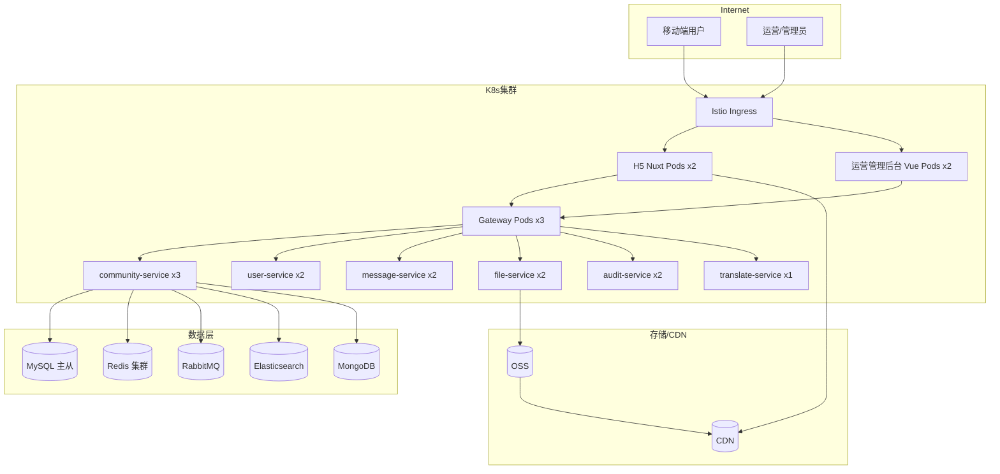

# Engineer Online — 部署拓扑

> **用途**：定义本期需求的物理部署视图（Pod 实例数、中间件分布、流量走向）。
>
> **文档边界**：
> - **本文**：当前需求的容量规划、实例配置、扩缩容策略
> - `standard/技术架构.md` §1.1：项目级逻辑架构（组件依赖、调用关系）
> - `standard/技术架构.md` §2：微服务编排、CI/CD、本地环境

---

## 1. 部署拓扑图



---

## 2. 组件清单与容量规划

### 2.1 应用层（Kubernetes Pods）

| 组件 | 实例数 | 规格（req / limit） | 用途 | 新增/复用 |
|---|---|---|---|---|
| **Istio Ingress** | 3 | 0.5C 1Gi / 1C 2Gi | 公司既有入口网关 | 复用 |
| **H5 Nuxt**（5.4 问题详情） | 2 | 0.5C 512Mi / 1C 1Gi | SSR 渲染 | 新建 |
| **运营管理后台 Vue** | 2 | 0.2C 256Mi / 0.5C 512Mi | 静态资源 + nginx | 新建 |
| **Gateway**（Spring Cloud Gateway） | 3 | 1C 1Gi / 2C 2Gi | 路由/鉴权/限流 | 复用 |
| **community-service** ⭐ | 3 | 2C 2Gi / 4C 4Gi | 本次需求核心服务（问题/回答/圈子/投票） | **新建** |
| **user-service** | 2 | 1C 1Gi / 2C 2Gi | 用户/角色/认证 | 复用 |
| **message-service** | 2 | 1C 1Gi / 2C 2Gi | 站内信/推送触发 | 复用 |
| **file-service** | 2 | 1C 1Gi / 2C 2Gi | OSS 鉴权直传 token 分发 | 复用 |
| **audit-service** | 2 | 1C 1Gi / 2C 2Gi | UOP 审核对接 | 复用（需新增 endpoint） |
| **translate-service** | 1 | 0.5C 512Mi / 1C 1Gi | Google Translate 代理 + 缓存 | 复用 |

⭐ **community-service** 是本期唯一新增的业务微服务。

### 2.2 数据层

| 中间件 | 部署形态 | 容量规划 | 用途 | 新增/复用 |
|---|---|---|---|---|
| **MySQL 8.0** | 1 主 2 从 | 8C 32Gi / 1TB SSD | 主业务库 | 复用（新增 `community` schema） |
| **Redis 7** | 3 主 3 从 Cluster | 共 24Gi | 缓存 + 计数器 + 分布式锁 | 复用 |
| **RabbitMQ** | 3 节点镜像队列 | 4C 8Gi | 异步事件（审核/通知/索引） | 复用 |
| **Elasticsearch 8** | 3 节点 | 4C 16Gi / 500Gi SSD | 搜索索引（5.5） | 复用 |
| **MongoDB**（可选） | 1 主 2 从 | 4C 8Gi | AuditLog 大数据量备份 | 复用 |

### 2.3 存储与分发

| 组件 | 规格 | 用途 |
|---|---|---|
| **OSS** | 按量付费 | 图片/视频存储；前端直传 |
| **CDN** | 按量付费 | OSS 资源加速；H5 静态资源加速 |

---

## 3. 流量路径

### 3.1 移动端请求

```
GAC APP（Flutter）
  │
  ├─ 原生页面（5.2/5.3/5.5/5.6） ─→ Ingress ─→ Gateway ─→ community-service
  │
  └─ WebView（5.4 问题详情）
        │
        ├─ 页面 HTML ─→ Ingress ─→ H5 Nuxt Pod（SSR）
        └─ 数据 API  ─→ Ingress ─→ Gateway ─→ community-service
```

### 3.2 管理后台请求

```
浏览器 ─→ Ingress ─→ 运营管理后台 Pod（静态资源）
                │
                └─ API 请求 ─→ Gateway ─→ community-service / user-service / audit-service
```

### 3.3 异步事件流

```
community-service
  │
  ├─ 提交审核事件 ─→ RabbitMQ ─→ audit-service ─→ UOP API
  │
  ├─ 审核回调事件 ─→ RabbitMQ ─→ community-service（更新状态）
  │                              └─→ message-service ─→ FCM ─→ 移动端
  │
  ├─ 索引变更事件 ─→ RabbitMQ ─→ ES 索引 worker
  │
  └─ 翻译请求 ─→ translate-service ─→ Redis 缓存 ─→ Google Translate API
```

---

## 4. 环境矩阵

| 环境 | 用途 | K8s Namespace | 域名 | 数据 |
|---|---|---|---|---|
| **dev** | 开发联调 | `engineer-online-dev` | `dev.engineer-online.internal` | 独立库，可随意清空 |
| **test** | QA 测试 | `engineer-online-test` | `test.engineer-online.internal` | 独立库，每周刷数据 |
| **staging** | 预发布 | `engineer-online-staging` | `staging.engineer-online.internal` | 生产数据脱敏副本 |
| **prod** | 生产 | `engineer-online-prod` | API 走 GAC APP 现有域名 | 生产库 |

---

## 5. 扩缩容策略

### 5.1 HPA（Horizontal Pod Autoscaler）

| 组件 | 最小实例 | 最大实例 | 触发指标 | 阈值 |
|---|---|---|---|---|
| community-service | 3 | 12 | CPU | 70% |
| H5 Nuxt | 2 | 8 | CPU | 65% |
| Gateway | 3 | 10 | CPU | 70% |

### 5.2 数据层扩容

- **MySQL**：单表超 500 万行后按 `group_id` hash 分 16 片
- **Redis**：按槽位容量监控，单槽 > 60% 时增加分片
- **ES**：索引单节点数据 > 300Gi 时增加节点

---

## 6. 发布策略

| 组件 | 发布方式 | 回滚时间 |
|---|---|---|
| community-service | 滚动更新 + 灰度 10% | < 5 分钟 |
| H5 Nuxt | 蓝绿发布（CDN 切换） | < 2 分钟 |
| 运营管理后台 | 滚动更新 | < 3 分钟 |
| Gateway | 滚动更新 + 一次一实例 | < 5 分钟 |
| DB migration | Liquibase 前置执行，支持 rollback | < 30 分钟 |

**关键原则**：DB migration 必须向前兼容（先改 schema，再改代码；老代码能兼容新 schema）。

---

## 7. 可观测性

| 类型 | 工具 | 覆盖范围 |
|---|---|---|
| **日志** | ELK（Filebeat → Logstash → ES → Kibana） | 所有 Pod 日志 |
| **指标** | Prometheus + Grafana | JVM、QPS、RT、错误率 |
| **链路追踪** | SkyWalking | 跨服务调用链 |
| **告警** | Alertmanager → 企业微信 | P95 > 500ms 持续 2 分钟报警 |
| **业务监控** | 自建 Dashboard | 审核通过率、UOP 同步成功率、推送到达率 |

---

## 8. 安全边界

| 层 | 策略 |
|---|---|
| **入口** | Istio Ingress + WAF（SQL 注入/XSS 过滤） |
| **认证** | Gateway 统一校验 JWT |
| **鉴权** | community-service 内 `@SaCheckPermission`（见 `design/权限设计.md`） |
| **传输** | 全链路 HTTPS（Ingress TLS 终止） |
| **数据** | 数据库账号最小权限；敏感字段脱敏后写日志 |
| **密钥** | 统一走 K8s Secret + Vault，禁止代码硬编码 |

---

## 9. 容灾与备份

| 资源 | 备份策略 | RTO | RPO |
|---|---|---|---|
| MySQL 业务数据 | 每日全量 + binlog | 1 小时 | 5 分钟 |
| Redis 缓存 | 不备份（可重建） | - | - |
| ES 索引 | 每周全量快照 | 4 小时 | 1 天 |
| OSS 文件 | 跨区域同步 | 立即 | 0 |
| 配置中心 | Git 版本化 | 即时 | 0 |

**演进预留**：V2 阶段评估多机房容灾（MySQL 双活 + Redis 跨机房复制）。

---

## 10. 上线 Checklist

关联任务 `OPS-04`（见 `tasks/任务清单.md`）：

- [ ] 数据库 migration 脚本在 staging 演练
- [ ] Redis / ES / MQ 容量充足（剩余 > 30%）
- [ ] 新增 Permission Code 的 JWT 已刷入所有环境
- [ ] UOP 审核对接的白名单 IP 已申请
- [ ] FCM 推送证书在生产环境可用
- [ ] OSS Bucket 权限策略与跨域配置生效
- [ ] 回滚方案文档完备，回滚时间 < 30 分钟
- [ ] 监控告警规则接入企业微信
- [ ] 压测报告达标（P95 < 300ms @ 1000 QPS）
