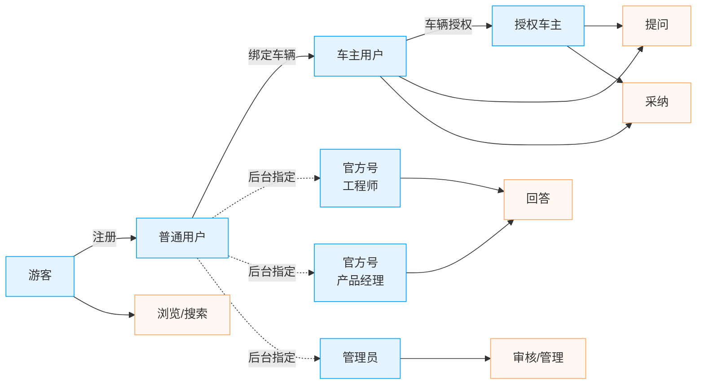
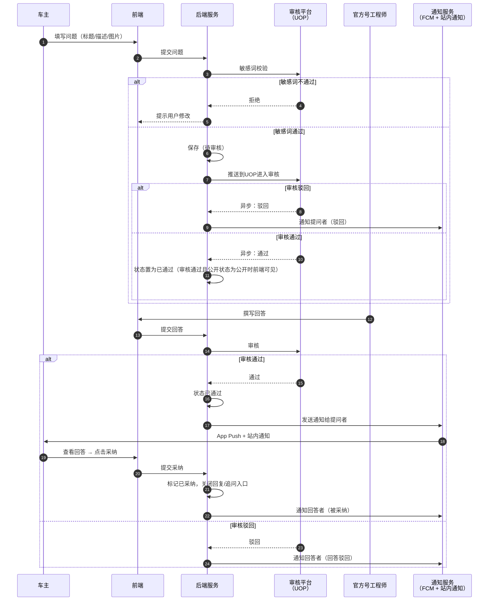
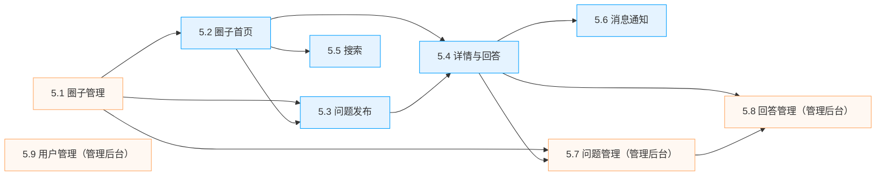

# Engineer Online（在线工程师）产品需求文档 — 总览

> 本文件为 PRD 总览文档，包含产品概述（第 1-4 部分）和全局约束（第 6-7 部分）。各功能模块的详细需求见独立文档。

---

## 1. 产品概述

| 字段 | 内容 |
|------|------|
| 产品名称 | Engineer Online（在线工程师） |
| 版本号 | V1.0 |
| 文档版本 | 1.4.0 |
| 最后更新日期 | 2026-05-11 |
| 作者 | Billy |
| 审核人 | |
| 文档状态 | reviewing |

**产品定位**：嵌入 GAC APP 内的汽车问答社区模块，车主遇到用车问题时可向经过品牌认证的在线工程师提问，获取专业解答。

> **单一真相源说明**：
> - 本文负责产品边界、角色权限、业务流程、全局规则
> - `design/权限设计.md` 负责 Permission Code；`design/数据模型.md` 负责字段类型 ER；`design/部署设计.md` 负责部署细节
> - `requirement/多语言文本.md` 负责 UI 文案与 i18n key

**目标用户**：

| 用户群体  | 特征                       |
| ----- | ------------------------ |
| 车主用户  | GAC 车主，遇到用车、保养、故障等问题     |
| 授权车主  | 经过车辆授权验证的车主              |
| 官方工程师 | GAC 认证的技术工程师、产品经理，提供专业解答 |
| 后台管理员 | 运营人员，负责内容审核、圈子管理         |

**核心问题**：

1. 车主遇到用车问题（故障灯、异响等）时缺乏专业可信的解答渠道
2. 车企需要一个直接触达用户、收集产品反馈的社区平台
3. 工程师的专业知识需要结构化沉淀，形成可搜索的知识库

**产品目标**：

- 为车主提供专业、可信的在线问答服务
- 建立品牌与用户之间的直接沟通渠道
- 积累结构化的汽车问题知识库

### 1.1 范围与边界

| 类别                  | 内容                                                                              |
| ------------------- | ------------------------------------------------------------------------------- |
| 本版本范围（In Scope）     | 圈子管理系统（平台层）、圈子首页与发布、问题详情、搜索、消息通知、内容管理后台（问题管理、回答管理、圈子管理、用户管理）                      |
| 不在范围内（Out of Scope） | 用户注册登录（已开发完成）、个人中心（已开发完成）、文章模块、活动模块、试驾模块、订单模块、车联网模块                             |
| 未来版本规划（Future）      | 未来将逐步完善社区功能，如拓展圈子类型如产品论坛、车型圈子等，增加内容类型如文章、问答、动态，新增社区首页、圈子列表、互动消息、个人主页、收藏、关注等社区功能 |

### 1.2 假设与约束

**假设**：
- 用户已安装 GAC APP 并完成注册登录
- 车主用户已绑定车辆（可获取车型、VIN、里程信息）
- 官方工程师账号由UOP管理后台创建后同步到GAC App创建App官方号账号

**约束**：
- 作为 GAC APP 的子模块，需遵循 App 的整体 UI 规范和技术架构
- 需支持多语言（中文、英文、泰文等语言）
- 内容需经过审核后才可展示（合规要求）
- 当前部署市场：泰国（Thailand）

### 1.3 外部依赖与集成

| 外部系统      | 集成方式   | 用途           | 说明                                               |
| --------- | ------ | ------------ | ------------------------------------------------ |
| UOP/SSA   | API 对接 | 用户运营平台(外部系统) | 问题/回答/采纳/删除状态同步；敏感词校验接口                          |
| 推送服务（FCM） | 内部服务   | App Push 通道  | 官方号回答审核通过后通知提问者                                  |
| 内容审核平台    | UOP 对接 | AI + 人工内容审核  | App 端仅对接敏感词校验接口；审核流程由平台处理（高风险自动删除、中风险人工审核、低风险通过） |
| 翻译服务      | API    | 内容翻译         | Translate 功能                                     |

### 1.4 术语表

| 术语    | 英文              | 定义                                                | 备注                              |
| ----- | --------------- | ------------------------------------------------- | ------------------------------- |
| 圈子    | Group           | 社区的基本组织单元，每个圈子有独立的配置、权限和内容                        | "在线工程师"是一个圈子实例                  |
| 问题    | Question        | 用户发起的提问帖子，可包含标题、描述、图片、车型信息                        | 区别于文章（Article）和动态（Post）         |
| 回答    | Answer          | 针对问题的回复                                           | 支持图片、视频，可被采纳                    |
| 采纳    | Accept          | 提问者将某个回答标记为最佳答案                                   | 每个问题仅可采纳 1 条回答                     |
| 官方号   | OfficialAccount | 经品牌认证的工程师或产品经理账号                                  | 有 V 认证标识和品牌标签                   |
| 普通用户  | RegularUser     | 已注册但非官方认证的用户（含车主）                                 | -                               |
| 车主用户  | CarOwner        | 已绑定车辆的用户                                          | 可获取车型和里程信息                      |
| 授权车主  | AuthorizedOwner | 经过验证的车辆所有者                                        |                                 |
| 审核    | Review          | 用户提问/回答的内容审核状态，可由UOP回传内容审核状态，在App运营管理后台也可以对内容进行审核 | 状态：待审核/通过/驳回                    |
| 推送UOP | UOP Sync        | 用户提问/追问成功提交后，将数据同步到 UOP 系统                        | 状态：未推送/已推送/推送失败                 |
| 热门    | Hot             | 在App运营管理后台可以对提问设置为热门或取消热门                         | 设置为热门的提问才会出现在圈子的热门列表            |
| 翻译    | Translate       | 将内容翻译为用户当前语言                                      | 多语言市场需求                         |
| 追问    | FollowUp        | 用户对工程师回答及其二级回答发起的后续回复                             | 最多两级（回答 → 回复 → 回复的回复）；采纳后关闭追问入口 |
| UOP   | UOP             | 统一运营平台，问题/回答/状态的同步目标系统                            | 外部系统                            |
| SSA   | SSA             | UOP 体系内的服务支撑应用                                    | 外部系统                            |
| FCM   | FCM             | Firebase Cloud Messaging，App Push 通道              | 见 技术架构.md 8.1                   |
| 敏感词校验 | ContentFilter   | 提交时调用 UOP 接口进行内容安全检测                              | 不通过则拒绝提交                        |

**命名规范**：
- 实体/类名：PascalCase（如 `Question`、`OfficialAccount`）
- 字段/属性名：snake_case（如 `created_at`、`vote_score`）
- 枚举/常量值：UPPER_SNAKE_CASE（如 `PUBLISHED`、`REVIEW_APPROVED`）
- URL 路径：kebab-case（如 `/engineer-online`）

---

### 1.5 角色定义与权限

### 1.5.1 角色定义

| 角色        | 说明          | 获取方式              |
| --------- | ----------- | ----------------- |
| 游客        | 未登录用户       | 默认                |
| 普通用户      | 已注册登录但未绑定车辆 | 注册                |
| 车主用户      | 已绑定车辆的用户    | 绑定车辆              |
| 授权车主      | 经过验证的车辆所有者  | 车主用户授权车辆          |
| 官方号（工程师）  | GAC认证的技术工程师 | 后台指定，GAC标识+ 官方号名称 |
| 官方号（产品经理） | GAC认证的产品经理  | 后台指定，GAC标识+ 官方号名称 |
| 后台管理员     | 系统管理员       | 后台指定              |

### 1.5.2 权限矩阵

权限受圈子配置控制，以下为"在线工程师"圈子的默认配置：

| 操作            | 所有用户（含游客） | 注册用户 | 车主用户 | 授权车主 | 官方号 | 作者  |
| ------------- | --------- | ---- | ---- | ---- | --- | --- |
| 访问权限（圈子/问题详情） | ✓         | ✓    | ✓    | ✓    | ✓   |     |
| 发布问题          | ✗         | ✗    | ✓    | ✓    | ✓   |     |
| 回答问题          | ✗         | ✗    | ✗    | ✗    | ✓   |     |
| 追问（对回答进行回复）   | ✗         | ✗    | ✓    | ✓    | ✓   | ✓   |
| 采纳回答（无需配置）    |           |      |      |      |     | ✓   |
| 删除问题（无需配置）    |           |      |      |      |     | ✓   |
| 投票权限（无需配置）    |           | ✓    | ✓    | ✓    | ✓   | ✓   |

### 1.5.3 角色规则
- RR-01: 圈子配置中的"访问权限""发表权限""回复权限"可覆盖上述默认权限矩阵
- RR-02: 官方号的品牌标签（如 GAC）和职位（如 Engineer / Product Manager）由管理员在后台设置
- RR-03: 同一用户在不同圈子可以有不同的权限（由圈子配置决定）
- RR-04: 官方号子类型 `OFFICIAL_ENGINEER` 与 `OFFICIAL_PM` 权限等价，区分仅用于 UI 职位展示
- RR-05: 用户可以同时有多个角色，只要匹配到圈子配置的基中一个角色，即代表用户有该权限
- RR-06: 在线工程师圈子中，车主用户与授权车主的默认权限一致；不同圈子可通过配置项分别控制两者权限

### 1.5.4 权限场景



### 1.6 竞品参考

| 竞品             | 参考点                    | 我们的差异            |
| -------------- | ---------------------- | ---------------- |
| Reddit         | 海外范内容社区，社区架构、界面交互习惯可参考 | 汽车官方问答社区，工程师认证回答 |
| Stack Overflow | 采纳机制、投票排序              | 汽车垂直领域，移动端优先     |
| 蔚来社区           | 品牌社区运营                 | 聚焦技术问答而非生活分享     |

### 1.7 版本变更记录

| 版本 | 日期 | 修改人 | 变更内容 |
|------|------|--------|----------|
| 1.0.0 | 2026-04-25 | Billy | 初始版本 |
| 1.1.0 | 2026-04-26 | Billy | 关闭 OQ-01~06,08,09；新增 SIA/广播组/技术主管/SSA/FCM 术语；新增 Permission Code 列表；新增模块依赖图；明确文件名编号规范；明确图片/视频大小限制 |
| 1.2.0 | 2026-04-26 | Billy | App 名称统一为 GAC APP；明确 Flutter 原生（5.2/5.3/5.5/5.6）+ H5 WebView（5.4）拆分；信息架构加 🧩/🌐 标识；模块索引加"实现技术"列 |
| 1.3.0 | 2026-04-27 | Billy | 实体英文 Circle → Group（含 API/表/字段/Permission Code/任务编号）；管理后台 CMS → 运营管理后台；prd/assets → assets/prototype；prd/角色提示词 → prompt（根目录） |
| 1.3.1 | 2026-04-28 | Billy | 修正版本号一致性；增加核心实体总览、追问权限、埋点事件；优化时序图异常分支、性能基准、状态机描述；修正内部引用路径；补充 cursor 分页说明；删除 UOP 侧术语 |
| 1.4.0 | 2026-04-29 | Billy | 删除置顶/精华功能，替换为热门；推送状态统一改为 UOP 同步状态；消息通知类型统一为系统消息；删除广播组/技术主管/SIA 等 UOP 侧概念；修正通知模板语法（have→has）；合并并发审核异常；修复批量操作失败响应格式 |

---

## 2. 功能结构

> 📌 **权威源**：[`requirement/功能结构.md`](功能结构.md)
>
> 本节不再重复功能结构树。请直接查阅 `requirement/功能结构.md` 获取完整的功能点清单。
>
> **模块概览**：
>
> | 层级 | 模块 | 说明 |
> |---|---|---|
> | 平台层 | 5.1 圈子管理 | 圈子配置、权限、多语言 |
> | 平台层 | 5.7 问题管理 | 审核、公开/隐藏、热门 |
> | 平台层 | 5.8 回答管理 | 审核、UOP 同步 |
> | 平台层 | 5.9 用户管理 | 用户列表、官方号设置 |
> | 业务层 | 5.2 圈子首页 | 问题列表、Tab 切换、统计 |
> | 业务层 | 5.3 问题发布 | 提问、图片/视频上传 |
> | 业务层 | 5.4 问题详情 | 回答、回复、投票、采纳、翻译 |
> | 业务层 | 5.5 搜索 | 关键词搜索、ES |
> | 业务层 | 5.6 消息通知 | 系统通知、未读标记 |

### 2.3 核心实体总览

| 实体 | 英文 | 所属模块 | 关键状态 |
|------|------|----------|----------|
| Group（圈子） | Group | 5.1 | `ENABLED` / `DISABLED` / `DELETED` |
| Question（问题） | Question | 5.2 / 5.3 / 5.7 | `PENDING` / `APPROVED` / `REJECTED` / `DELETED` |
| Answer（回答） | Answer | 5.4 / 5.8 | `PENDING` / `APPROVED` / `REJECTED` / `DELETED` |
| Reply（回复） | Reply | 5.4 | `PENDING` / `APPROVED` / `REJECTED` / `DELETED` |
| OfficialAccount（官方号） | OfficialAccount | 5.1 / 5.4 | `ACTIVE` / `INACTIVE` |
| Notification（通知） | Notification | 5.6 | `UNREAD` / `READ` |
| AuditLog（操作日志） | AuditLog | 5.7 / 5.8 | — |

> 实体详细字段定义见各 `05.x` 模块文档及 `design/数据模型.md`。

---

## 3. 信息架构

### 3.1 移动端（GAC APP ）

> **承载方式**：GAC APP 是 Flutter 原生宿主。下方树状结构中，🧩 表示 Flutter 原生页面，🌐 表示 H5 WebView 容器内嵌的页面。

```
在线工程师（Engineer Online）
├── 🧩 首页（5.2 Flutter 原生）
│   ├── 品牌区（Logo + 简介 + Learn more）
│   ├── 数据统计（累计问题 / 累计回复 / 今日发帖）
│   ├── Tab 切换（Hot / Newest / My Question）
│   └── 问题列表（问题卡片 + 回答预览）
├── 🧩 提问页（5.3 Flutter 原生）
│   ├── 标题输入
│   ├── 描述输入（Optional）
│   ├── 图片上传
│   ├── 车型选择
│   └── 总里程
├── 🌐 问题详情页（5.4 H5 WebView，Vue 3 + Vant）
│   ├── 问题内容区（作者 / 标题 / 正文 / 媒体 / 车型 / 时间）
│   ├── 操作区（翻译 / 删除）
│   └── 回答列表区
│       ├── 回答卡片（工程师信息 / 内容 / Accept 按钮）
│       └── 嵌套回复
├── 🧩 搜索页（5.5 Flutter 原生）
│   ├── 搜索输入框
│   └── 搜索结果列表
└── 🧩 消息页（5.6 Flutter 原生）
    └── 系统消息列表（工程师回复 / 审核结果 / 采纳通知）
```

> **跨页跳转**：从 Flutter 列表页（5.2/5.5）点击问题卡片时，由 Flutter 路由打开 H5 WebView 容器（5.4）；详情页内的"返回"由 H5 通知 Flutter 回退至原生栈。详见 `技术架构.md` 第 8 章。

### 3.2 后台管理（运营管理后台）

```
GAC 运营管理后台（已有系统）
└── Content（内容管理）
    ├── Questions（问题管理）
    │   ├── 问题列表（筛选 / 审核 / 热门 / 隐藏）
    │   └── 问题详情（编辑 / 查看回复）
    ├── Answers（回答管理）
    │   ├── 回答列表（筛选 / 审核 / UOP 同步管理）
    │   └── 批量操作（审核 / 删除）
    └── 圈子管理
        ├── 圈子列表（创建 / 编辑 / 删除）
        └── 圈子配置（类型 / 权限 / 功能开关）
```

> 注：回答管理在后台作为独立页面，与问题管理平行管理。详见 `05.08-回答管理（管理后台）.md`。

### 3.3 全局导航（移动端）

| 位置 | 元素 | 说明 |
|------|------|------|
| 顶部导航栏 | 返回按钮（左）、搜索图标（右） | 首页固定 |
| 品牌区域 | Logo + "Engineer Online" + 简介 | 仅首页显示 |
| 底部 | "Ask a Question" 按钮（黑色固定） | 仅首页显示 |

---

## 4. 核心业务流程：提问 → 审核 → 回答 → 采纳



> 服务级编排（具体微服务名、MQ 事件、缓存 key）见 `技术架构.md` 第 1.1 节。

---

## 5. 功能模块索引

| 文档                                                 | 功能模块             | 优先级 | 层级     | 实现技术           |
| -------------------------------------------------- | ---------------- | --- | ------ | -------------- |
| [05.01-圈子管理(管理后台).md](modules/05.01-圈子管理(管理后台).md) | 圈子管理与配置          | P0  | 平台层    | 运营管理后台         |
| [05.02-圈子首页.md](modules/05.02-圈子首页.md)             | 圈子首页问题列表         | P0  | 在线工程师层 | Flutter 原生     |
| [05.03-问题发布.md](modules/05.03-问题发布.md)             | 提问功能             | P0  | 在线工程师层 | Flutter 原生     |
| [05.04-问题详情.md](modules/05.04-问题详情.md)             | 问题详情、回答、回复、投票、采纳 | P0  | 在线工程师层 | **H5 WebView** |
| [05.05-搜索.md](modules/05.05-搜索.md)                 | 关键词搜索            | P1  | 在线工程师层 | Flutter 原生     |
| [05.06-消息通知.md](modules/05.06-消息通知.md)             | 消息中心             | P1  | 在线工程师层 | Flutter 原生     |
| [05.07-问题管理（管理后台）.md](modules/05.07-问题管理（管理后台）.md) | 问题管理（后台）         | P0  | 平台层    | 运营管理后台         |
| [05.08-回答管理（管理后台）.md](modules/05.08-回答管理（管理后台）.md) | 回答管理（后台）         | P0  | 平台层    | 运营管理后台         |
| [05.09-用户管理（管理后台）.md](modules/05.09-用户管理（管理后台）.md) | 用户管理（后台）         | P0  | 平台层    | 运营管理后台         |

### 5.1 模块依赖关系



> **图例**：橙色为平台层（基础设施），蓝色为在线工程师业务层。改动上游模块时，下游模块需联动评审。

> **注**：文件名前导 0 仅用于排序（`05.01-圈子管理(管理后台).md`），文档内部及交叉引用均使用 `5.1`、`BR-5.1-01`、`AC-5.1-01` 形式（不带前导 0）。

---

## 6. 全局规则

### 6.1 认证与会话
- GR-AUTH-01: 用户登录态由 GAC APP 统一管理，本模块不处理登录注册
- GR-AUTH-02: 访问需要登录的功能（如提问、投票）时，跳转到 App 统一登录页

### 6.2 权限控制
- GR-PERM-01: 权限检查优先级：圈子配置权限 > 角色默认权限
- GR-PERM-02: 无权限操作时，不显示对应功能入口（而非显示后再拒绝）
- GR-PERM-03: 官方号的 V 标识、品牌标签、职位在所有展示场景中一致显示

### 6.3 分页规则
- GR-PAGE-01: 移动端列表采用 **cursor 分页**（避免数据漂移），每次加载 20 条；游标格式见 技术架构.md 5.2
  - **为什么用 cursor**：传统 `page` 分页在实时数据场景下（如有新内容插入列表顶部），翻页时会出现数据重复或遗漏。`cursor` 基于排序字段的最后一个值定位，不受数据变动影响，更适合移动端无限滚动的信息流场景
- GR-PAGE-02: 后台管理采用 **传统页码分页**（page/pageSize），默认每页 20 条
- GR-PAGE-03: 列表为空时显示空状态引导
- GR-PAGE-04: 移动端 API 同时支持 `cursor` 与 `page` 参数（互斥，cursor 优先）；建议前端在首次请求时不传，后续翻页用响应中返回的 `nextCursor`

### 6.4 搜索规则
- GR-SEARCH-01: 搜索范围覆盖问题标题 + 内容
- GR-SEARCH-02: 搜索关键词在结果中以红色高亮显示
- GR-SEARCH-03: 搜索结果按相关性排序，支持车型关键词匹配

### 6.5 通知规则
- GR-NOTIFY-01: 工程师回复通知实时推送（App push + 站内通知）
- GR-NOTIFY-02: 未读通知显示红点标识
- GR-NOTIFY-03: 本模块产生的通知统一归类为系统消息（复用 APP 系统消息通道）

### 6.6 内容规范
- GR-CONTENT-01: 所有用户输入内容需进行敏感词过滤和 XSS 防护
- GR-CONTENT-02: 图片上传限制 — 格式：`jpg / jpeg / png / gif / webp`；单张大小：≤ 5 MB；问题最多 9 张，回答最多 3 张
- GR-CONTENT-03: 视频上传限制 — 格式：`mp4`；单个大小：≤ 50 MB；时长：≤ 60s；问题最多 1 个，回答最多 1 个
- GR-CONTENT-04: 内容支持翻译功能（Translate），调用 Google Translate API（缓存 7 天，详见 技术架构.md 9.2）
- GR-CONTENT-05: 富文本内容仅允许 `<b> <i> <u> <a> <br>` 等基础标签，其余 HTML 标签前端渲染前剥离

### 6.7 错误处理
- GR-ERROR-01: 网络异常统一提示"网络异常，请稍后重试"，提供重试按钮
- GR-ERROR-02: 服务端错误统一提示"系统繁忙，请稍后重试"
- GR-ERROR-03: 内容不存在或已删除时显示友好提示页

### 6.8 审核规则
- GR-AUDIT-01: 问题和回答提交时先调用 UOP 敏感词校验接口，不通过则拒绝提交并提示用户
- GR-AUDIT-02: 敏感词校验通过后，问题/回答推送到 UOP，由内容审核平台进行 AI + 人工审核（App 端不处理审核流程）
- GR-AUDIT-03: 审核结果由内容审核平台回调：高风险→自动删除并通知用户；中风险→人工审核；低风险→自动通过
- GR-AUDIT-04: 问题发布成功后仅发布者本人可见，审核通过后对其他用户可见
- GR-AUDIT-05: 管理员操作（审核、删除、热门标记等）记录操作日志
- GR-AUDIT-06: 删除操作同步状态到 UOP，数据标识"已删除"，列表显示暗色文字"问题已删除"

### 6.9 多语言
- GR-LANG-01: 后台管理的圈子名称和描述支持多语言配置（+ Lang 按钮）
- GR-LANG-02: 移动端 UI 语言跟随 App 系统语言设置
- GR-LANG-03: 用户生成内容（问题、回答）通过翻译功能实现跨语言阅读

### GR-TIME-01 相对时间格式

所有前端页面的时间显示统一使用以下规则：

| 条件 | 显示格式 | 示例 |
|---|---|---|
| < 1 分钟 | "Just now" | Just now |
| < 60 分钟 | "N m ago" | 5 m ago |
| < 24 小时 | "N h ago" | 3 h ago |
| < 7 天 | "N d ago" | 2 d ago |
| ≥ 7 天 | "YYYY-MM-DD HH:mm" | 2026-05-12 14:30 |

**适用范围**：问题发布时间、回答时间、回复时间、通知时间、搜索结果时间。

**i18n key**：`time.just_now` / `time.minutes_ago` / `time.hours_ago` / `time.days_ago`

---

## 7. 非功能性需求

### 7.1 性能

| 指标 | 目标值 | 说明 |
|------|--------|------|
| 首页加载时间 | ≤ 2s | 含首屏问题列表渲染；WiFi 环境、缓存未命中、20 条数据 |
| 问题详情加载 | ≤ 1.5s | 含回答列表首屏；WiFi 环境、缓存未命中 |
| 搜索响应时间 | ≤ 1s | 关键词搜索返回结果；ES 正常运行条件下 |
| 图片加载 | 渐进式加载 | 先显示缩略图，点击查看大图 |

### 7.2 安全

- SEC-01: 所有 API 接口需鉴权（token 由 GAC APP 统一管理）
- SEC-02: 用户输入内容 XSS 过滤
- SEC-03: 图片/视频上传需校验文件类型和大小，防止恶意文件
- SEC-04: 后台管理操作需角色权限校验
- SEC-05: 用户隐私数据（手机号、邮箱）在后台列表中脱敏显示

### 7.3 兼容性

| 平台 | 版本 | 说明 |
|------|------|------|
| iOS | ≥ 14.0 | GAC APP 最低支持版本 |
| Android | ≥ 8.0 | GAC APP 最低支持版本 |
| 后台管理 Web | Chrome/Edge 最近 2 个大版本 | 桌面端 |

### 7.4 可用性与运维
- OPS-01: 服务可用性 ≥ 99.9%
- OPS-02: 图片/视频存储使用 CDN 加速
- OPS-03: 审核队列积压告警：待审核内容超过 100 条时通知运营

### 7.5 SEO
- SEO-01: 不适用（App 内嵌模块，非独立 Web 页面）

### 7.6 埋点与数据分析

| 事件名称 | 触发时机 | 上报参数 | 用途 |
|----------|----------|----------|------|
| page_view | 进入首页 | group_id, tab | 流量分析 |
| question_post | 发布问题成功 | question_id, vehicle_model | 发布转化率 |
| question_card_click | 点击问题卡片 | question_id, source_tab | 列表转化 |
| question_detail_view | 查看问题详情 | question_id | 内容热度 |
| answer_post | 发布回答成功 | question_id, answer_id, author_type | 回答活跃度 |
| answer_accept | 采纳回答 | question_id, answer_id | 解决率 |
| answer_vote | 投票（赞/踩） | question_id, answer_id, vote_type | 内容质量 |
| search_execute | 执行搜索 | keyword, result_count | 搜索效果 |
| translate_use | 使用翻译功能 | content_type, target_lang | 多语言使用 |
| notification_click | 点击通知消息 | notification_type, question_id | 通知转化 |

---

## 附录 A：待确认事项（Open Questions）

| 编号    | 问题                             | 相关功能 | 提出人   | 状态     | 是否阻塞开发 | 临时默认策略                                               | 结论                                                                                     |
| ----- | ------------------------------ | ---- | ----- | ------ | ------ | ---------------------------------------------------- | -------------------------------------------------------------------------------------- |
| OQ-01 | 图片上传大小限制具体是多少？                 | 全局   | Billy | ✅ 已关闭  | 否      | -                                                    | 单张 ≤ 5 MB；格式 jpg/jpeg/png/gif/webp（GR-CONTENT-02）                                      |
| OQ-02 | 视频上传格式和大小限制？                   | 全局   | Billy | ✅ 已关闭  | 否      | -                                                    | 单个 ≤ 50 MB；格式 mp4；时长 ≤ 60s（GR-CONTENT-03）                                              |
| OQ-03 | 每个问题最多可采纳几个回答？                 | 5.4  | Billy | ✅ 已关闭  | 否      | -                                                    | 仅可采纳 1 条回答（BR-5.4-03）；采纳后关闭追问入口                                                            |
| OQ-04 | 审核是人工审核还是系统自动审核？是否支持自动审核+人工复核？ | 5.7  | Billy | ✅ 已关闭  | 否      | -                                                    | 由内容审核平台处理：高风险自动删除、中风险人工审核、低风险通过；App 端不参与（GR-AUDIT-02/03）                               |
| OQ-05 | 翻译功能调用哪个翻译服务？                  | 全局   | Billy | ✅ 已关闭  | 否      | -                                                    | Google Cloud Translation API；结果缓存 7 天（技术架构.md 9.2）                                     |
| OQ-06 | "在线工程师"圈子中，普通用户（非车主）能否发布问题？    | 5.3  | Billy | ✅ 已关闭  | 否      | -                                                    | 否。仅车主用户、授权车主、官方号、管理员可发布（见 3.2 权限矩阵）                                                    |
| OQ-07 | 回答被采纳后，是否有积分/勋章等激励机制？          | 5.4  | Billy | 🟡 推迟  | 否      | 本期不实现激励体系；前后端按无积分、无勋章处理                              | 留待 V2 规划，本期不实现                                                                         |
| OQ-08 | 问题是否有过期关闭机制？                   | 5.4  | Billy | ✅ 已关闭  | 否      | -                                                    | 不主动关闭。用户可一直追问，采纳后关闭追问入口（BR-5.4-12） |
| OQ-09 | 富文本支持哪些标签？XSS 过滤白名单？           | 全局   | Billy | ✅ 已关闭  | 否      | -                                                    | 仅 `<b> <i> <u> <a> <br>`（GR-CONTENT-05）                                                |
| OQ-10 | UOP 接口的 SLA 与降级策略？             | 全局   | Billy | 🔴 待讨论 | 否      | 开发/单测阶段使用 mock 或 stub；联调前必须与 UOP 团队对齐 SLA、超时、重试与降级策略 | 需要与 UOP 团队对齐（截止日期：2026-04-30）                                                          |

---

## 评审检查清单

- [ ] 术语表的英文名与数据对象字段一致
- [ ] 术语表的英文命名遵循命名规范
- [ ] 权限矩阵覆盖所有角色 × 所有操作的组合
- [ ] `design/权限设计.md` 中的 Permission Code 列表与本文件权限矩阵一致，且每个码都有归属角色
- [ ] 外部依赖与集成已列出所有第三方服务
- [ ] 所有阻塞开发的 OQ 已关闭；未关闭但不阻塞的 OQ 已写明临时默认策略
- [ ] YAML front matter 元数据与正文信息一致
- [ ] 模块依赖图（5.1 节）与各 5.x 文件 front matter 中 depends_on 一致
- [ ] 各 `05.x` 模块文档的 status / priority / depends_on 与总览索引表一致
- [ ] 所有 `BR-xxx` / `AC-xxx` 编号全局唯一，无重复或跳号
- [ ] 文档版本号已在变更记录追加新条目
