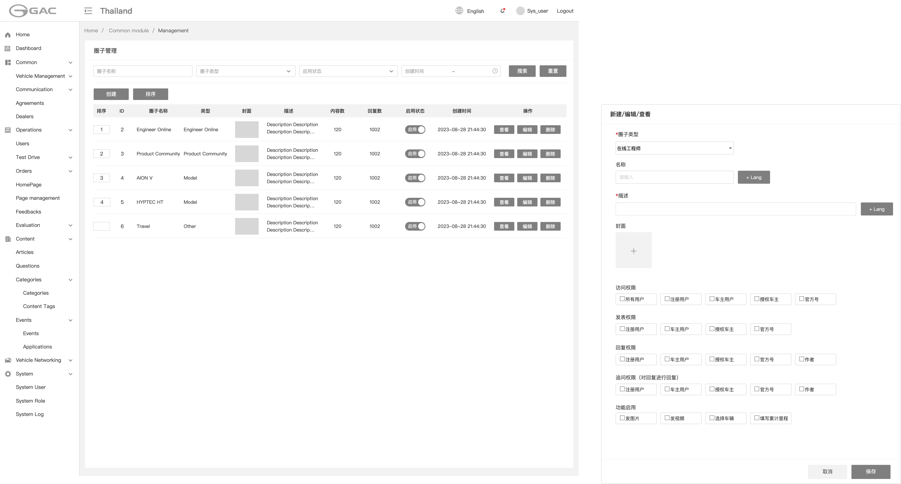
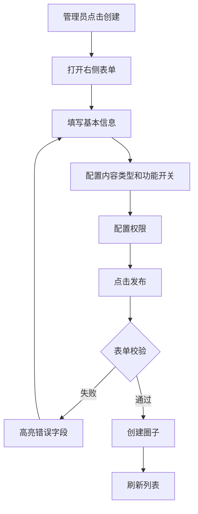
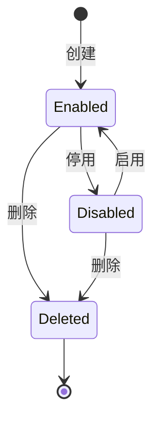

# 5.1 圈子管理与配置

> 层级：平台层 | 优先级：P0
>
> **原型**：

## 5.1.1 功能概述

| 字段 | 内容 |
|------|------|
| 功能描述 | 后台管理员创建和配置社区圈子，控制每个圈子的内容类型、功能开关和权限 |
| 用户故事 | 作为管理员，我希望灵活配置不同圈子的功能和权限，以便支持不同类型的社区场景 |
| 涉及角色 | 后台管理员 |
| 前置条件 | 管理员已登录后台管理系统 |
| 后置条件 | 圈子创建/更新后，移动端对应社区立即生效 |
| 优先级 | P0 |
| 实现技术 | 运营管理后台（Vue 3 + Ant Design Vue） |
| 依赖功能 | 无（基础平台功能） |
| 原型链接 | [圈子管理](../../asset/prototype/圈子管理.png) |

## 5.1.2 页面/界面描述

### 页面：圈子列表页（后台 Web）

**页面元素清单**：

| 编号     | 元素名称    | 类型     | 默认值 | 约束/校验规则 | 交互行为 | 说明                                       |
| ------ | ------- | ------ | --- | ------- | ---- | ---------------------------------------- |
| E-A-01 | 圈子名称搜索框 | 文本输入   | 空   | -       | 筛选列表 | 模糊匹配                                     |
| E-A-02 | 圈子类型下拉  | 单选下拉   | 全部  | -       | 筛选列表 | 可选类型见数据对象                                |
| E-A-03 | 启用状态下拉  | 单选下拉   | 全部  | 启用/禁用   | 筛选列表 | -                                        |
| E-A-04 | 创建时间范围  | 日期范围选择 | 空   | -       | 筛选列表 | -                                        |
| E-A-05 | 搜索按钮    | 按钮     | -   | -       | 提交表单 | 触发筛选                                     |
| E-A-06 | 重置按钮    | 按钮     | -   | -       | 提交表单 | 清空筛选条件                                   |
| E-A-07 | 创建按钮    | 按钮     | -   | -       | 打开弹窗 | 打开新建表单                                   |
| E-A-08 | 圈子列表表格  | 数据表格   | -   | -       | -    | 列：排序序号/ID/名称/类型/封面图/背景颜色/描述/内容数/回复数/启用状态/创建时间/操作 |
| E-A-09 | 查看按钮    | 操作按钮   | -   | -       | 打开弹窗 | 查看圈子配置详情                                 |
| E-A-10 | 编辑按钮    | 操作按钮   | -   | -       | 打开弹窗 | 编辑圈子配置                                   |
| E-A-11 | 删除按钮    | 操作按钮   | -   | -       | 打开弹窗 | 二次确认后删除                                  |

### 页面：圈子新建/编辑表单（右侧抽屉）

| 编号     | 元素名称      | 类型    | 默认值 | 约束/校验规则   | 交互行为 | 说明                                                  |
| ------ | --------- | ----- | --- | --------- | ---- | --------------------------------------------------- |
| E-B-01 | 圈子类型      | 单选下拉  | 请选择 | 必填        | -    | Engineer Online / Product Community / Model / Other |
| E-B-02 | 名称        | 文本输入  | 空   | 必填        | -    | -                                                   |
| E-B-03 | + Lang 按钮 | 按钮    | -   | -         | 打开弹窗 | 添加其他语言的名称                                           |
| E-B-04 | 描述        | 多行文本  | 空   | 必填        | -    | -                                                   |
| E-B-05 | + Lang 按钮 | 按钮    | -   | -         | 打开弹窗 | 添加其他语言的描述                                           |
| E-B-06 | 封面        | 图片上传  | 空   | 图片格式      | 上传文件 | 单张                                                  |
| E-B-07 | 功能启用      | 多选复选框 | 空   | -         | 切换状态 | 图片 / 视频 / 选择车辆 / 车辆累计公里数                            |
| E-B-10 | 访问权限      | 多选复选框 | 空   | 至少选一项     | 切换状态 | 全部用户 / 车主 / 授权车主 / 官方号                              |
| E-B-11 | 发表权限      | 多选复选框 | 空   | 至少选一项     | 切换状态 | 全部用户 / 车主 / 授权车主 / 官方号                              |
| E-B-12 | 回答权限      | 多选复选框 | 空   | 至少选一项     | 切换状态 | 全部用户 / 车主 / 授权车主 / 官方号 / 作者                         |
| E-B-13 | 追问权限      | 多选复选框 | 空   | 至少选一项     | 切换状态 | 全部用户 / 车主 / 授权车主 / 官方号 / 作者                         |
| E-B-14 | 保存按钮      | 按钮    | -   | 所有必填项校验通过 | 提交表单 | -                                                   |
| E-B-16 | 取消按钮      | 按钮    | -   | -         | 关闭抽屉 | 有修改时二次确认                                            |

## 5.1.3 交互逻辑

**创建圈子主流程**：



## 5.1.4 业务规则

- BR-5.1-01: 圈子名称在同一系统内不可重复
- BR-5.1-02: 圈子类型创建后不可修改
- BR-5.1-03: 停用圈子后，移动端不再展示该圈子入口，已有内容保留但不可访问
- BR-5.1-04: 删除圈子前需确认，圈子内有内容时需二次确认"删除圈子将同时删除所有内容"
- BR-5.1-05: 排序字段控制圈子在移动端的展示顺序，数字越小排越前
- BR-5.1-06: 多语言名称和描述中，至少需填写一种语言

## 5.1.5 边界与异常处理

| 编号 | 场景 | 触发条件 | 系统行为 | 用户提示 | 恢复方式 |
|------|------|----------|----------|----------|----------|
| EX-5.1-01 | 圈子名称重复 | 创建/编辑时名称已存在 | 拒绝提交 | "圈子名称已存在" | 修改名称 |
| EX-5.1-02 | 删除有内容的圈子 | 圈子内有问题或文章 | 弹出二次确认 | "该圈子包含 X 条内容，删除后不可恢复" | 确认或取消 |
| EX-5.1-03 | 封面图上传失败 | 网络异常或文件格式错误 | 提示错误 | "图片上传失败，请重试" | 重新上传 |
| EX-5.1-04 | 表单校验失败 | 必填项未填、多选框未选至少一项、封面格式不符合要求 | 高亮错误字段，阻止提交 | 按字段显示具体错误提示（如"名称不能为空"） | 修正后重新提交 |

## 5.1.6 数据对象

**圈子（Group）**

| 字段 | 英文名 | 类型 | 必填 | 约束 | 说明 |
|------|--------|------|------|------|------|
| 圈子ID | id | integer | 是 | 系统生成 | 主键 |
| 排序 | sort_order | integer | 是 | ≥ 0 | 控制展示顺序 |
| 名称 | name | string | 是 | ≤200字符 | 支持多语言 |
| 类型 | type | enum | 是 | ENGINEER_ONLINE / PRODUCT_COMMUNITY / MODEL / OTHER | 创建后不可修改 |
| 描述 | description | string | 是 | ≤ 1000字符 | 支持多语言 |
| 封面 | cover_image | image | 是 | webp/png/jpg, ≤3MB | DB 映射为 `cover_url` |
| 启用状态 | is_enabled | boolean | 是 | 默认 true | - |
| 是否删除 | is_deleted | boolean | 是 | 默认 false | 软删除标记，Deleted 状态通过此字段实现 |
| 内容数 | content_count | integer | 是 | ≥ 0，默认 0 | 冗余计数 |
| 回复数 | reply_count | integer | 是 | ≥ 0，默认 0 | 冗余计数 |
| 功能启用 | enabled_features | string[] | 否 | reply / image / video / vehicle / mileage | - |
| 访问权限 | access_roles | string[] | 是 | all / car_owner / authorized_owner / official | - |
| 发表权限 | post_roles | string[] | 是 | 同上 | - |
| 回答权限 | reply_roles | string[] | 是 | 同上 + author | 控制一级回答（回答问题）的权限 |
| 追问权限 | follow_up_roles | string[] | 是 | 同上 + author | 控制对一级/二级回答发起追问的权限 |
| 创建时间 | created_at | datetime | 是 | 系统生成 | - |
| 更新时间 | updated_at | datetime | 是 | 系统生成 | - |

**圈子多语言（GroupTranslation）**

| 字段   | 英文名         | 类型        | 必填  | 约束           | 说明        |
| ---- | ----------- | --------- | --- | ------------ | --------- |
| ID   | id          | integer   | 是   | 系统生成         | 主键        |
| 圈子ID | group_id    | ref:Group | 是   | 外键           | -         |
| 语言代码 | locale      | string    | 是   | zh / en / th | ISO 639-1 |
| 名称   | name        | string    | 是   | -            | -         |
| 描述   | description | string    | 否   | -            | -         |
|      |             |           |     |              |           |

## 5.1.7 状态机



| 当前状态 | 目标状态 | 触发动作 | 允许角色 | 副作用 |
|----------|----------|----------|----------|--------|
| - | Enabled | 创建圈子 | 管理员 | 移动端可见 |
| Enabled | Disabled | 点击停用 | 管理员 | 移动端不可见，内容保留 |
| Disabled | Enabled | 点击启用 | 管理员 | 移动端恢复可见 |
| Enabled/Disabled | Deleted | 点击删除 | 管理员 | 内容一并删除 |

## 5.1.8 通知/消息触发

> 本模块为后台管理操作，不涉及通知触发。

## 5.1.9 验收标准

**正常流程：**
- AC-5.1-01: **Given** 管理员在圈子管理页 **When** 点击创建并填写完整信息后点击发布 **Then** 圈子创建成功，列表中出现新圈子
- AC-5.1-02: **Given** 圈子已创建 **When** 管理员编辑圈子配置并保存 **Then** 配置立即生效，移动端行为随之变化
- AC-5.1-03: **Given** 圈子已创建 **When** 管理员添加多语言名称 **Then** 不同语言环境下显示对应语言的名称

**异常流程：**
- AC-5.1-04: **Given** 已存在名为"Engineer Online"的圈子 **When** 创建同名圈子 **Then** 提示"圈子名称已存在"，不允许创建

**边界测试：**
- AC-5.1-05: **Given** 圈子内有 100 条问题 **When** 管理员删除圈子 **Then** 弹出确认框提示内容数量，确认后圈子及所有内容删除
- AC-5.1-06: **Given** 圈子的回复权限设为"官方号" **When** 普通车主尝试回复 **Then** 不显示回复入口

## 5.1.10 API 契约

> 管理后台接口，需 `@SaCheckRole("ADMIN")` 鉴权

| 接口       | 方法     | 路径                               | 主要参数                                                                                                                                     | 返回                       | 说明             |
| -------- | ------ | -------------------------------- | ---------------------------------------------------------------------------------------------------------------------------------------- | ------------------------ | -------------- |
| 圈子列表     | GET    | /api/v1/admin/groups             | name, type, isEnabled, startDate, endDate, page, pageSize                                                                                | PageResult\<GroupVO\>    | 模糊匹配名称         |
| 圈子详情     | GET    | /api/v1/admin/groups/{id}        | -                                                                                                                                        | GroupVO (含 translations) | 包含多语言配置        |
| 创建圈子     | POST   | /api/v1/admin/groups             | GroupCreateDTO (name, type, description, coverImage, enabledFeatures, accessRoles, postRoles, replyRoles, followUpRoles, translations[]) | {id}                     | type 创建后不可修改   |
| 编辑圈子     | PUT    | /api/v1/admin/groups/{id}        | GroupUpdateDTO (同上，除 type)                                                                                                               | -                        | 变更后缓存失效        |
| 删除圈子     | DELETE | /api/v1/admin/groups/{id}        | -                                                                                                                                        | -                        | 有内容时前端二次确认     |
| 启用/禁用    | PUT    | /api/v1/admin/groups/{id}/status | {isEnabled: boolean}                                                                                                                     | -                        | 停用后移动端不可见      |
| 移动端-圈子配置 | GET    | /api/v1/groups/{id}/config       | -                                                                                                                                        | GroupConfigVO            | 移动端读取，含功能开关和权限 |

### 5.1.10.1 API 样例

**请求：创建圈子**

```http
POST /api/v1/admin/groups
Authorization: Bearer admin-jwt
Content-Type: application/json

{
  "name": "Engineer Online",
  "type": "ENGINEER_ONLINE",
  "description": "GAC 官方在线工程师问答社区",
  "coverImage": "https://cdn.example.com/groups/engineer-online-cover.jpg",
  "enabledFeatures": ["reply", "image", "video"],
  "accessRoles": ["all"],
  "postRoles": ["car_owner", "authorized_owner", "official"],
  "replyRoles": ["official"],
  "followUpRoles": ["official", "author"],
  "sortOrder": 1,
  "translations": [
    { "locale": "en", "name": "Engineer Online", "description": "GAC Official Engineer Q&A community" },
    { "locale": "th", "name": "วิศวกรออนไลน์", "description": "ชุมชนถาม-ตอบโดยวิศวกร GAC อย่างเป็นทางการ" }
  ]
}
```

**响应（成功）**：

```json
{ "code": 0, "data": { "id": 1 }, "traceId": "trace-group-001", "timestamp": 1714123456789 }
```

**响应（名称重复）**：

```json
{
  "code": 3003,
  "message": "圈子名称已存在",
  "data": { "field": "name", "existingId": 1 },
  "traceId": "trace-group-002",
  "timestamp": 1714123466789
}
```

**请求：移动端读取圈子配置**

```http
GET /api/v1/groups/1/config
```

**响应**：

```json
{
  "code": 0,
  "data": {
    "id": 1,
    "name": "Engineer Online",
    "type": "ENGINEER_ONLINE",
    "description": "GAC 官方在线工程师问答社区",
    "coverImage": "https://cdn.example.com/groups/engineer-online-cover.jpg",
    "enabledFeatures": ["reply", "image", "video"],
    "accessRoles": ["all"],
    "postRoles": ["car_owner", "authorized_owner", "official"],
    "replyRoles": ["official"],
    "followUpRoles": ["official", "author"],
    "isEnabled": true
  },
  "traceId": "trace-group-003",
  "timestamp": 1714123476789
}
```
