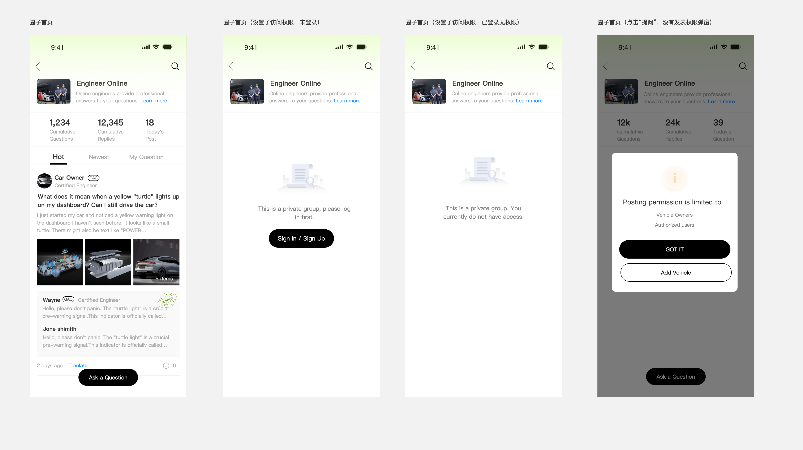
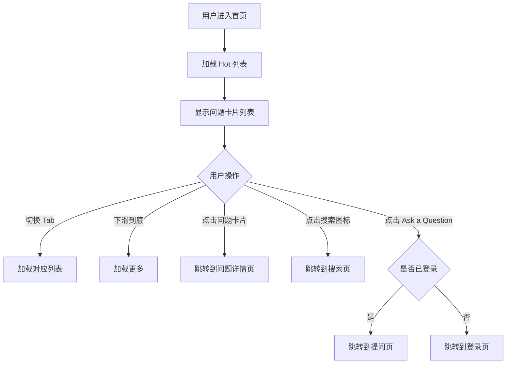
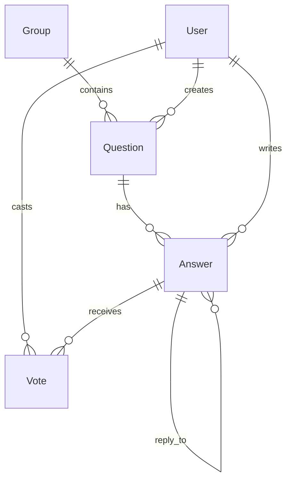
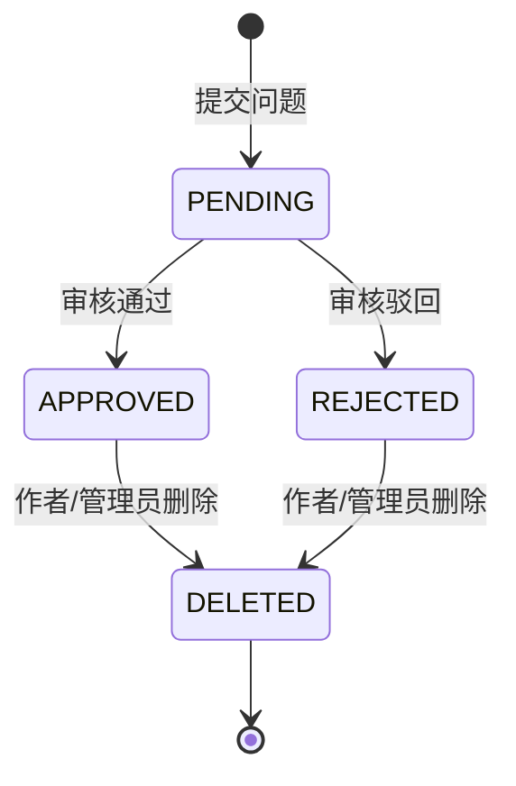

# 5.2 圈子首页

> 层级：在线工程师层 | 优先级：P0
>
> **原型**：

## 5.2.1 功能概述

| 字段   | 内容                                                    |
| ---- | ----------------------------------------------------- |
| 功能描述 | 用户进入"在线工程师"社区首页，浏览问题列表，支持 Hot/Newest/My Question 三种排序 |
| 用户故事 | 作为车主，我希望浏览其他车主的问题和工程师的回答，以便快速找到与我类似的问题                |
| 涉及角色 | 所有角色（游客可浏览）                                           |
| 前置条件 | 用户进入 GAC APP 的"在线工程师"模块                               |
| 后置条件 | 无                                                     |
| 优先级  | P0                                                    |
| 实现技术 | **Flutter 原生**（GAC APP 内嵌页面）                          |
| 依赖功能 | 5.1 圈子管理                                              |
| 原型链接 | [在线工程师首页](../../asset/prototype/圈子首页.png)               |

## 5.2.2 页面/界面描述

### 页面：首页

**页面状态**：

| 状态 | 触发条件 | 说明 |
|------|----------|------|
| 默认状态 | 首次加载 | 显示 Hot 标签下的问题列表 |
| 空状态 | 当前 Tab 无数据 | 显示引导文案"暂无问题" |
| 加载中 | 数据请求中 | 显示骨架屏 |
| 加载更多 | 滚动到底部 | 底部显示加载指示器 |

**页面元素清单**：

| 编号   | 元素名称              | 类型     | 默认值 | 约束/校验规则        | 交互行为        | 说明               |
| ---- | ----------------- | ------ | --- | -------------- | ----------- | ---------------- |
| E-01 | 返回按钮              | 按钮     | -   | -              | 返回上一页       | 左上角              |
| E-02 | 搜索图标              | 按钮     | -   | -              | 跳转到 [搜索页]   | 右上角              |
| E-03 | 圈子 Logo           | 图片     | -   | -              | -           | 社区 Logo          |
| E-04 | 圈子名称              | 文本     | -   | -              | -           | -                |
| E-05 | 圈子简介              | 文本     | -   | -              | -           | -                |
| E-06 | Learn more 链接     | 链接     | -   | -              | 弹窗显示完整简介    | 蓝色文字             |
| E-07 | 累计问题数             | 统计数字   | 0   | -              | -           | 格式带千分号（如1,000）   |
| E-08 | 累计回复数             | 统计数字   | 0   | -              | -           | 格式带千分号（如120,000） |
| E-09 | 今日发帖数             | 统计数字   | 0   | -              | -           | 每日 0 点重置         |
| E-10 | Tab 栏             | Tab 切换 | 最热  | 最热 / 最新 / 我的问题 | 加载对应列表      |                  |
| E-11 | 问题卡片              | 卡片组件   | -   | -              | 跳转到 [问题详情页] | 见下方卡片结构          |
| E-12 | Ask a Question 按钮 | 固定按钮   | -   | -              | 跳转到 [提问页]   | 黑色，页面底部固定        |

**问题卡片结构**：

| 子元素        | 类型    | 说明                  |
| ---------- | ----- | ------------------- |
| 提问者头像      | 图片    | 圆形                  |
| 提问者昵称      | 文本    | 如 "Car Owner"       |
| 问题标题       | 文本    | 加粗，最多3行             |
| 内容描述       | 文本    | 灰色，最多3行，截断显示        |
| 图片缩略图      | 图片列表  | 最多显示3张              |
| 回答预览       | 嵌套卡片  | 灰色背景区域              |
| ├ 工程师头像    | 图片    |                     |
| ├ 工程师昵称    | 文本    | 如 "Wayne"           |
| ├ 品牌标签     | 标签    | 如 "GAC"，黑色边框        |
| ├ Adopt 标记 | 徽章    | 已采纳时显示              |
| └ 回答摘要     | 文本    | 最多2行                |
| 发布时间       | 文本    | 相对时间，如 "2 days ago" |
| 评论数        | 图标+数字 | 气泡图标 + 数字           |

## 5.2.3 交互逻辑

**主流程**：



**Tab 排序逻辑**：

| Tab  | 排序规则                                      | 说明                |
| ---- | ----------------------------------------- | ----------------- |
| 最热   | 是否最热字段为"true"、审核通过且公开的问题，排序规则：排序数字>发表时间倒序 | 默认 Tab，访问权限根据圈子配置 |
| 最新   | 审核通过且公开的问题，排序规则：发表时间倒序                    | 最新问题              |
| 我的问题 | 当前用户发表的问题，按时间倒序，不需要根据审核状态和公开状态过滤          | 需要登录，未登录时调起登录页    |

**页面跳转关系**：

| 起始页 | 触发动作 | 目标页 | 携带参数 | 说明 |
|--------|----------|--------|----------|------|
| 首页 | 点击问题卡片 | 问题详情页 | question_id | - |
| 首页 | 点击搜索图标 | 搜索页 | - | - |
| 首页 | 点击 Ask a Question | 提问页 | - | 未登录跳登录 |
| 首页 | 点击返回 | App 上级页面 | - | - |

## 5.2.4 业务规则

- BR-5.2-01: 仅显示审核通过且公开的问题
- BR-5.2-02: 问题卡片中的回答预览最多显示2条，已采纳的回答优先显示，无已采纳则按回复时间倒序显示
- BR-5.2-03: 问题卡片中的图片最多显示3张缩略图（横向排列），超出3张时第3张图显示 "+N" 数量提示
- BR-5.2-10: 统计数字格式化规则：显示具体数字，格式带千分号（如 1000→1,000，1200000→1,200,000）
- BR-5.2-04: 发布时间采用相对时间显示：1分钟内显示"Just now"，60分钟内显示"N m ago"，24小时内显示"N h ago"，7天以内显示"N d ago"，7天以上显示"YYYY-MM-DD HH:mm"
- BR-5.2-05: My Question Tab 需要登录，未登录时点击该 Tab 触发登录引导
- BR-5.2-06: 无限滚动加载，每次加载 20 条，无更多数据时显示"No more questions"
- BR-5.2-07: 最热Tab访问权限：若圈子配置为部分用户，未登录提示"该圈子设置了访问权限，请先登录"，已登录提示"该圈子仅限以下用户访问：{圈子配置的可访问的用户角色名称}"；配置为全部用户则无需登录
- BR-5.2-08: 问题卡片中的最新回答区域最多显示2条，已采纳的回答优先显示，无已采纳则按回复时间倒序显示
- BR-5.2-09: 提问按钮为底部浮动按钮，若当前用户不符合圈子配置的发表权限则弹窗提示

## 5.2.5 边界与异常处理

| 编号        | 场景     | 触发条件            | 系统行为             | 用户提示                | 恢复方式     |
| --------- | ------ | --------------- | ---------------- | ------------------- | -------- |
| EX-5.2-01 | 列表为空   | 当前 Tab 无审核通过的问题 | 显示空状态            | 暂无数据                |          |
| EX-5.2-02 | 首次加载失败 | 网络异常            | 显示空状态 + Toast 提示 | Toast: "加载失败，请稍后再试" | 点击重试按钮   |
| EX-5.2-03 | 加载更多失败 | 分页请求失败          | 底部显示重试按钮         | Toast: "加载失败，请稍后再试" | 上滑重新触发加载 |

## 5.2.6 数据对象

**问题（Question）**

| 字段   | 英文名           | 类型        | 必填  | 约束                            | 说明                           |
| ---- | ------------- | --------- | --- | ----------------------------- | ---------------------------- |
| 问题ID | id            | integer   | 是   | 系统生成                          | 主键                           |
| 标题   | title         | string    | 是   | 5-400字符                       | -                            |
| 内容   | content       | string    | 否   | -                             | 纯文本描述，Optional，前端提交时无需富文本编辑器 |
| 图片列表 | images        | image[]   | 否   | 最多9张                          | -                            |
| 视频列表 | videos        | file[]    | 否   | 最多1个                          | -                            |
| 车型   | vehicle_model | string    | 否   | -                             | 关联车辆信息                       |
| 总里程  | total_mileage | string    | 否   | -                             | 如 "1203km"；DB 映射为 `mileage` INT，单位剥离存储 |
| VIN  | vin           | string    | 否   | -                             | 车辆识别号                        |
| 圈子ID | group_id      | ref:Group | 是   | 外键                            | -                            |
| 作者ID | author_id     | ref:User  | 是   | 外键                            | -                            |
| 审核状态 | review_status | enum      | 是   | PENDING / APPROVED / REJECTED | 默认 PENDING                   |
| 是否热门 | is_hot        | boolean   | 是   | 默认 false                      | 管理员标记                        |
| 是否公开 | is_public     | boolean   | 是   | 默认 false                      | 管理员控制前台可见性，false 时仅作者可见    |
| 同步到UOP状态 | sync_to_uop_status | enum   | 是   | 默认 NOT_SYNCED                 | NOT_SYNCED / SYNCED / SYNC_FAILED / UPDATE_FAILED；问题数据同步到 UOP 的状态 |
| 是否删除 | is_deleted    | boolean   | 是   | 默认 false                      | 软删除标记，Deleted 状态通过此字段实现      |
| 回答数  | answer_count  | integer   | 是   | ≥ 0，默认 0                      | 冗余计数                         |
| 浏览数  | view_count    | integer   | 是   | ≥ 0，默认 0                      | -                            |
| 创建时间 | created_at    | datetime  | 是   | 系统生成                          | -                            |
| 更新时间 | updated_at    | datetime  | 是   | 系统生成                          | -                            |

**实体关系**：



## 5.2.7 状态机



| 当前状态     | 目标状态            | 触发动作                           | 允许角色     | 副作用                   |
| -------- | --------------- | ------------------------------ | -------- | --------------------- |
| -        | Pending         | 提交问题                           | 有发表权限的用户 | 进入审核队列；`is_public` 初始 false |
| Pending  | Approved        | 审核通过                           | 管理员      | `is_public` 初始 false，仅作者可见；UOP 回传公开状态或管理员手动操作后 `is_public=true`，对外可见 |
| Pending  | Rejected        | 审核驳回                           | 管理员      | 通知作者；仅作者本人可见 |
| Approved | is_public=true  | 设为公开                           | 管理员 / UOP 回传 | 对外可见 |
| Approved | is_public=false | 取消公开                           | 管理员      | 仅作者可见 |
| Approved | Deleted         | 删除（`is_deleted=true`）            | 作者/管理员   | 从列表移除，数据软删除保留         |
| Rejected | Deleted         | 删除（`is_deleted=true`）            | 作者/管理员   | 从列表移除，数据软删除保留         |

> **被驳回问题的可见性**：被驳回的问题仅作者本人在 "My Question" Tab 中可见，显示"已驳回"状态标签，不显示编辑/重新提交入口。作者可选择删除。

## 5.2.8 通知/消息触发

> 本模块为浏览功能，不涉及通知触发。

## 5.2.9 验收标准

**正常流程：**
- AC-5.2-01: **Given** 用户进入首页 **When** 页面加载完成 **Then** 显示 Hot Tab 下的问题列表，统计数据正确
- AC-5.2-02: **Given** 用户在首页 **When** 切换到 Newest Tab **Then** 列表按发布时间倒序重新加载
- AC-5.2-03: **Given** 问题有已采纳的回答 **When** 在首页显示问题卡片 **Then** 回答预览区显示已采纳的回答，并带有 Adopt 标记

**异常流程：**
- AC-5.2-04: **Given** 用户未登录 **When** 点击 My Question Tab **Then** 跳转到登录页
- AC-5.2-05: **Given** 网络异常 **When** 加载列表 **Then** 显示"加载失败，点击重试"

**边界测试：**
- AC-5.2-06: **Given** Hot Tab 下无任何问题 **When** 页面加载 **Then** 显示空状态引导
- AC-5.2-07: **Given** 问题发布时间为 2 小时前 **When** 显示问题卡片 **Then** 时间显示为"2 hours ago"

## 5.2.10 API 契约

> 移动端接口，无需登录可访问（My Question 除外）。移动端列表使用 cursor 分页（GR-PAGE-01），后台用 page。

| 接口 | 方法 | 路径 | 主要参数 | 返回 | 说明 |
|------|------|------|----------|------|------|
| 问题列表 | GET | /api/v1/groups/{groupId}/questions | tab(hot/newest/my), cursor?, limit=20 | CursorPage\<QuestionListVO\> | tab=my 时需 JWT |
| 统计数据 | GET | /api/v1/groups/{groupId}/stats | - | {totalQuestions, totalReplies, todayPosts} | 可缓存，TTL 60s |

**QuestionListVO 结构**：

```typescript
interface QuestionListVO {
  id: number;
  title: string;
  summary: string;              // 摘要，截取前 3 行
  images: string[];             // 缩略图 URL，最多 3 张；列表页仅展示图片缩略图，视频在详情页展示
  author: UserBrief;
  answerPreview?: {             // 回答预览：优先已采纳 → 官方号第一条
    author: UserBrief;
    summary: string;
    isAccepted: boolean;
  };
  answerCount: number;
  createdAt: string;            // ISO 8601 原始时间，前端实时计算相对时间
}

interface CursorPage<T> {
  list: T[];
  nextCursor: string | null;    // null 表示已到末尾
  hasMore: boolean;
}
```

### 5.2.10.1 API 样例

**请求 1：首次拉取 Hot Tab**

```http
GET /api/v1/groups/1/questions?tab=hot&limit=20
Authorization: Bearer eyJhbGc...   # 可选，My Question 时必传
```

**响应 1（成功）**：

```json
{
  "code": 0,
  "message": "success",
  "data": {
    "list": [
      {
        "id": 12345,
        "title": "AION V 仪表盘出现故障灯怎么处理？",
        "summary": "今天早上启动时发现仪表盘上有一个黄色故障灯亮起，请问是什么问题？",
        "images": [
          "https://cdn.example.com/community/prod/20260420/abc.jpg"
        ],
        "author": {
          "id": 67890,
          "nickname": "Car Owner",
          "avatar": "https://cdn.example.com/avatars/67890.png",
          "role": "CAR_OWNER",
          "officialInfo": null
        },
        "answerPreview": {
          "author": {
            "id": 11111,
            "nickname": "Wayne",
            "avatar": "https://cdn.example.com/avatars/11111.png",
            "role": "OFFICIAL_PM",
            "officialInfo": {
              "brandLabel": "GAC",
              "position": "Product Manager",
              "verified": true
            }
          },
          "summary": "您好，黄色故障灯通常表示需要尽快检修但不影响行驶...",
          "isAccepted": true
        },
        "answerCount": 6,
        "createdAt": "2026-04-24T10:30:45Z"
      }
    ],
    "nextCursor": "eyJpZCI6MTIzNDUsInQiOjE3MTQwMDAwMDB9",
    "hasMore": true
  },
  "traceId": "trace-abc-001",
  "timestamp": 1714123456789
}
```

**请求 2：使用 cursor 翻页**

```http
GET /api/v1/groups/1/questions?tab=hot&cursor=eyJpZCI6MTIzNDUsInQiOjE3MTQwMDAwMDB9&limit=20
```

**响应 2（已到末尾）**：

```json
{
  "code": 0,
  "message": "success",
  "data": {
    "list": [],
    "nextCursor": null,
    "hasMore": false
  },
  "traceId": "trace-abc-002",
  "timestamp": 1714123466789
}
```

**响应 3（错误：未登录访问 My Question）**：

```json
{
  "code": 2001,
  "message": "未登录",
  "data": null,
  "traceId": "trace-abc-003",
  "timestamp": 1714123476789
}
```
