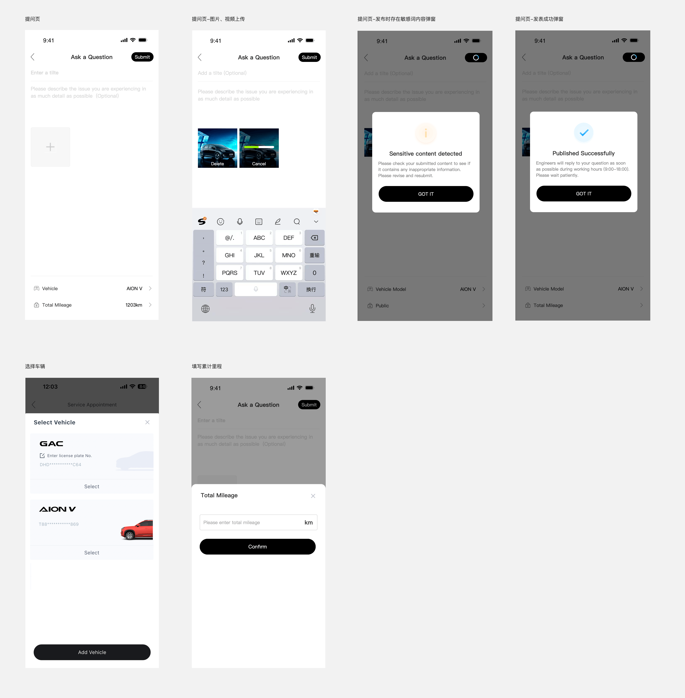
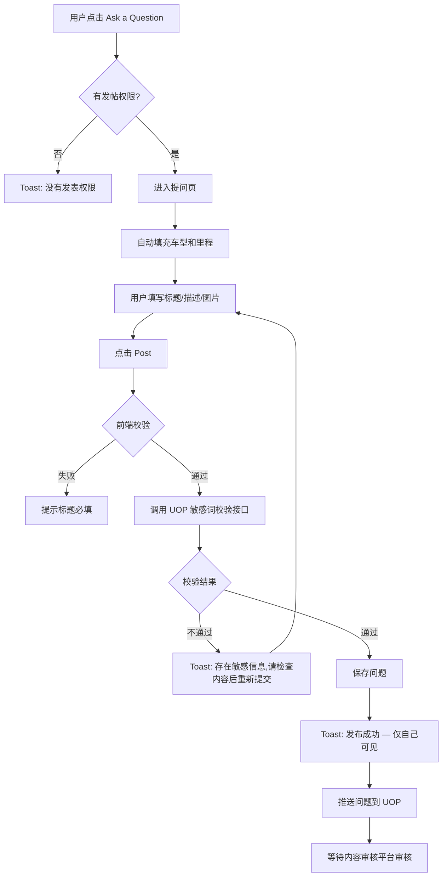

# 5.3 问题发布（提问）

> 层级：在线工程师层 | 优先级：P0
>
> **原型**：

## 5.3.1 功能概述

| 字段   | 内容                                            |
| ---- | --------------------------------------------- |
| 功能描述 | 车主填写问题标题、描述、上传图片，关联车型和里程后发布提问                 |
| 用户故事 | 作为车主，我希望描述我的汽车问题并附上照片和车辆信息，以便工程师能准确理解并回答      |
| 涉及角色 | 车主用户、授权车主                                     |
| 前置条件 | 用户已登录且有发表权限（由圈子配置决定）                          |
| 后置条件 | 问题提交后调用 UOP 敏感词校验，通过后保存并推送到 UOP；审核通过前仅发布者本人可见 |
| 优先级  | P0                                            |
| 实现技术 | **Flutter 原生**（GAC APP 内嵌页面）                  |
| 依赖功能 | 5.1 圈子管理、5.2 圈子首页                             |
| 原型链接 | [提问页](../../asset/prototype/提问页.png)               |

## 5.3.2 页面/界面描述

### 页面：提问页

| 编号   | 元素名称          | 类型      | 默认值              | 约束/校验规则                      | 交互行为                           | i18n key                                                            | 说明                                                                                                                     |
| ---- | ------------- | ------- | ---------------- | ---------------------------- | ------------------------------ | ------------------------------------------------------------------- | ---------------------------------------------------------------------------------------------------------------------- |
| E-01 | 返回按钮          | 按钮      | -                | -                            | 跳转到 [上一页]                      | `common.btn_back`                                                   | 有未保存内容时弹确认框                                                                                                            |
| E-02 | 页面标题          | 文本      | "Ask a Question" | -                            | -                              | `ask.title`                                                         | 居中                                                                                                                     |
| E-03 | Post 按钮       | 按钮      | 禁用               | 标题必填且校验通过                    | 提交表单                           | `common.btn_post`                                                   | 黑色，右上角                                                                                                                 |
| E-04 | 标题输入框         | 文本输入    | 空                | 必填，5-400字符                   | -                              | `ask.field.title.label` / `ask.field.title.placeholder`             | placeholder: "Enter a title"                                                                                           |
| E-05 | 描述输入框         | 多行文本    | 空                | 选填，≤10,000字符                 | 达到上限时阻止继续输入                    | `ask.field.description.label` / `ask.field.description.placeholder` | placeholder: "Please describe the issue you are experiencing in as much detail as possible (Optional)"；右下角显示当前字数/10000 |
| E-06 | 图片/视频上传区      | 图片/视频上传 | 空                | 图片+视频合计≤9个，图片≤5MB，视频≤5MB/60s | 上传文件，上传中显示取消按钮，上传后显示移除按钮，点击可预览 | `ask.field.images.label`                                            | 支持相册和拍照；格式统一转为jpg、mp4                                                                                                  |
| E-07 | Vehicle 选择器   | 导航入口    | 用户绑定的默认车型        | -                            | 弹出[车辆选择界面]                     | `ask.field.vehicle.label`                                           | 用户绑定多辆车时可切换；右侧显示当前车型如"AION V"                                                                                          |
| E-08 | Total Mileage | 导航入口    | 空                | -                            | 弹出到 [里程输入界面]                   | `ask.field.mileage.label`                                           | 用户可手动输入，单位为km；若圈子设置要求累计里程则必填                                                                                           |
| E-09 | 上传进度条         | 进度指示    | -                | -                            | -                              | -                                                                   | 每张图片/视频独立显示上传进度                                                                                                        |
| E-10 | 重试按钮          | 按钮      | -                | 上传失败时显示                      | 重新上传                           | -                                                                   | 单个文件上传失败后可点击重试                                                                                                         |

## 5.3.3 交互逻辑

**主流程**：



## 5.3.4 业务规则

- BR-5.3-01: 标题为必填，5-400 字符
- BR-5.3-02: 描述为选填（Optional），最多 10,000 字符
- BR-5.3-03: 图片/视频合计最多上传 9 个，图片单张 ≤ 5 MB，视频单个 ≤ 5 MB、时长 ≤ 60s。格式统一转为 jpg、mp4 后上传（遵循 GR-CONTENT-02/03）
- BR-5.3-04: 选择车辆：若当前圈子启用了该发表设置项且当前用户是车主或授权车主，则显示该字段，必填，默认选中当前车主的默认车辆，点击弹出选择车辆界面；若圈子未启用或用户不是车主/授权车主，则不显示
- BR-5.3-05: 总里程：若当前圈子启用了该发表设置项且当前用户是车主或授权车主，则显示该字段，必填，点击弹出填写车辆里程界面；若圈子未启用或用户不是车主/授权车主，则不显示
- BR-5.3-06: 提交时调用 UOP 敏感词校验接口，不通过则弹窗提示用户，用户可修改后重新提交
- BR-5.3-07: 问题提交成功后弹窗提示发表成功以及运营人员工作时间等信息文案，审核通过前仅发布者本人可见
- BR-5.3-08: 发表按钮默认置灰，当用户完成必填项且不存在上传中的图片/视频时显示为可提交状态；提交中按钮显示"加载中"动画
- BR-5.3-09: 圈子配置中"选择车辆"和"公里数"开关控制是否显示对应字段
- BR-5.3-10: 上传交互：上传中显示"取消"按钮，点击取消上传；上传成功后显示"移除"按钮，点击移除该图片/视频；上传成功后点击图片/视频可进行预览
- BR-5.3-11: 图片/视频上传走 OSS 直传：先调 `/api/v1/upload/presign` 拿预签名 URL，前端 PUT 到 OSS，再调 `/api/v1/upload/confirm` 确认。上传策略：用户选择图片/视频后立即开始上传，显示上传进度；上传成功后在界面显示缩略图和删除按钮；点击发表时只提交已上传成功的 CDN URL 列表，未上传完成的不计入
- BR-5.3-12: 客户端压缩最佳实践：上传前在客户端进行压缩，图片目标单张 ≤ 2MB（长边 ≤ 1920px，质量 80%），使用原生压缩库（Flutter: `flutter_image_compress`）。压缩后若仍 > 5MB 则提示用户选择更小图片。视频上传前压缩至 ≤ 5MB（分辨率 720p，码率 2Mbps）

## 5.3.5 边界与异常处理

| 编号 | 场景 | 触发条件 | 系统行为 | 用户提示 | 恢复方式 |
|------|------|----------|----------|----------|----------|
| EX-5.3-01 | 标题过短 | 标题 < 5 个字符 | 拒绝提交 | "标题至少 5 个字符" | 补充标题 |
| EX-5.3-02 | 标题过长 | 标题达到 400 个字符 | 阻止继续输入 | 输入框右下显示当前字数/400 | - |
| EX-5.3-03 | 图片格式/大小错误 | 非允许格式或 > 5 MB | 拒绝该图，标记失败 | "图片格式不支持/超出大小限制（≤5 MB）" | 重选 |
| EX-5.3-04 | 视频格式/大小错误 | 非 mp4 或 > 5 MB 或 > 60s | 拒绝该视频 | "视频格式/大小/时长超出限制" | 重选 |
| EX-5.3-05 | 图片上传失败 | 网络异常或 OSS 错误 | 标记失败图片 | "图片上传失败，请重试" | 点击重试 |
| EX-5.3-06 | 敏感词校验不通过 | UOP 接口返回不通过 | 保留表单内容 | "存在敏感信息，请检查内容后重新提交" | 用户修改后重新提交 |
| EX-5.3-07 | 提交失败 | 服务端 5xx | 保留表单内容 | "提交失败，请稍后重试" | 重试 |
| EX-5.3-08 | 返回时有未保存内容 | 用户点击返回且已填写内容 | 弹出确认框 | "确定放弃编辑？" | 确认或取消 |
| EX-5.3-09 | 无车辆信息 | 用户未绑定车辆 | Vehicle 选择器显示空，可手动选择或跳过 | 若圈子要求选择车辆则无法跳过 | - |
| EX-5.3-10 | 无发帖权限 | 圈子配置不允许该角色发帖 | Toast 提示 | "没有发表权限" | - |
| EX-5.3-11 | 描述过长 | 描述 > 10,000 字符 | 阻止继续输入 | 输入框右下显示当前字数/10000，超限变红 | 删减内容 |

## 5.3.6 数据对象

复用 5.2 中定义的 Question 实体。提交时的请求数据：

| 字段       | 英文名           | 类型       | 必填  | 说明                  |
| -------- | ------------- | -------- | --- | ------------------- |
| 标题       | title         | string   | 是   | 5-400字符             |
| 内容       | content       | string   | 否   | 纯文本，≤10,000字符       |
| 图片/视频URL | mediaUrls     | string[] | 否   | CDN URL，图片+视频合计最多9个 |
| 圈子ID     | group_id      | integer  | 是   | 自动设置                |
| 车型       | vehicle_model | string   | 否   | 选填，默认用户绑定车辆         |
| 总里程      | total_mileage | string   | 否   | 单位为km，圈子设置要求时必填     |

## 5.3.7 状态机

> 复用 5.2.7 中定义的 Question 状态机（Pending → Approved/Rejected）。

## 5.3.8 通知/消息触发

| 触发事件 | 接收人 | 通知方式 | 通知内容模板 | 延迟 |
|----------|--------|----------|-------------|------|
| 问题审核驳回 | 提问者 | 站内通知 | "Your question has been rejected: {reason}" | 实时 |

## 5.3.9 验收标准

**正常流程：**
- AC-5.3-01: **Given** 用户已登录 **When** 填写标题并点击 Post **Then** 问题提交成功，提示"发布成功"，返回首页
- AC-5.3-02: **Given** 用户已绑定 AION V **When** 进入提问页 **Then** Vehicle 自动显示"AION V"，可切换其他绑定车辆；Total Mileage 默认显示空，可手动输入
- AC-5.3-03: **Given** 用户上传 3 张图片 **When** 点击 Post **Then** 问题提交成功，详情页显示 3 张图片

**异常流程：**
- AC-5.3-04: **Given** 用户未登录 **When** 点击 Ask a Question **Then** 跳转到登录页
- AC-5.3-05: **Given** 标题仅输入 2 个字符 **When** 点击 Post **Then** 提示标题过短

**边界测试：**
- AC-5.3-06: **Given** 用户已上传 9 张图片 **When** 尝试继续上传 **Then** "+"号消失，不允许继续上传
- AC-5.3-07: **Given** 用户已填写标题和描述 **When** 点击返回 **Then** 弹出"确定放弃编辑？"确认框

## 5.3.10 API 契约

> 移动端接口，需登录且有发帖权限

| 接口 | 方法 | 路径 | 主要参数 | 返回 | 说明 |
|------|------|------|----------|------|------|
| 创建问题 | POST | /api/v1/groups/{groupId}/questions | QuestionCreateDTO (title, content?, imageUrls[]?, videoUrls[]?, vehicleModel?, vin?, totalMileage?) | {id} | 自动进入审核队列 |
| 图片预签名 | POST | /api/v1/upload/presign | {filename, contentType, size} | {uploadUrl, cdnUrl, expireAt} | 前端直传 OSS |
| 图片上传确认 | POST | /api/v1/upload/confirm | {cdnUrl} | - | 验证文件存在 |
| 敏感词校验 | POST | /api/v1/content/check | {title, content} | {pass: boolean, reason?} | 调用 UOP 接口 |
| 获取车辆信息 | GET | /api/v1/user/vehicle | - | {vehicleModel, totalMileage, vin} | 需 JWT；无绑定车辆返回 null |

**QuestionCreateDTO 结构**：

```typescript
interface QuestionCreateDTO {
  title: string;              // 必填，5-400 字符
  content?: string;           // 选填，纯文本，≤10,000字符
  mediaUrls?: string[];       // CDN URL 列表，图片+视频合计最多 9 个
  vehicleModel?: string;      // 选填，圈子启用且车主身份时必填
  vin?: string;               // 车辆识别号，选择车辆后自动填充
  totalMileage?: string;      // 单位为km，圈子启用且车主身份时必填
}
```

### 5.3.10.1 API 样例

**请求：创建问题**

```http
POST /api/v1/groups/1/questions
Authorization: Bearer eyJhbGc...
Content-Type: application/json

{
  "title": "AION V 充电时仪表盘显示警告",
  "content": "充电到 80% 后仪表盘出现红色警告图标。",
  "images": [
    "https://cdn.example.com/community/prod/20260426/img-001.jpg",
    "https://cdn.example.com/community/prod/20260426/img-002.jpg"
  ],
  "vehicleModel": "AION V",
  "totalMileage": "1203km"
}
```

**响应（成功）**：

```json
{
  "code": 0,
  "message": "success",
  "data": { "id": 99001 },
  "traceId": "trace-post-001",
  "timestamp": 1714123456789
}
```

**响应（标题过短，4002）**：

```json
{
  "code": 4002,
  "message": "标题至少 5 个字符",
  "data": { "field": "title", "current": 2, "min": 5 },
  "traceId": "trace-post-002",
  "timestamp": 1714123466789
}
```

**响应（敏感词命中）**：

```json
{
  "code": 4007,
  "message": "存在敏感信息，请检查内容后重新提交",
  "data": { "matched": ["违规词"] },
  "traceId": "trace-post-003",
  "timestamp": 1714123476789
}
```

**响应（无发帖权限）**：

```json
{
  "code": 4006,
  "message": "没有发表权限",
  "data": null,
  "traceId": "trace-post-004",
  "timestamp": 1714123486789
}
```

**OSS 直传流程样例**：

```http
# Step 1: 获取预签名
POST /api/v1/upload/presign
{
  "filename": "img-001.jpg",
  "contentType": "image/jpeg",
  "size": 524288
}

# Response
{
  "code": 0,
  "data": {
    "uploadUrl": "https://oss.aliyuncs.com/community/prod/20260426/uuid-abc.jpg?Signature=...&Expires=...",
    "cdnUrl": "https://cdn.example.com/community/prod/20260426/uuid-abc.jpg",
    "expireAt": "2026-04-26T11:30:00Z"
  }
}

# Step 2: 前端 PUT 直传到 uploadUrl

# Step 3: 确认
POST /api/v1/upload/confirm
{ "cdnUrl": "https://cdn.example.com/community/prod/20260426/uuid-abc.jpg" }
```
