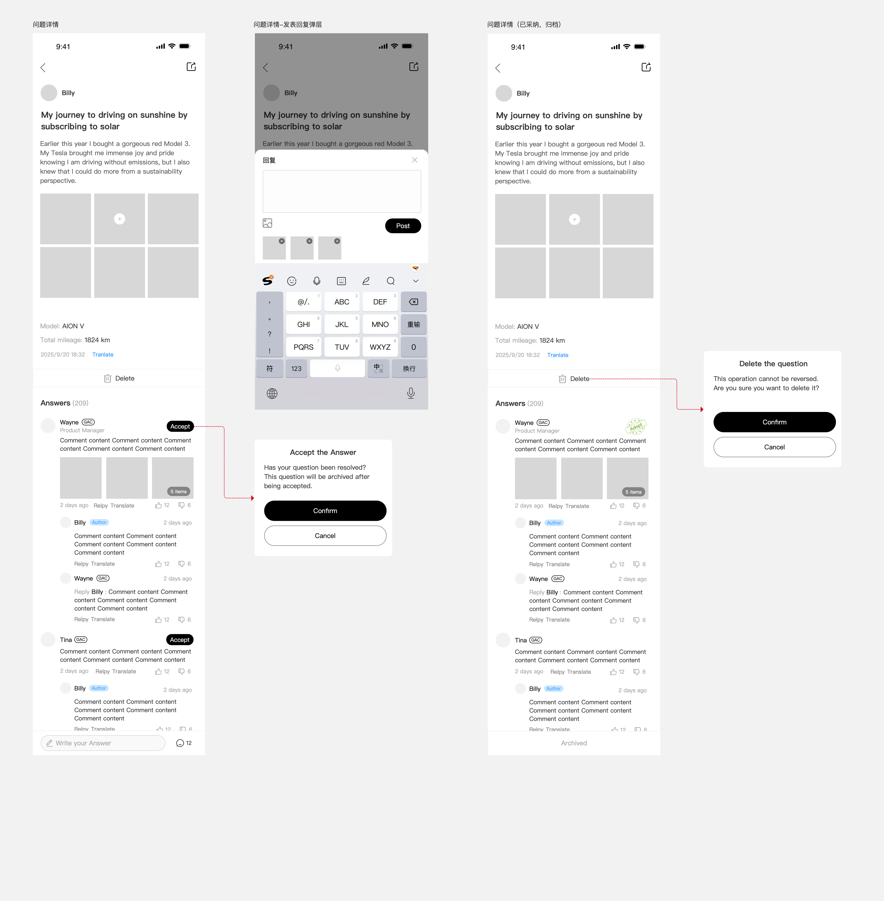
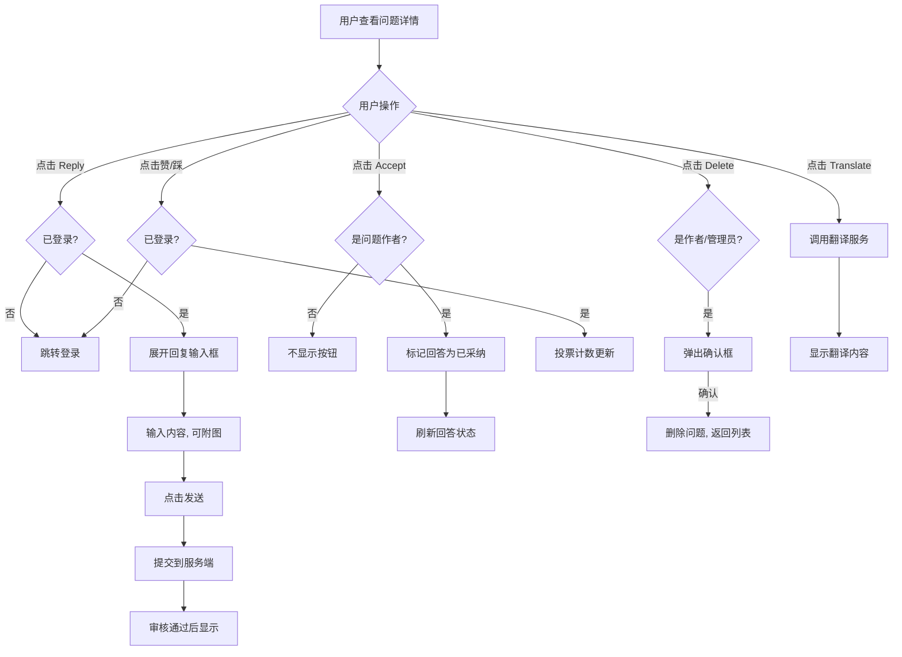

# 5.4 问题详情

> 层级：在线工程师层 | 优先级：P0
>
> **原型**：

## 5.4.1 功能概述

| 字段   | 内容                                                |
| ---- | ------------------------------------------------- |
| 功能描述 | 用户查看问题详情、浏览工程师回答、进行回复/投票/采纳操作                     |
| 用户故事 | 作为车主，我希望查看工程师的详细回答并采纳最佳答案；作为工程师，我希望回答车主的问题并附上图片说明 |
| 涉及角色 | 所有角色（游客可查看，操作需登录）                                 |
| 前置条件 | 从问题列表或搜索结果点击进入                                    |
| 后置条件 | 回答/回复/投票/采纳的操作结果实时反映                              |
| 优先级  | P0                                                |
| 实现技术 | **H5 WebView**（Vue 3 + NuxtJS + Vant；唯一的非原生页面）    |
| 依赖功能 | 5.2 圈子首页、5.3 问题发布                                 |
| 原型链接 | [详情页](../../asset/prototype/问题详情.png)               |

## 5.4.2 页面/界面描述

### 页面：问题详情页

**页面元素清单 — 问题区域**：

| 编号 | 元素名称 | 类型 | 约束/校验规则 | 交互行为 | i18n key | 说明 |
|------|----------|------|---------------|----------|----------|------|
| E-01 | 返回按钮 | 按钮 | - | 跳转到 [上一页] | `common.btn_back` | 左上角 |
| E-02 | 分享按钮 | 按钮 | - | 打开弹窗 | `common.btn_share` | 右上角，分享链接 |
| E-03 | 作者头像 | 图片 | - | - | - | 圆形 |
| E-04 | 作者昵称 | 文本 | - | - | - | - |
| E-05 | 问题标题 | 文本 | - | - | - | 加粗大字 |
| E-06 | 问题内容 | 文本 | - | - | - | 纯文本 + 换行，white-space: pre-wrap |
| E-07 | 媒体区域 | 图片/视频网格 | - | 点击查看大图/播放视频 | - | 最多 3x3 网格，视频有播放按钮 |
| E-08 | 车型标签 | 文本 | - | - | `detail.label.model` | "Model: AION V" |
| E-09 | 发布时间 | 文本 | - | - | `time.relative` | 相对时间：N<1min "Just now" / N<60min "N m ago" / N<24h "N h ago" / N<7d "N d ago" / 其他 "YYYY-MM-DD hh:mm" |
| E-10 | 翻译按钮 | 链接 | - | 切换状态 | `detail.btn.translate_show` / `detail.btn.translate_hide` | 绿色文字"Translate"，点击后翻译内容 |
| E-11 | 删除按钮 | 按钮 | 仅作者可见 | 打开弹窗 | `common.btn_delete` / `detail.confirm.delete` | 垃圾桶图标 + "Delete" |

**页面元素清单 — 回答区域**：

| 编号     | 元素名称         | 类型    | 约束/校验规则 | 交互行为   | i18n key                                                  | 说明                   |
| ------ | ------------ | ----- | ------- | ------ | --------------------------------------------------------- | -------------------- |
| E-A-01 | 回答标题         | 文本    | -       | -      | `detail.label.answers_count`                              | "Answers (209)" 显示总数 |
| E-A-02 | 回答卡片         | 卡片组件  | -       | -      | -                                                         | 每条回答一个卡片             |
| E-A-03 | 回答者头像        | 图片    | -       | -      | -                                                         | 官方号带 V 徽章            |
| E-A-04 | 回答者昵称        | 文本    | -       | -      | -                                                         | 如 "Wayne"            |
| E-A-05 | 品牌标签         | 标签    | 仅官方号显示  | -      | GAC官方号标识                                                  | 如 "GAC"，             |
| E-A-06 | 官方号名称        | 文本    | 仅官方号显示  | -      | CERTIFIED_ENGINEER：认证工程师<br>PRODUCT_MANAGER：产品经理`         | 如 "Product Manager"  |
| E-A-07 | Accept 按钮    | 按钮    | 仅问题作者可见 | 切换状态   | `detail.btn.accept` / `detail.btn.unaccept`               | 黑色按钮，点击后采纳           |
| E-A-08 | 回答内容         | 文本    | -       | -      | -                                                         | -                    |
| E-A-09 | 回答图片         | 图片列表  | -       | 点击查看大图 | -                                                         | 最多3张缩略图              |
| E-A-10 | 回答时间         | 文本    | -       | -      | `time.minutes_ago` / `time.hours_ago` / `time.days_ago`   | 相对时间                 |
| E-A-11 | Reply 按钮     | 链接    | 需登录     | 展开/收起  | `common.btn_reply`                                        | 展开回复输入框              |
| E-A-12 | Translate 按钮 | 链接    | -       | 切换状态   | `detail.btn.translate_show` / `detail.btn.translate_hide` | 翻译回答内容               |
| E-A-13 | 赞按钮          | 图标+数字 | 需登录     | 切换状态   | -                                                         | 👍 + 数字              |
| E-A-14 | 踩按钮          | 图标+数字 | 需登录     | 切换状态   | -                                                         | 👎 + 数字              |

**页面元素清单 — 嵌套回复**：

| 编号 | 元素名称 | 类型 | i18n key | 说明 |
|------|----------|------|----------|------|
| E-B-01 | 回复者头像 | 图片 | - | 小尺寸 |
| E-B-02 | 回复者昵称 | 文本 | `detail.label.author_tag` | 问题作者显示红色"Author"标签 |
| E-B-03 | 回复对象 | 文本 | - | "Wayne ▸ Billy" 格式，表示回复谁 |
| E-B-04 | 回复时间 | 文本 | `time.minutes_ago` / `time.hours_ago` / `time.days_ago` | 相对时间 |
| E-B-05 | 回复内容 | 文本 | - | - |
| E-B-06 | Reply 按钮 | 链接 | `common.btn_reply` | 展开回复输入框 |
| E-B-07 | Translate 按钮 | 链接 | `detail.btn.translate_show` / `detail.btn.translate_hide` | 翻译回复 |
| E-B-08 | 赞/踩按钮 | 图标+数字 | - | 同回答区 |

## 5.4.3 交互逻辑

**回答与回复流程**：



## 5.4.4 业务规则

- BR-5.4-01: 回答列表排序规则：已采纳的回答排在最前，其余按回复时间倒序排列
- BR-5.4-02: 官方号的回答展示、GAC品牌标签和官方号名称
- BR-5.4-03: Accept 按钮仅对问题作者可见，仅可对 1 个一级回答进行采纳；采纳后问题归档，不允许再进行回复
- BR-5.4-04: 用户对同一回答只能赞或踩其一，再次点击同类型则取消。数据层实现：以 `(user_id, answer_id)` 为唯一键仅存储一行记录，`vote_type` 字段可更新；已赞时点击踩 → 更新为 DOWNVOTE；已赞时再次点击赞 → 删除记录。赞/踩计数在 Service 层根据操作类型（新增/切换/取消）计算增量后更新，禁止直接 COUNT(*）
- BR-5.4-05: 问题作者在评论区以红色"Author"标签标识
- BR-5.4-06: 嵌套回复以"A ▸ B"格式显示回复关系
- BR-5.4-13: 嵌套回复最多支持两层（回答 → 回复 → 回复的回复），`parent_id` 指向直接父回复。UI 上嵌套回复在对应父回答下方垂直展示，水平方向不额外缩进（所有回复左对齐），通过 "Wayne ▸ Billy" 格式标识回复关系
- BR-5.4-07: 翻译按钮点击后替换原文显示翻译结果，再次点击恢复原文
- BR-5.4-08: 删除问题需二次确认，已采纳的问题仍可删除；删除后同步状态到 UOP（数据标识"已删除"），其下所有回答仍保留但移动端不可见，已采纳状态保留用于历史记录，列表中带问号标识、暗色文字显示"问题已删除"
- BR-5.4-09: 问题详情页的时间显示采用相对时间：N 小于1分钟显示"Just now"，N 小于60分钟显示"N m ago"，N 小于24小时显示"N h ago"，N 小于7天显示"N d ago"，N 大于等于7天显示"YYYY-MM-DD hh:mm"
- BR-5.4-10: 回答和回复发布时调用 UOP 敏感词校验接口，不通过则 Toast "存在敏感信息，请检查内容后重新提交"
- BR-5.4-11: 用户可对工程师回答及其二级回复发起追问（追问是对回答/二级回复的回复，在线工程师圈子的追问权限会配置成作者才可以追问），追问走同样的回答的发布和审核流程
- BR-5.4-12: 采纳任一回答后，整个问题归档，关闭所有回复入口，不再允许任何追问或回复；采纳状态同步推送到 UOP
- BR-5.4-14: 一级回答和二级回复的图片/视频最多显示 3 个，超出 3 个时最后一张图显示总数量"N Items"
- BR-5.4-15: 赞/踩操作防抖：点击后 UI 立即反馈，但延时 1 秒后请求后端接口；若 1 秒内有重复点击则按最近点击时间再延后 1 秒后请求
- BR-5.4-16: 二级回复内容前显示"Reply {被回复人昵称} : "前缀
- BR-5.4-17: 翻译按钮显示规则：当问题标题/描述或回复内容的语言与 App 设置语言不一致时显示"translate"按钮；使用 google_mlkit_language_id 检测语言，Google Cloud Translation API 进行翻译
- BR-5.4-18: 分享按钮显示条件：当前问题的审核状态为审核通过且公开状态为"公开"时才显示
- BR-5.4-19: 问题详情页回答列表使用 cursor 分页，每次加载 10 条
- BR-5.4-20: 底部追问入口：根据圈子追问权限配置，没有权限的用户点击 toast 提示"仅允许xxx/xxxx进行追问"；有权限的用户点击后弹出追问输入框

## 5.4.5 边界与异常处理

| 编号        | 场景     | 触发条件          | 系统行为    | 用户提示              | 恢复方式 |
| --------- | ------ | ------------- | ------- | ----------------- | ---- |
| EX-5.4-01 | 问题已删除  | 通过缓存链接访问已删除问题 | 显示404页面 | 显示空数据界面提示"该问题已删除" |      |
| EX-5.4-02 | 翻译失败   | 翻译服务异常        | 保持原文    | "翻译失败，请稍后重试"      | 重试   |
| EX-5.4-03 | 回复提交失败 | 网络异常          | 保留输入内容  | "提交失败，请重试"        | 重试   |
| EX-5.4-04 | 重复采纳   | 已采纳 1 条后再次点击采纳 | 拒绝操作    | "该问题已采纳其他回答"      | -    |


## 5.4.6 数据对象

**回答/回复（Answer）**

| 字段       | 英文名                | 类型           | 必填  | 约束                                             | 说明                 |
| -------- | ------------------ | ------------ | --- | ---------------------------------------------- | ------------------ |
| 回复ID     | id                 | integer      | 是   | 系统生成                                           | 主键                 |
| 内容       | content            | string       | 是   | ≥1字符                                           | -                  |
| 媒体列表 | media          | MediaItem[]     | 否   | 图片+视频合计最多9个，按上传顺序                           | -                  |
| 回复人ID    | author_id          | ref:User     | 是   | 外键                                             | -                  |
| 回复人身份    | author_type        | enum         | 是   | REGULAR_USER / OFFICIAL_ENGINEER / OFFICIAL_PM | -                  |
| 问题ID     | question_id        | ref:Question | 是   | 外键                                             | 所属问题               |
| 父回复ID    | parent_id          | ref:Answer   | 否   | 外键                                             | 嵌套回复时指向被回复的 Answer |
| 审核状态     | review_status      | enum         | 是   | PENDING / APPROVED / REJECTED                  | 默认 PENDING         |
| 是否采纳     | is_accepted        | boolean      | 是   | 默认 false                                       | 问题作者操作             |
| 同步到UOP状态 | sync_to_uop_status | enum         | 否   | NOT_SYNCED / SYNCED / SYNC_FAILED / UPDATE_FAILED | 回答数据同步到 UOP 的状态    |
| 是否删除     | is_deleted         | boolean      | 是   | 默认 false                                       | 软删除标记，删除通过此字段实现    |
| 赞数       | upvote_count       | integer      | 是   | ≥ 0                                            | -                  |
| 踩数       | downvote_count     | integer      | 是   | ≥ 0                                            | -                  |
| 创建时间     | created_at         | datetime     | 是   | 系统生成                                           | -                  |
| 更新时间     | updated_at         | datetime     | 是   | 系统生成                                           | -                  |

**投票（Vote）**

| 字段 | 英文名 | 类型 | 必填 | 约束 | 说明 |
|------|--------|------|------|------|------|
| 投票ID | id | integer | 是 | 系统生成 | 主键 |
| 用户ID | user_id | ref:User | 是 | 外键 | - |
| 回答ID | answer_id | ref:Answer | 是 | 外键 | - |
| 投票类型 | vote_type | enum | 是 | UPVOTE / DOWNVOTE | 同一用户同一回答只能投一种 |
| 创建时间 | created_at | datetime | 是 | 系统生成 | - |

## 5.4.7 状态机

> 回答状态机见 `05.08-回答管理（管理后台）.md` 5.8.7 节（审核状态：Pending → Approved/Rejected；UOP 同步状态：NotSynced → Synced/SyncFailed）。

## 5.4.8 通知/消息触发

| 触发事件 | 接收人 | 通知方式 | 通知内容模板 | 延迟 |
|----------|--------|----------|-------------|------|
| 官方号回答审核通过 | 提问者 | 站内通知 + App Push | "{engineer name} has replied your Question..." | 实时 |
| 回答被采纳 | 回答者 | 站内通知 | "Your answer has been accepted" | 实时 |

## 5.4.9 验收标准

**正常流程：**
- AC-5.4-01: **Given** 用户进入问题详情页 **When** 页面加载 **Then** 显示问题完整内容、车型、时间，下方显示回答列表及总数
- AC-5.4-02: **Given** 工程师 Wayne 回答了问题 **When** 查看回答卡片 **Then** 显示 V 徽章、"GAC"标签、"Product Manager"职位
- AC-5.4-03: **Given** 问题作者查看详情 **When** 某回答未被采纳 **Then** 该回答显示"Accept"按钮
- AC-5.4-04: **Given** 用户已登录 **When** 点击赞按钮 **Then** 赞数+1，按钮高亮
- AC-5.4-05: **Given** 用户已赞过 **When** 再次点击赞 **Then** 取消赞，赞数-1
- AC-5.4-06: **Given** Billy 回复了 Wayne 的回答 **When** 查看回复 **Then** 显示 "Wayne ▸ Billy" 及 Author 红色标签

**异常流程：**
- AC-5.4-07: **Given** 用户未登录 **When** 点击 Reply **Then** 跳转登录页
- AC-5.4-08: **Given** 非问题作者 **When** 查看回答 **Then** 不显示 Accept 按钮

**边界测试：**
- AC-5.4-09: **Given** 问题有 209 条回答 **When** 查看详情 **Then** 标题显示"Answers (209)"，分页或无限滚动加载
- AC-5.4-10: **Given** 用户已赞某回答 **When** 点击踩按钮 **Then** 赞取消，踩+1（互斥切换）

## 5.4.10 API 契约

> 移动端接口，查看无需登录，操作（回复/投票/采纳/删除）需登录

| 接口 | 方法 | 路径 | 主要参数 | 返回 | 说明 |
|------|------|------|----------|------|------|
| 问题详情 | GET | /api/v1/questions/{id} | - | QuestionDetailVO | 自动 +1 浏览数 |
| 回答列表 | GET | /api/v1/questions/{id}/answers | cursor, limit(默认10) | CursorResult\<AnswerVO\> | 已采纳优先，时间正序；cursor 分页 |
| 提交回答 | POST | /api/v1/questions/{id}/answers | AnswerCreateDTO (content, media[]?, parentId?) | {id} | parentId 存在时为嵌套回复；media 图片+视频合计最多3个，后端存入 `images` + `videos` |
| 投票 | POST | /api/v1/answers/{id}/vote | {voteType: "UPVOTE"\|"DOWNVOTE"} | {upvoteCount, downvoteCount, myVote} | 再次相同操作=取消；myVote 为当前用户投票状态 |
| 采纳回答 | POST | /api/v1/answers/{id}/accept | - | - | 仅问题作者可操作 |
| 取消采纳 | DELETE | /api/v1/answers/{id}/accept | - | - | 仅问题作者可操作 |
| 删除问题 | DELETE | /api/v1/questions/{id} | - | - | 仅作者/管理员，同步 UOP |
| 敏感词校验 | POST | /api/v1/content/check | {content} | {pass: boolean, reason?} | 回答/回复提交前调用 |
| 翻译内容 | POST | /api/v1/translate | {content, targetLang, format?, sourceId?} | {translatedText} | format: `text`/`html`（默认text）；sourceId 用于业务缓存，无则纯文本缓存 |

**QuestionDetailVO 结构**：

```typescript
interface QuestionDetailVO {
  id: number;
  title: string;
  content?: string;
  media: MediaItem[];          // 图片+视频混排，按用户上传顺序
  vehicleModel?: string;
  totalMileage?: string;
  author: UserBrief;
  answerCount: number;
  viewCount: number;
  createdAt: string;           // ISO 8601 具体日期时间
  isOwner: boolean;            // 当前用户是否为作者（控制 Delete/Accept 显示）
}
```

**AnswerVO 结构**：

```typescript
interface MediaItem {
  type: 'image' | 'video';
  url: string;                  // 原图/原视频地址
  coverUrl: string;             // 缩略图/封面 URL；图片 = 客户端压缩裁剪的 450×450 缩略图，视频 = 客户端截取的第一帧封面
  duration?: number;            // type=video 时必填（秒），客户端读取原视频元数据
}

interface AnswerVO {
  id: number;
  content: string;
  media: MediaItem[];          // 图片+视频混排，按用户上传顺序
  author: UserBrief;
  parentId?: number;           // 嵌套回复时有值
  replyTo?: UserBrief;         // 被回复人信息（A ▸ B 格式用）
  isAccepted: boolean;
  upvoteCount: number;
  downvoteCount: number;
  myVote?: 'UPVOTE' | 'DOWNVOTE' | null; // 当前用户的投票状态
  createdAt: string;           // ISO 8601，前端实时计算相对时间
}
```

**AnswerCreateDTO 结构**：

```typescript
interface AnswerCreateDTO {
  content: string;             // 必填，≥1 字符
  media?: MediaItem[];         // 图片+视频合计最多 3 个
  parentId?: number;           // 嵌套回复时必填，指向被回复的 Answer ID
}
```

### 5.4.10.1 API 样例

**请求：获取问题详情**

```http
GET /api/v1/questions/12345
Authorization: Bearer eyJhbGc...
```

**响应（成功）**：

```json
{
  "code": 0,
  "data": {
    "id": 12345,
    "title": "AION V 仪表盘出现故障灯怎么处理？",
    "content": "今天早上启动时...",
    "media": [
      {
        "type": "image",
        "url": "https://cdn.example.com/community/prod/20260420/abc.jpg",
        "coverUrl": "https://cdn.example.com/community/prod/20260420/abc-thumb.jpg"
      }
    ],
    "vehicleModel": "AION V",
    "totalMileage": "1203km",
    "author": {
      "id": 67890,
      "nickname": "Car Owner",
      "avatar": "https://cdn.example.com/avatars/67890.png",
      "role": "CAR_OWNER",
      "officialInfo": null
    },
    "answerCount": 209,
    "viewCount": 4521,
    "createdAt": "2025-09-20T18:32:15Z",
    "isOwner": true
  },
  "traceId": "trace-detail-001",
  "timestamp": 1714123456789
}
```

**请求：投票（赞）**

```http
POST /api/v1/answers/55001/vote
Authorization: Bearer eyJhbGc...

{ "voteType": "UPVOTE" }
```

**响应（成功）**：

```json
{
  "code": 0,
  "data": { "upvoteCount": 13, "downvoteCount": 3, "myVote": "UPVOTE" },
  "traceId": "trace-vote-001",
  "timestamp": 1714123456789
}
```

**响应（重复同方向投票 = 取消）**：

```json
{
  "code": 0,
  "data": { "upvoteCount": 12, "downvoteCount": 3 },
  "traceId": "trace-vote-002",
  "timestamp": 1714123466789
}
```

**响应（投票频率过高）**：

```json
{
  "code": 1003,
  "message": "操作过于频繁",
  "data": { "retryAfterSeconds": 5 },
  "traceId": "trace-vote-003",
  "timestamp": 1714123476789
}
```

**请求：采纳回答**

```http
POST /api/v1/answers/55001/accept
Authorization: Bearer eyJhbGc...
```

**响应（非问题作者尝试采纳）**：

```json
{
  "code": 2004,
  "message": "无权限",
  "data": null,
  "traceId": "trace-accept-001",
  "timestamp": 1714123486789
}
```

**响应（重复采纳同一回答）**：

```json
{
  "code": 5003,
  "message": "该回答已被采纳",
  "data": null,
  "traceId": "trace-accept-002",
  "timestamp": 1714123496789
}
```

**请求：翻译内容**

```http
POST /api/v1/translate
Authorization: Bearer eyJhbGc...

{
  "content": "您好，黄色故障灯通常表示需要尽快检修但不影响行驶。",
  "targetLang": "en",
  "format": "text",
  "sourceId": 55001
}
```

**响应（成功）**：

```json
{
  "code": 0,
  "data": {
    "translatedText": "Hello, a yellow warning light usually indicates that..."
  },
  "traceId": "trace-tr-001",
  "timestamp": 1714123506789
}
```
