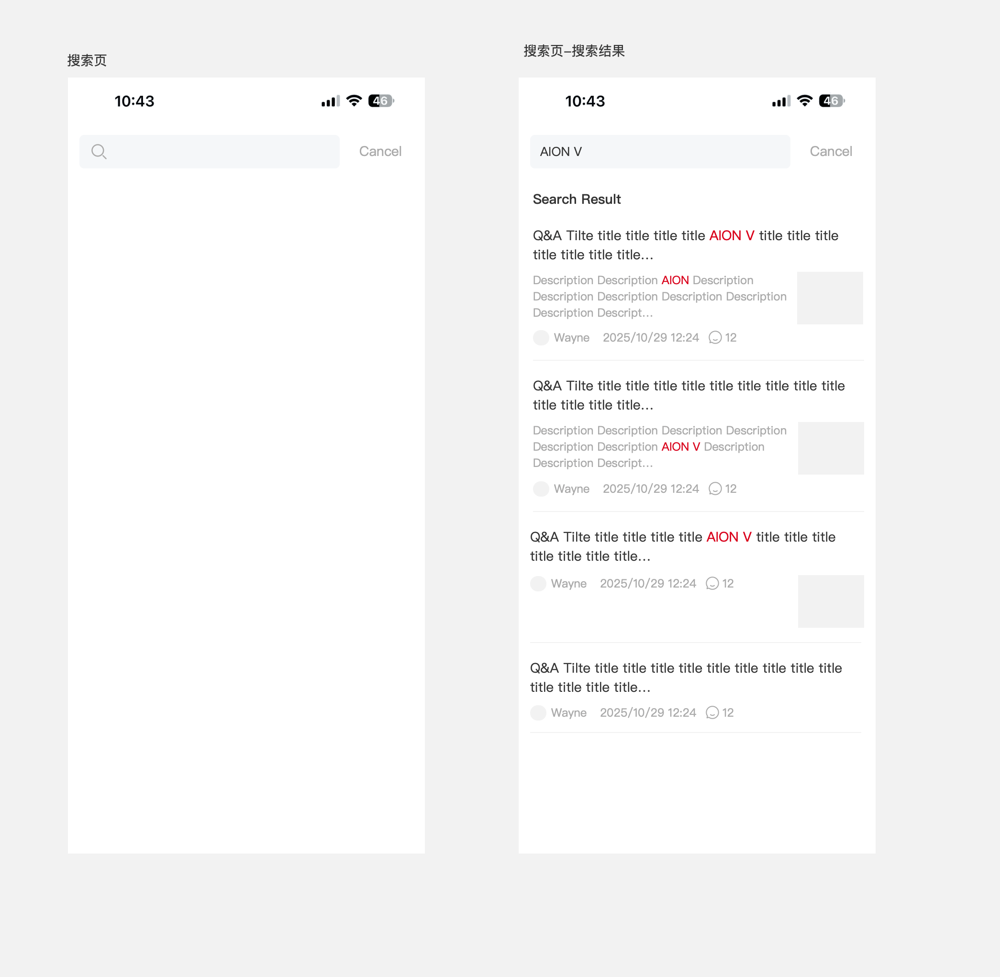
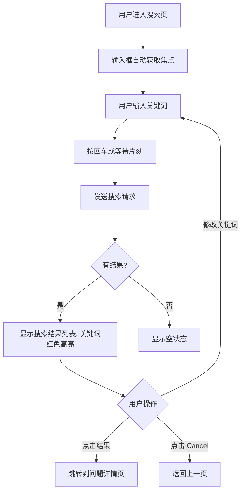

# 5.5 搜索

> 层级：在线工程师层 | 优先级：P1
>
> **原型**：

## 5.5.1 功能概述

| 字段 | 内容 |
|------|------|
| 功能描述 | 用户通过关键词搜索问题，结果高亮匹配词 |
| 用户故事 | 作为车主，我希望搜索与我的车型或问题相关的已有问答，以便快速找到答案 |
| 涉及角色 | 所有角色（含游客） |
| 前置条件 | 用户从首页点击搜索图标进入 |
| 后置条件 | 无 |
| 优先级 | P1 |
| 实现技术 | **Flutter 原生**（GAC APP 内嵌页面） |
| 依赖功能 | 5.2 圈子首页 |
| 原型链接 | [搜索页](../../asset/prototype/搜索页.png) |

## 5.5.2 页面/界面描述

### 页面：搜索页

| 编号 | 元素名称 | 类型 | 默认值 | 约束/校验规则 | 交互行为 | 说明 |
|------|----------|------|--------|---------------|----------|------|
| E-01 | 搜索输入框 | 文本输入 | 空 | ≥1字符 | 提交表单 | 自动获取焦点，回车触发搜索 |
| E-02 | Cancel 按钮 | 按钮 | - | - | 跳转到 [上一页] | 右侧 |
| E-03 | "Search Result" 标题 | 文本 | - | - | - | 有结果时显示 |
| E-04 | 搜索结果卡片 | 卡片组件 | - | - | 跳转到 [问题详情页] | - |

**搜索结果卡片结构**：

| 子元素 | 说明 |
|--------|------|
| 问题标题 | 关键词红色高亮，最多2行 |
| 问题描述摘要 | 关键词红色高亮，最多3行，有则显示 |
| 缩略图 | 问题第一张图片，右侧显示，有则显示 |
| 提问者头像 | 小圆形 |
| 提问者昵称 | 如 "Car Owner" |
| 发布时间 | 相对时间，如 "2 days ago" |
| 回答数 | 气泡图标 + 数字 |

## 5.5.3 交互逻辑



## 5.5.4 业务规则

- BR-5.5-01: 搜索范围为问题标题和问题内容（不含回答内容）
- BR-5.5-02: 搜索关键词在标题和描述中以红色高亮显示，使用 `<em class="highlight">` 包裹
- BR-5.5-03: 仅搜索 `review_status = APPROVED` 且 `public_status = PUBLIC` 的问题（即审核通过且公开状态为公开）
- BR-5.5-04: 搜索结果按相关性排序，Elasticsearch function_score 配置：
  - `query`: `multi_match` 搜索 `title`（权重 3）和 `content`（权重 1）
  - `should`: 标题命中的分值贡献加成（`title^3, content^1`）；意图紧密度补偿（词序一致性，`slop: 2`）
  - `functions`: ① `gauss` 时间衰减（`created_at`，365天衰减至0.5）；② `field_value_factor` 回答数（factor=0.1，modifier=log1p）
  - `score_mode`: sum，`boost_mode`: multiply
  - 即：基础相关性分 × 时间衰减 × 社交活跃度加成
- BR-5.5-05: 搜索结果每次加载 20 条，支持无限滚动（使用 cursor 分页避免数据漂移）
- BR-5.5-06: 搜索结果卡片中的缩略图取问题的第一张图片
- BR-5.5-07: 搜索引擎实现：主搜索使用 Elasticsearch（详见 技术架构.md 6.3）；ES 故障时自动降级为 MySQL `LIKE` 查询，降级模式下最多返回 100 条结果，并通过 HTTP Response Header `X-Search-Mode: degraded` 通知前端展示提示

## 5.5.5 边界与异常处理

| 编号 | 场景 | 触发条件 | 系统行为 | 用户提示 | 恢复方式 |
|------|------|----------|----------|----------|----------|
| EX-5.5-01 | 无搜索结果 | 关键词无匹配 | 显示空状态 | "未找到相关问题" | 修改关键词 |
| EX-5.5-02 | 搜索失败 | 网络异常 | 显示错误提示 | "搜索失败，请重试" | 重试 |
| EX-5.5-03 | 关键词为空 | 用户未输入直接搜索 | 不发送请求 | - | 输入关键词 |
| EX-5.5-04 | ES 不可用 | Elasticsearch 集群故障 | 自动降级 MySQL LIKE | 顶部黄色提示 "搜索服务降级中，结果可能不全" | 等待恢复 |
| EX-5.5-05 | 关键词过长 | keyword.length > 100 | 截断到前 100 字符并搜索 | Toast "关键词过长，已自动截断" | - |

## 5.5.6 数据对象

> 搜索功能复用 5.2（Question）中定义的数据对象，无独立数据实体。

## 5.5.7 状态机

> 本模块无独立状态机。

## 5.5.8 通知/消息触发

> 本模块不涉及通知触发。

## 5.5.9 验收标准

**正常流程：**
- AC-5.5-01: **Given** 用户进入搜索页 **When** 输入"AION V"并搜索 **Then** 显示包含"AION V"的问题列表，"AION V"以红色高亮
- AC-5.5-02: **Given** 搜索结果存在 **When** 点击某条结果 **Then** 跳转到该问题的详情页

**异常流程：**
- AC-5.5-03: **Given** 用户在搜索页 **When** 输入无匹配的关键词 **Then** 显示"未找到相关问题"

**边界测试：**
- AC-5.5-04: **Given** 搜索结果超过 20 条 **When** 滚动到底部 **Then** 自动加载下一页

## 5.5.10 API 契约

> 移动端接口，无需登录。使用 cursor 分页（GR-PAGE-01）。

| 接口 | 方法 | 路径 | 主要参数 | 返回 | 说明 |
|------|------|------|----------|------|------|
| 搜索问题 | GET | /api/v1/questions/search | keyword, cursor?, limit=20, groupId? | CursorPage\<SearchResultVO\> | 仅搜索 APPROVED 状态 |

**SearchResultVO 结构**：

```typescript
interface SearchResultVO {
  id: number;
  titleHighlight: string;      // 关键词以 <em class="highlight"> 包裹
  summaryHighlight?: string;   // 同上
  thumbnail?: string;          // 第一张图片缩略图
  author: UserBrief;           // 提问者信息
  relativeTime: string;        // 提问相对时间
  answerCount: number;
}
```

### 5.5.10.1 API 样例

**请求**

```http
GET /api/v1/questions/search?keyword=AION%20V%20%E6%95%85%E9%9A%9C%E7%81%AF&limit=20
```

**响应（成功）**：

```json
{
  "code": 0,
  "data": {
    "list": [
      {
        "id": 12345,
        "titleHighlight": "<em class=\"highlight\">AION V</em> 仪表盘出现<em class=\"highlight\">故障灯</em>怎么处理？",
        "summaryHighlight": "今天早上启动时发现仪表盘上有一个黄色<em class=\"highlight\">故障灯</em>...",
        "thumbnail": "https://cdn.example.com/community/prod/20260420/abc.jpg",
        "author": {
          "id": 67890,
          "nickname": "Car Owner",
          "avatar": "https://cdn.example.com/avatars/67890.png",
          "role": "CAR_OWNER",
          "officialInfo": null
        },
        "relativeTime": "2 days ago",
        "answerCount": 6
      }
    ],
    "nextCursor": "eyJzY29yZSI6MC44LCJpZCI6MTIzNDV9",
    "hasMore": true
  },
  "traceId": "trace-search-001",
  "timestamp": 1714123456789
}

> HTTP Response Header: `X-Search-Mode: elasticsearch`
```

**响应（无结果）**：

```json
{
  "code": 0,
  "data": { "list": [], "nextCursor": null, "hasMore": false },
  "traceId": "trace-search-002",
  "timestamp": 1714123466789
}
```

**响应（ES 降级）**：

```json
{
  "code": 0,
  "data": { "list": [/* ... */], "nextCursor": null, "hasMore": false },
  "traceId": "trace-search-003",
  "timestamp": 1714123476789
}

> HTTP Response Header: `X-Search-Mode: degraded`
> 前端收到 degraded 后展示顶部黄色提示："搜索服务降级中，结果可能不全"
```
