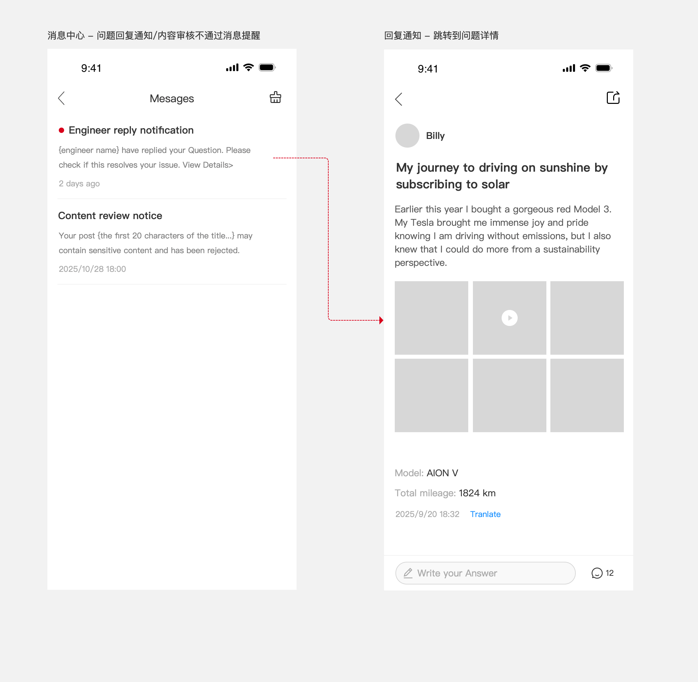
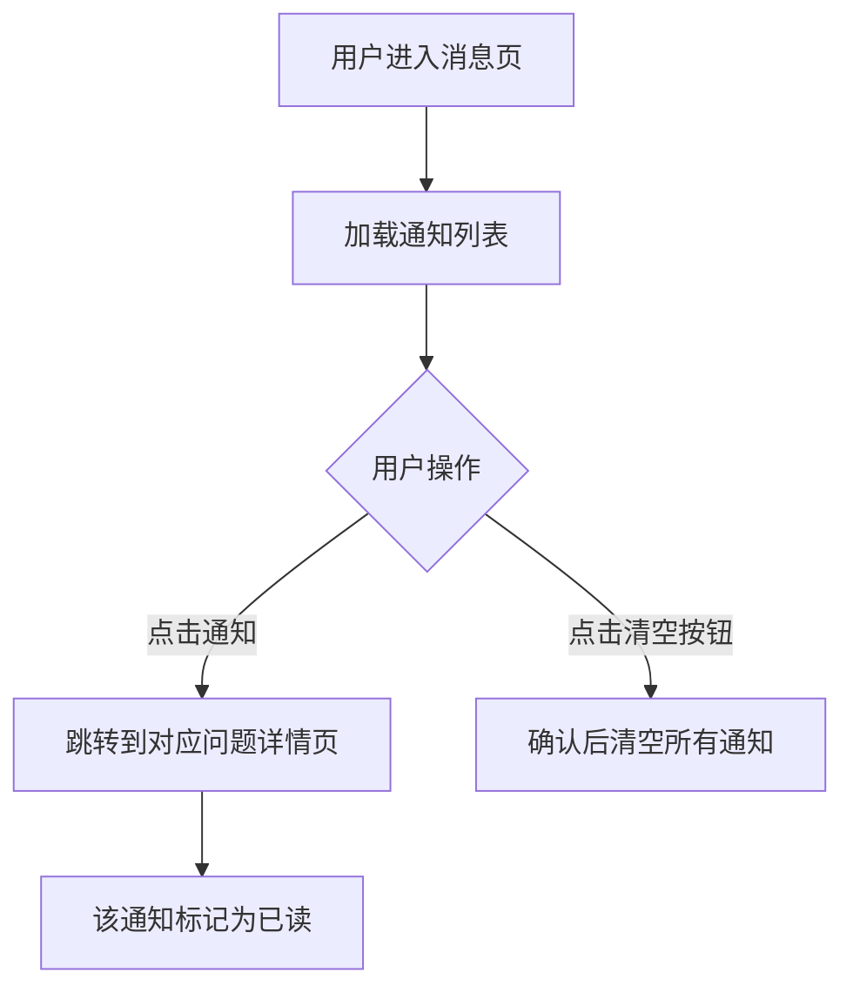

# 5.6 消息通知

> 层级：在线工程师层 | 优先级：P1
>
> **原型**：

## 5.6.1 功能概述

| 字段 | 内容 |
|------|------|
| 功能描述 | 用户查看工程师回复、回答采纳、审核结果等系统消息 |
| 用户故事 | 作为车主，我希望在工程师回答我的问题后收到通知，以便及时查看解答 |
| 涉及角色 | 普通用户、车主用户、授权车主 |
| 前置条件 | 用户已登录 |
| 后置条件 | 通知标记为已读 |
| 优先级 | P1 |
| 实现技术 | **Flutter 原生**（GAC APP 内嵌页面） |
| 依赖功能 | 5.4 问题详情 |
| 原型链接 | [消息通知](../../asset/prototype/消息通知.png) |

## 5.6.2 页面/界面描述

### 页面：消息列表页

| 编号 | 元素名称 | 类型 | 默认值 | 约束/校验规则 | 交互行为 | 说明 |
|------|----------|------|--------|---------------|----------|------|
| E-01 | 返回按钮 | 按钮 | - | - | 跳转到 [上一页] | 左上角 |
| E-02 | 页面标题 | 文本 | "Messages" | - | - | 居中 |
| E-04 | 通知卡片 | 列表项 | - | - | 跳转到 [对应详情] | - |

**通知卡片结构**：

| 子元素 | 说明 |
|--------|------|
| 未读标识 | 红色圆点，仅未读时显示 |
| 通知标题 | 加粗，如"Question replied" |
| 通知内容 | 灰色文字，如"{engineer name} has replied to your question. Please check if this resolves your issue. View Details>" |
| 时间 | 相对时间或具体时间 |

## 5.6.3 交互逻辑



## 5.6.4 业务规则

> ⚠️ **编号连续性说明**：BR-5.6-06（清空二次确认）于 v1.3.3 随清空功能移除，编号不复用。

- BR-5.6-01: 本模块产生的通知统一归类为系统消息（复用 APP 系统消息通道）
- BR-5.6-02: 未读通知标题前显示红色圆点
- BR-5.6-03: 点击通知后自动标记为已读
- BR-5.6-04: 通知按时间倒序排列（最新在最前）
- BR-5.6-05: 工程师回复通知内容模板："{engineer name} has replied to your question. Please check if this resolves your issue. View Details>"

## 5.6.5 边界与异常处理

| 编号 | 场景 | 触发条件 | 系统行为 | 用户提示 | 恢复方式 |
|------|------|----------|----------|----------|----------|
| EX-5.6-01 | 无通知 | 用户没有任何通知 | 显示空状态 | "暂无消息" | - |
| EX-5.6-02 | 通知关联的问题已删除 | 点击通知但问题不存在 | 显示提示 | "该问题已删除" | 返回消息列表 |

## 5.6.6 数据对象

**通知（Notification）**

| 字段 | 英文名 | 类型 | 必填 | 约束 | 说明 |
|------|--------|------|------|------|------|
| 通知ID | id | integer | 是 | 系统生成 | 主键 |
| 接收人ID | user_id | ref:User | 是 | 外键 | - |
| 类型 | type | enum | 是 | SYSTEM_MESSAGE | 统一为系统消息 |
| 标题 | title | string | 是 | - | - |
| 内容 | content | string | 是 | - | 支持模板变量 |
| 关联对象ID | target_id | integer | 否 | - | 如 question_id |
| 关联对象类型 | target_type | string | 否 | question / event / service | - |
| 是否已读 | is_read | boolean | 是 | 默认 false | - |
| 创建时间 | created_at | datetime | 是 | 系统生成 | - |

## 5.6.7 状态机

> 通知状态较简单（未读 → 已读），不单独绘制状态机。

## 5.6.8 通知/消息触发

| 触发事件 | 接收人 | 通知方式 | 通知内容模板 | 延迟 |
|----------|--------|----------|-------------|------|
| 官方号回答审核通过 | 提问者 | 系统消息 | "{engineer name} has replied to your question. Please check if this resolves your issue. View Details>" | 实时 |
| 问题审核驳回 | 提问者 | 系统消息 | "Your question has been rejected: {reason}" | 实时 |
| 回答/评论审核驳回 | 作者 | 系统消息 | "Your reply has been rejected: {reason}" | 实时 |
| 回答被采纳 | 回答者 | 系统消息 | "Your answer has been accepted" | 实时 |

## 5.6.9 验收标准

**正常流程：**
- AC-5.6-01: **Given** 工程师回答了用户的问题 **When** 用户进入消息页 **Then** 显示一条工程师回复通知，带红色未读标识
- AC-5.6-02: **Given** 用户有未读通知 **When** 点击该通知 **Then** 跳转到对应问题详情页，红色未读标识消失

**边界测试：**
- AC-5.6-04: **Given** 通知对应的问题已被删除 **When** 点击通知 **Then** 提示"该问题已删除"

## 5.6.10 API 契约

> 移动端接口，需登录

| 接口 | 方法 | 路径 | 主要参数 | 返回 | 说明 |
|------|------|------|----------|------|------|
| 通知列表 | GET | /api/v1/notifications | page, pageSize | PageResult\<NotificationVO\> | 按时间倒序 |
| 未读数量 | GET | /api/v1/notifications/unread-count | - | {count} | 首页角标用 |
| 标记已读 | PUT | /api/v1/notifications/{id}/read | - | - | 单条标记 |
| 全部已读 | PUT | /api/v1/notifications/read-all | - | - | 批量标记 |

**NotificationVO 结构**：

```typescript
interface NotificationVO {
  id: number;
  type: 'SYSTEM_MESSAGE';
  title: string;
  content: string;             // 已填充模板变量
  isRead: boolean;
  targetId?: number;           // 关联对象 ID
  targetType?: 'question' | 'event' | 'service';
  createdAt: string;
}
```

### 5.6.10.1 API 样例

**请求：获取通知列表**

```http
GET /api/v1/notifications?cursor=&limit=20
Authorization: Bearer eyJhbGc...
```

**响应**：

```json
{
  "code": 0,
  "data": {
    "list": [
      {
        "id": 70001,
        "type": "SYSTEM_MESSAGE",
        "title": "Question replied",
        "content": "Wayne has replied to your question. Please check if this resolves your issue. View Details>",
        "isRead": false,
        "targetId": 12345,
        "targetType": "question",
        "createdAt": "2026-04-26T10:30:00Z"
      },
      {
        "id": 70002,
        "type": "SYSTEM_MESSAGE",
        "title": "Question rejected",
        "content": "Your question has been rejected: contains sensitive words",
        "isRead": true,
        "targetId": 12300,
        "targetType": "question",
        "createdAt": "2026-04-25T08:15:00Z"
      }
    ],
    "nextCursor": "eyJpZCI6NzAwMDB9",
    "hasMore": true
  },
  "traceId": "trace-noti-001",
  "timestamp": 1714123456789
}
```

**请求：未读数量**

```http
GET /api/v1/notifications/unread-count
Authorization: Bearer eyJhbGc...
```

**响应**：

```json
{ "code": 0, "data": { "count": 3 }, "traceId": "trace-noti-002", "timestamp": 1714123456789 }
```

