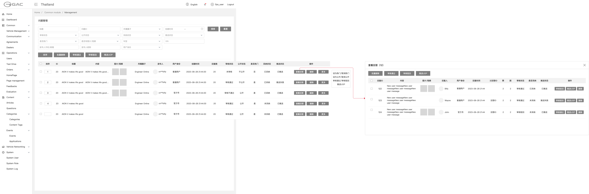
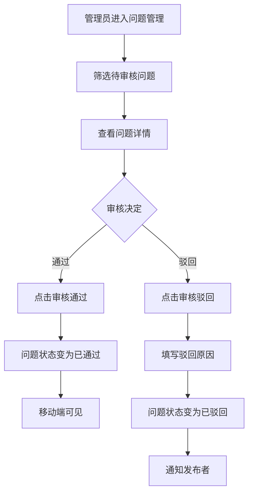
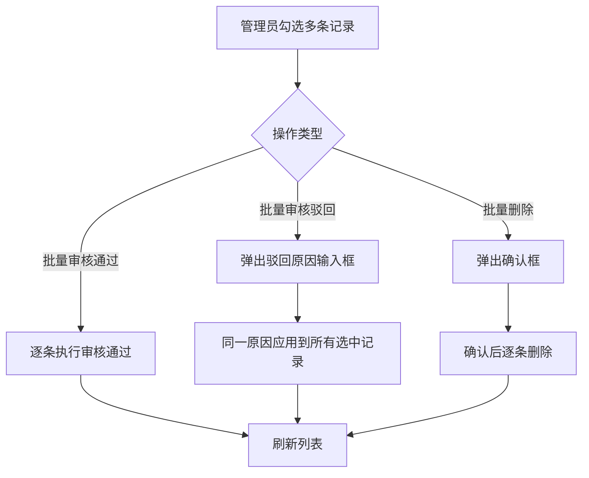

# 5.7 问题管理（后台）

> 层级：平台层 | 优先级：P0
>
> **原型**：

## 5.7.1 功能概述

| 字段 | 内容 |
|------|------|
| 功能描述 | 后台管理员对问题进行审核、管理（热门/公开状态/删除），支持批量操作 |
| 用户故事 | 作为管理员，我希望审核用户发布的问题，管理内容质量，以便社区保持专业和合规 |
| 涉及角色 | 后台管理员 |
| 前置条件 | 管理员已登录后台管理系统 |
| 后置条件 | 审核结果实时影响移动端内容展示；驳回时通知发布者 |
| 优先级 | P0 |
| 实现技术 | 运营管理后台（Vue 3 + Ant Design Vue） |
| 依赖功能 | 5.1 圈子管理、5.2 圈子首页 |
| 原型链接 | [问题管理](../../asset/prototype/问题管理.png) |

---

## 5.7.2 页面/界面描述

### 页面 A：问题管理列表页

**页面元素清单 — 筛选区**：

| 编号 | 元素名称 | 类型 | 默认值 | 约束/校验规则 | 交互行为 | i18n key | 说明 |
|------|----------|------|--------|---------------|----------|----------|------|
| E-A-01 | 标题 | 文本输入 | 空 | - | 筛选列表 | `admin.question.filter.title` | 模糊匹配 |
| E-A-02 | 问题ID | 文本输入 | 空 | 数字 | 筛选列表 | `admin.question.filter.id` | 精确匹配 |
| E-A-03 | 所属圈子 | 单选下拉 | 全部 | - | 筛选列表 | `admin.question.filter.group` | 圈子列表 |
| E-A-04 | 创建时间 | 日期范围选择 | 空 | - | 筛选列表 | `admin.question.filter.create_time` | 起止时间 |
| E-A-05 | 审核状态 | 单选下拉 | 全部 | 待审核/已通过/已驳回 | 筛选列表 | `admin.question.filter.review_status` | - |
| E-A-06 | 是否公开 | 单选下拉 | 全部 | 公开/不公开 | 筛选列表 | `admin.question.filter.public_status` | 对应 `is_public` 字段 |
| E-A-07 | 采纳状态 | 单选下拉 | 全部 | 未采纳/已采纳 | 筛选列表 | `admin.question.filter.accept_status` | - |
| E-A-08 | 推送状态 | 单选下拉 | 全部 | 未推送/已推送/推送失败/更新失败 | 筛选列表 | `admin.question.filter.sync_to_uop_status` | UOP 同步状态 |
| E-A-09 | 是否热门 | 单选下拉 | 全部 | 是/否 | 筛选列表 | `admin.question.filter.is_hot` | - |
| E-A-10 | 是否有图片/视频 | 单选下拉 | 全部 | 是/否 | 筛选列表 | `admin.question.filter.has_media` | - |
| E-A-11 | 车型 | 单选下拉 | 全部 | - | 筛选列表 | `admin.question.filter.vehicle` | 车型管理创建的所有车型年款+年份（过滤已删除） |
| E-A-12 | VIN | 文本输入 | 空 | - | 筛选列表 | `admin.question.filter.vin` | 精确匹配 |
| E-A-13 | 发布人手机/邮箱 | 文本输入 | 空 | - | 筛选列表 | `admin.question.filter.poster_contact` | 精确搜索 |
| E-A-14 | 发布人昵称 | 文本输入 | 空 | - | 筛选列表 | `admin.question.filter.poster_nickname` | 精确搜索 |
| E-A-15 | 用户身份 | 单选下拉 | 全部 | 普通用户/官方号 | 筛选列表 | `admin.question.filter.poster_role` | - |
| E-A-16 | 搜索按钮 | 按钮 | - | - | 提交表单 | `common.btn_search` | - |
| E-A-17 | 重置按钮 | 按钮 | - | - | 提交表单 | `common.btn_reset` | 清空筛选条件 |

**页面元素清单 — 批量操作区**：

| 编号     | 元素名称   | 类型  | 约束/校验规则 | 交互行为 | i18n key                                                   | 说明                    |
| ------ | ------ | --- | ------- | ---- | ---------------------------------------------------------- | --------------------- |
| E-A-18 | 批量按钮   | 按钮  | -       | 切换状态 | `admin.question.btn.batch_mode`                            | 进入多选模式                |
| E-A-19 | 自定按钮   | 按钮  | -       | 打开弹窗 | `admin.question.btn.customize_columns`                     | 自定义列显示                |
| E-A-20 | 排序     | 按钮  | 需选中至少1条 | 提交排序 | `admin.question.btn.batch_sort`                            | 输入排序数字，正数，按排序数字由小到大排序 |
| E-A-21 | 审核通过   | 按钮  | 需选中至少1条 | 提交表单 | `common.btn_approve`                                       | 绿色                    |
| E-A-22 | 审核驳回   | 按钮  | 需选中至少1条 | 打开弹窗 | `common.btn_reject` / `admin.question.field.reject_reason` | 橙色，需填写驳回原因            |
| E-A-23 | 批量删除   | 按钮  | 需选中至少1条 | 打开弹窗 | `admin.question.btn.batch_delete`                          | 红色，二次确认               |
| E-A-24 | 推送到UOP | 按钮  | 需选中至少1条 | 提交表单 | `admin.question.btn.batch_push_uop`                        | 通过UOP问题推送接口同步到UOP     |

**页面元素清单 — 数据表格**：

| 列名 | 类型 | i18n key | 说明 |
|------|------|----------|------|
| 复选框 | 复选框 | - | 批量操作选择 |
| 排序序号 | 数字 | `admin.question.field.sort_order` | 可编辑，正数，按排序数字由小到大排序 |
| 问题ID | 数字 | `admin.question.filter.id` | - |
| 标题 | 文本 | `admin.question.filter.title_content` | 截断显示 |
| 内容 | 文本 | `admin.question.field.content` | 截断显示 |
| 图片/视频 | 媒体缩略图 | `admin.question.field.media` | 点击查看大图/播放，多张时显示数量 |
| 所属圈子 | 文本 | `admin.question.filter.group` | 如 "Engineer Online" |
| 发布人 | 用户卡片 | `admin.question.filter.poster` | 头像+昵称 |
| 用户身份 | 状态标签 | `admin.question.field.poster_role` | 普通用户 / 官方号 |
| 创建时间 | 日期时间 | `admin.question.filter.publish_time` | - |
| 审核状态 | 状态标签 | `admin.question.filter.review_status` | 待审核/已通过/已驳回，颜色区分 |
| 是否公开 | 状态标签 | `admin.question.filter.public_status` | 公开/不公开，对应 `is_public` 字段 |
| 采纳状态 | 状态标签 | `admin.question.filter.accept_status` | 未采纳/已采纳 |
| 推送状态 | 状态标签 | `admin.question.filter.sync_to_uop_status` | 未推送/已推送/推送失败/更新失败 |
| 是否热门 | 开关/文本 | `admin.question.filter.is_hot` | 管理员标记，算法加权 |
| 回复数 | 数字 | `admin.question.field.reply_count` | 可点击查看回复面板 |
| 操作 | 按钮组 | `common.btn_view` / `common.btn_delete` / `admin.question.btn.view_replies` / `admin.question.btn.set_hot` / `admin.question.btn.cancel_hot` / `admin.question.btn.set_public` / `admin.question.btn.cancel_public` / `common.btn_approve` / `common.btn_reject` / `admin.question.btn.push_uop` | 查看/删除/查看回复/设为热门/取消热门/设为公开/取消公开/审核通过/审核驳回/推送到UOP |

### 页面 B：查看回复面板（弹窗）

**页面元素清单 — 回复列表数据表格**：

| 列名 | 类型 | i18n key | 说明 |
|------|------|----------|------|
| 复选框 | 复选框 | - | 批量操作选择 |
| 回复ID | 数字 | `admin.answer.field.id` | - |
| 回复内容 | 文本 | `admin.question.field.content` | 截断显示 |
| 图片/视频 | 媒体缩略图 | `ask.field.images.label` | 点击查看大图/播放 |
| 回复人 | 用户卡片 | `admin.question.filter.poster` | 头像+昵称 |
| 用户身份 | 状态标签 | `admin.answer.filter.replier_type` | 普通用户 / 官方号 |
| 回复时间 | 日期时间 | `admin.answer.field.reply_time` | - |
| 父回答ID | 数字 | `admin.answer.field.parent_id` | 仅回复对象是回答时保存回答ID；一级回答该字段为空 |
| 审核状态 | 状态标签 | `admin.question.filter.review_status` | 待审核/已通过/已驳回 |
| 采纳状态 | 状态标签 | `admin.question.filter.accept_status` | 未采纳/已采纳 |
| 推送状态 | 状态标签 | `admin.question.filter.sync_to_uop_status` | 未推送/已推送/推送失败/更新失败 |
| 赞 | 数字 | `admin.answer.field.upvotes` | 被点赞数量 |
| 踩 | 数字 | `admin.answer.field.downvotes` | 被踩数量 |
| 操作 | 按钮组 | `common.btn_approve` / `common.btn_reject` / `common.btn_delete` | 审核通过/审核驳回/删除 |

**页面元素清单 — 回复操作区**：

| 编号     | 元素名称 | 类型  | 约束/校验规则 | 交互行为 | i18n key                                                   | 说明         |
| ------ | ---- | --- | ------- | ---- | ---------------------------------------------------------- | ---------- |
| E-C-01 | 批量按钮 | 按钮  | -       | 切换状态 | `admin.question.btn.batch_mode`                            | 进入多选模式     |
| E-C-02 | 审核通过 | 按钮  | 需选中至少1条 | 提交表单 | `common.btn_approve`                                       | 绿色         |
| E-C-03 | 审核驳回 | 按钮  | 需选中至少1条 | 打开弹窗 | `common.btn_reject` / `admin.question.field.reject_reason` | 橙色，需填写驳回原因 |
| E-C-04 | 批量删除 | 按钮  | 需选中至少1条 | 打开弹窗 | `admin.question.btn.batch_delete`                          | 红色，二次确认    |

**页面元素清单 — 面板信息**：

| 编号 | 元素名称 | 类型 | i18n key | 说明 |
|------|----------|------|----------|------|
| E-C-05 | 面板标题 | 文本 | - | "查看回复 (N)" 显示回复总数 |
| E-C-06 | 关闭按钮 | 按钮 | `common.btn_close` | 关闭弹窗 |

---

## 5.7.3 交互逻辑

**问题审核流程**：



**批量操作流程**：



**页面跳转关系**：

| 起始页 | 触发动作 | 目标 | 说明 |
|--------|----------|------|------|
| 问题列表 | 点击"查看" | 右侧面板：问题详情 | 只读模式 |
| 问题列表 | 点击"查看回复" | 弹窗：查看回复面板 | 显示该问题的所有回复，支持审核和批量操作 |
| 问题列表 | 点击"推送到UOP" | 提交同步请求 | 将问题同步到UOP系统 |

---

## 5.7.4 业务规则

> ⚠️ **编号连续性说明**：BR-5.7-05（代发问题）、BR-5.7-06（早期驳回原因必填）于 v1.4.0 随"发表问题"功能整体移除，编号不复用。当前"驳回原因必填"规则编号为 BR-5.7-07。

- BR-5.7-01: 问题列表默认按排序序号升序、创建时间倒序排列；排序数字为正数，按排序数字由小到大排序，排序规则：排序数字 > 创建时间倒序
- BR-5.7-02: 发布人手机号/邮箱脱敏显示（中间字符替换为 ***）
- BR-5.7-03: 热门操作：标记为热门的问题在移动端列表中获得更高排序权重
- BR-5.7-04: 公开状态控制：取消公开后问题在移动端不可见，但后台仍可管理；设为公开后恢复移动端可见
- BR-5.7-07: 审核驳回时必须填写驳回原因
- BR-5.7-08: 所有管理操作记录操作日志（操作人、时间、操作类型、对象、变更前后值）
- BR-5.7-09: 批量操作一次最多选择 100 条
- BR-5.7-10: 删除操作需二次确认，不可撤销
- BR-5.7-11: 推送到UOP：通过UOP问题推送接口将问题同步到UOP，推送状态在列表中实时显示
- BR-5.7-12: 查看回复弹窗中，回复列表支持单条审核和批量审核（通过/驳回/删除），批量操作一次最多选择100条
- BR-5.7-13: 一级回答的父回答ID为空；二级回复的父回答ID为被回复的回答ID

---

## 5.7.5 边界与异常处理

| 编号 | 场景 | 触发条件 | 系统行为 | 用户提示 | 恢复方式 |
|------|------|----------|----------|----------|----------|
| EX-5.7-01 | 并发审核冲突 | 问题已被其他管理员审核或两个管理员同时操作 | 先提交者生效 | 后提交者提示"该记录已被处理" | 刷新列表 |
| EX-5.7-02 | 批量操作超限 | 选中超过100条 | 拒绝操作 | "单次批量操作最多100条" | 减少选中数量 |
| EX-5.7-03 | UOP推送失败 | UOP接口异常或网络超时 | 记录推送失败状态，允许重试 | "推送失败，请稍后重试" | 点击重新推送 |
| EX-5.7-04 | 排序序号冲突 | 多个问题使用相同排序序号 | 按创建时间倒序作为次级排序 | 无提示，列表正常展示 | 无需恢复 |
| EX-5.7-05 | 查看回复弹窗并发审核 | 回复已被其他管理员审核 | 先提交者生效 | 后提交者提示"该回复已被处理" | 刷新回复列表 |

---

## 5.7.6 数据对象

复用 5.2（Question）中定义的实体。

**审核日志（AuditLog）**

| 字段 | 英文名 | 类型 | 必填 | 约束 | 说明 |
|------|--------|------|------|------|------|
| 日志ID | id | integer | 是 | 系统生成 | 主键 |
| 操作人ID | operator_id | ref:User | 是 | 外键 | 管理员 |
| 操作类型 | action_type | enum | 是 | APPROVE / REJECT / DELETE / HOT / UNHOT / SET_PUBLIC / SET_UNPUBLIC | - |
| 目标对象类型 | target_type | enum | 是 | QUESTION / ANSWER / GROUP | - |
| 目标对象ID | target_id | integer | 是 | - | - |
| 变更前值 | before_value | string | 否 | JSON | 变更前的字段值 |
| 变更后值 | after_value | string | 否 | JSON | 变更后的字段值 |
| 备注 | remark | string | 否 | - | 如驳回原因 |
| 操作时间 | created_at | datetime | 是 | 系统生成 | - |

---

## 5.7.7 状态机

> 复用 5.2.7 中定义的 Question 状态机。后台管理操作（审核、热门、公开状态、删除）均为状态转换的触发动作。

## 5.7.8 通知/消息触发

| 触发事件 | 接收人 | 通知方式 | 通知内容模板 | 延迟 |
|----------|--------|----------|-------------|------|
| 问题审核驳回 | 提问者 | 站内通知 | "Your question has been rejected: {reason}" | 实时 |
| 问题被删除 | 提问者 | 站内通知 | "Your question has been removed" | 实时 |

## 5.7.9 验收标准

**正常流程：**
- AC-5.7-01: **Given** 有 3 条待审核问题 **When** 管理员筛选审核状态为"待审核" **Then** 列表显示这 3 条问题
- AC-5.7-02: **Given** 管理员查看某问题 **When** 点击审核通过 **Then** 审核状态变为"已通过"，移动端可见该问题
- AC-5.7-03: **Given** 管理员审核驳回某问题 **When** 填写驳回原因并提交 **Then** 问题状态变为"已驳回"，发布者收到通知
- AC-5.7-04: **Given** 管理员在问题管理 **When** 将某问题设为热门 **Then** 该问题在移动端 Hot Tab 获得更高排序权重
- AC-5.7-05: **Given** 管理员选中 5 条问题 **When** 点击"批量审核通过" **Then** 5 条问题全部变为已通过状态
- AC-5.7-06: **Given** 管理员点击某问题的"查看回复" **When** 弹窗打开 **Then** 显示该问题的所有回复列表，包含回复ID、内容、图片/视频、回复人、用户身份、回复时间、父回答ID、审核状态、采纳状态、推送状态、赞、踩
- AC-5.7-07: **Given** 管理员在查看回复弹窗中选中 3 条回复 **When** 点击"批量审核通过" **Then** 3 条回复全部变为已通过状态
- AC-5.7-08: **Given** 管理员通过批量排序调整某问题的排序序号 **When** 输入正数并保存 **Then** 列表按排序序号由小到大重新排列
- AC-5.7-09: **Given** 管理员选中 2 条问题 **When** 点击"推送到UOP" **Then** 问题同步到UOP，推送状态变为"已推送"
- AC-5.7-10: **Given** 管理员点击某问题的"删除" **When** 确认删除 **Then** 问题被删除，列表刷新，该问题不可恢复

**异常流程：**
- AC-5.7-11: **Given** 问题已被管理员 A 审核通过 **When** 管理员 B 尝试审核同一问题 **Then** 提示"该问题已被审核"
- AC-5.7-12: **Given** UOP推送接口异常 **When** 管理员点击"推送到UOP" **Then** 推送状态变为"推送失败"，提示"推送失败，请稍后重试"

**边界测试：**
- AC-5.7-13: **Given** 管理员选中 101 条记录 **When** 点击批量删除 **Then** 提示"单次批量操作最多100条"
- AC-5.7-14: **Given** 管理员审核通过一条问题 **When** 查看系统日志 **Then** 记录包含操作人、时间、操作类型、问题ID
- AC-5.7-15: **Given** 管理员在查看回复弹窗中 **When** 对一级回答和二级回复进行操作 **Then** 一级回答父回答ID为空，二级回复父回答ID为被回复的回答ID

## 5.7.10 API 契约

> 管理后台接口，需 `@SaCheckPermission("question:audit:any")` 或 `@SaCheckRole("ADMIN")` 鉴权

| 接口 | 方法 | 路径 | 主要参数 | 返回 | 说明 |
|------|------|------|----------|------|------|
| 问题列表 | GET | /api/v1/admin/questions | keyword, questionId, groupId, startDate, endDate, reviewStatus, isPublic, acceptStatus, syncToUopStatus, isHot, hasMedia, vehicleSeries, year, vin, posterPhone, posterEmail, posterNickname, posterRole, page, pageSize | PageResult\<AdminQuestionVO\> | 手机/邮箱脱敏 |
| 单条审核 | POST | /api/v1/admin/questions/{id}/audit | {action: 'APPROVE'\|'REJECT', reason?: string} | - | REJECT 时 reason 必填 |
| 批量审核 | POST | /api/v1/admin/questions/audit | {ids: number[], action, reason?} | {success: number, failed: number, failedItems: {id: number, reason: string}[]} | ids 长度 ≤ 100 |
| 热门/取消热门 | PUT | /api/v1/admin/questions/{id}/hot | {isHot: boolean} | - | - |
| 公开/取消公开 | PUT | /api/v1/admin/questions/{id}/public | {isPublic: boolean} | - | - |
| 推送到UOP | POST | /api/v1/admin/questions/{id}/push-uop | - | {syncToUopStatus: string} | 同步问题到UOP |
| 批量推送到UOP | POST | /api/v1/admin/questions/push-uop | {ids: number[]} | {success: number, failed: number, failedItems: {id: number, reason: string}[]} | ids 长度 ≤ 100 |
| 批量排序 | PUT | /api/v1/admin/questions/sort | {items: {id: number, sortOrder: number}[]} | - | 排序数字为正数 |
| 删除问题 | DELETE | /api/v1/admin/questions/{id} | - | - | 二次确认；同步 UOP；已采纳的问题仍可删除 |
| 查看回复面板 | GET | /api/v1/admin/questions/{id}/answers | reviewStatus?, acceptStatus?, syncToUopStatus?, page, pageSize | PageResult\<AdminAnswerVO\> | 详见 5.8 |

### 5.7.10.1 API 样例

**请求：列表（筛选待审核）**

```http
GET /api/v1/admin/questions?reviewStatus=PENDING&page=1&pageSize=20
Authorization: Bearer admin-jwt
```

**响应**：

```json
{
  "code": 0,
  "data": {
    "list": [
      {
        "id": 12345,
        "sortOrder": 0,
        "title": "AION V 仪表盘出现故障灯怎么处理？",
        "summary": "今天早上启动时...",
        "groupName": "Engineer Online",
        "posterNickname": "on***My",
        "posterPhone": "138****1234",
        "posterEmail": "a***@gmail.com",
        "posterRole": "CAR_OWNER",
        "createdAt": "2026-04-26T10:30:00Z",
        "reviewStatus": "PENDING",
        "isPublic": true,
        "acceptStatus": "UNACCEPTED",
        "syncToUopStatus": "NOT_SYNCED",
        "isHot": false,
        "answerCount": 0,
        "viewCount": 12
      }
    ],
    "pagination": { "page": 1, "pageSize": 20, "total": 3, "totalPages": 1, "hasMore": false }
  },
  "traceId": "trace-adm-q-001",
  "timestamp": 1714123456789
}
```

**请求：批量审核驳回**

```http
POST /api/v1/admin/questions/audit
Authorization: Bearer admin-jwt
Content-Type: application/json

{
  "ids": [12345, 12346, 12347],
  "action": "REJECT",
  "reason": "含有不实信息"
}
```

**响应（部分失败）**：

```json
{
  "code": 0,
  "data": {
    "success": 2,
    "failed": 1,
    "failedItems": [
      { "id": 12347, "reason": "已被审核（先来后到）" }
    ]
  },
  "traceId": "trace-adm-q-002",
  "timestamp": 1714123466789
}
```

**响应（超过 100 条）**：

```json
{
  "code": 1001,
  "message": "单次批量操作最多 100 条",
  "data": { "field": "ids", "max": 100, "current": 101 },
  "traceId": "trace-adm-q-003",
  "timestamp": 1714123476789
}
```
