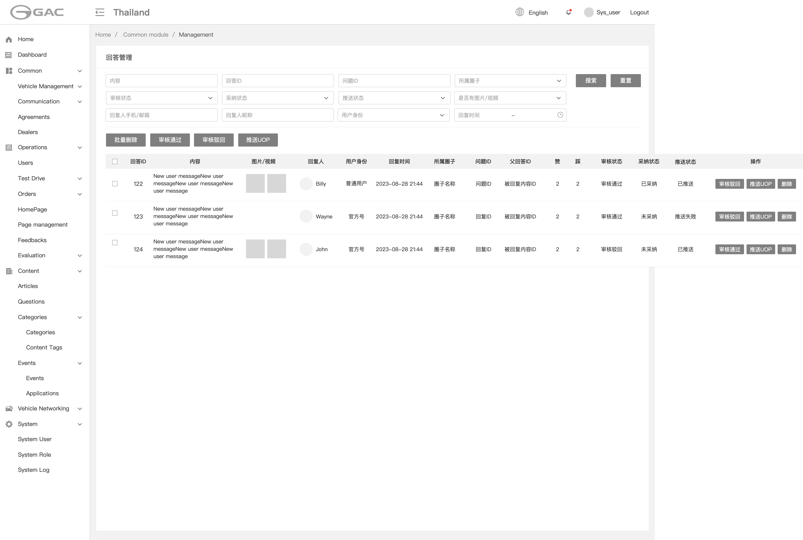
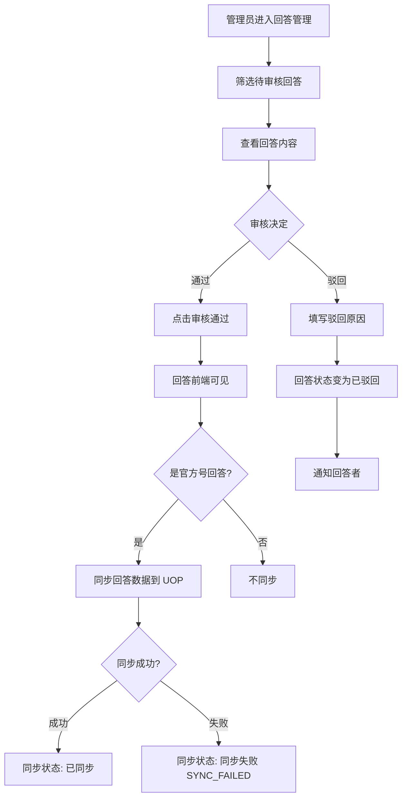
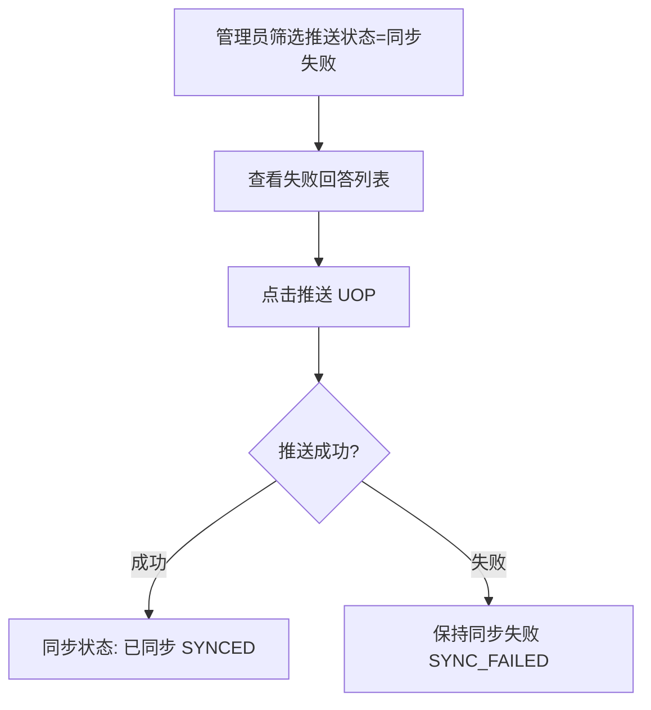
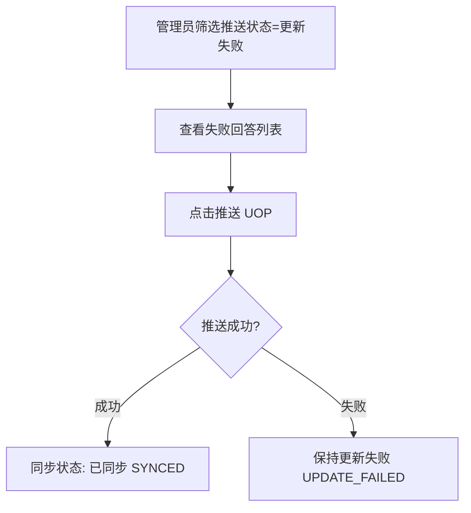
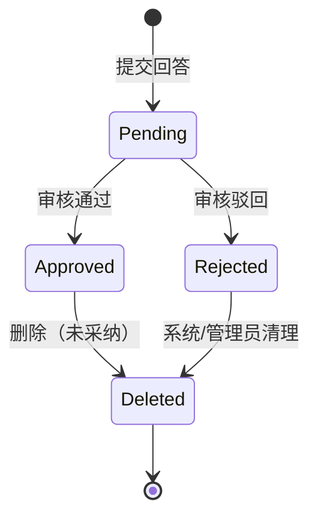
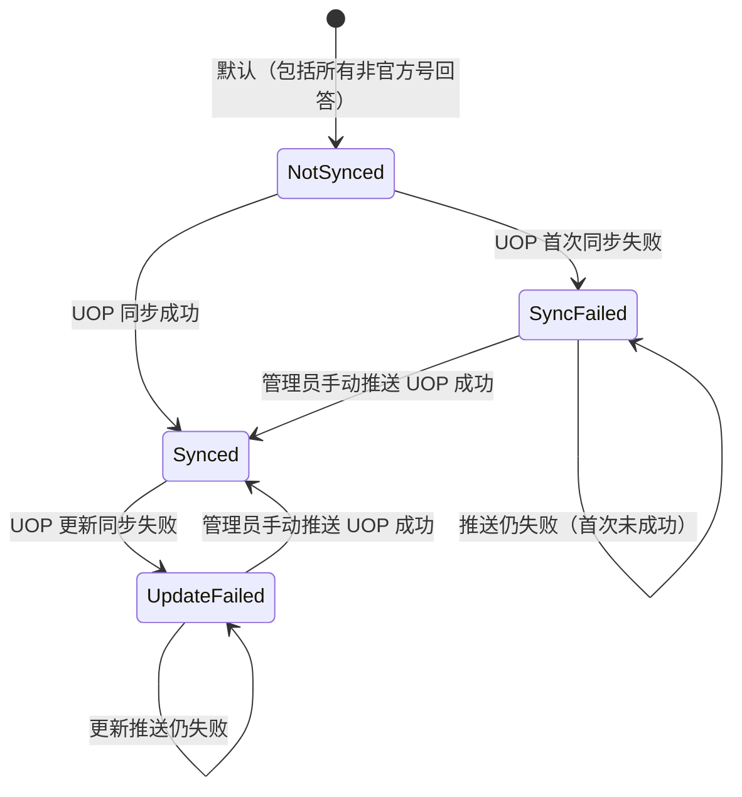

# 5.8 回答管理（后台）

> 层级：平台层 | 优先级：P0
>
> **原型**：

## 5.8.1 功能概述

| 字段 | 内容 |
|------|------|
| 功能描述 | 后台管理员对回答进行审核、管理 UOP 同步状态、查看采纳情况，支持批量操作 |
| 用户故事 | 作为管理员，我希望审核工程师和用户的回答，确保回答质量，并监控 UOP 同步状态 |
| 涉及角色 | 后台管理员 |
| 前置条件 | 管理员已登录后台管理系统 |
| 后置条件 | 审核通过的官方号回答自动同步到 UOP；驳回时通知回答者 |
| 优先级 | P0 |
| 实现技术 | 运营管理后台（Vue 3 + Ant Design Vue） |
| 依赖功能 | 5.1 圈子管理、5.4 问题详情、5.7 问题管理（管理后台） |
| 原型链接 | [回答管理](../../asset/prototype/回答管理.png) |

---

## 5.8.2 页面/界面描述

### 页面：回答管理列表页

**页面元素清单 — 筛选区**：

| 编号   | 元素名称     | 类型     | 默认值 | 约束/校验规则           | 交互行为 | 说明            |
| ---- | -------- | ------ | --- | ----------------- | ---- | ------------- |
| E-01 | 内容       | 文本输入   | 空   | -                 | 筛选列表 | 模糊匹配          |
| E-02 | 回复ID     | 文本输入   | 空   | 数字                | 筛选列表 | 精确匹配          |
| E-03 | 问题ID     | 文本输入   | 空   | 数字                | 筛选列表 | 精确匹配          |
| E-04 | 所属圈子     | 单选下拉   | 全部  | -                 | 筛选列表 | -             |
| E-05 | 审核状态     | 单选下拉   | 全部  | 待审核/通过/驳回         | 筛选列表 | -             |
| E-06 | 采纳状态     | 单选下拉   | 全部  | 已采纳/未采纳           | 筛选列表 | -             |
| E-07 | 回复人手机/邮箱 | 文本输入   | 空   | -                 | 筛选列表 | 精确搜索回复人手机号或邮箱 |
| E-08 | 回复人昵称    | 文本输入   | 空   | -                 | 筛选列表 | 精确搜索          |
| E-09 | 回复人身份    | 单选下拉   | 全部  | 普通用户/官方号          | 筛选列表 | -             |
| E-10 | 回复时间     | 日期范围选择 | 空   | -                 | 筛选列表 | 起止时间          |
| E-11 | 搜索按钮     | 按钮     | -   | -                 | 提交表单 | -             |
| E-12 | 重置按钮     | 按钮     | -   | -                 | 提交表单 | 清空条件          |
| E-13 | 推送状态     | 单选下拉   | 空   | 未推送/已推送/推送失败/更新失败 | 筛选列表 | 对应 NOT_SYNCED / SYNCED / SYNC_FAILED / UPDATE_FAILED |
| E-14 | 是否有图片/视频 | 单选下拉   | 空   | 有/无               | 筛选列表 | -             |

**页面元素清单 — 批量操作区**：

| 编号   | 元素名称  | 类型  | 约束/校验规则 | 交互行为 | 说明        |
| ---- | ----- | --- | ------- | ---- | --------- |
| E-13 | 批量删除  | 按钮  | 需选中至少1条 | 打开弹窗 | 二次确认      |
| E-14 | 审核通过  | 按钮  | 需选中至少1条 | 提交表单 |           |
| E-15 | 审核驳回  | 按钮  | 需选中至少1条 | 打开弹窗 |           |
| E-16 | 推送UOP | 按钮  | 需选中至少1条 | 提交表单 | 将回答同步到UOP |

**页面元素清单 — 数据表格**：

| 列名 | 类型 | 说明 |
|------|------|------|
| 复选框 | 复选框 | 批量操作选择 |
| 回复ID | 数字 | - |
| 内容 | 文本 | 截断显示 |
| 图片/视频 | 缩略图 | 点击查看大图 |
| 回复人 | 头像+昵称 | 头像缩略图 + 昵称 |
| 用户身份 | 文本 | 普通用户 / 官方号 Engineer / 官方号 Product Manager |
| 回复时间 | 日期时间 | - |
| 所属圈子 | 文本 | - |
| 问题ID | 数字 | 关联的问题ID |
| 父回答ID | 数字 | 仅回复对象是回答时保存回答ID；回答问题时（一级回答）该字段为空 |
| 审核状态 | 状态标签 | 审核通过（绿）/ 审核驳回（红） |
| 采纳状态 | 文本 | 已采纳 / 未采纳 |
| 推送状态 | 状态标签 | 未同步/ 已同步（绿）/ 同步失败（红）/ 更新失败 | 仅官方号回答有状态变化 |
| 赞 | 数字 | - |
| 踩 | 数字 | - |
| 操作 | 按钮组 | 审核通过/审核驳回/推送UOP/删除 |

---

## 5.8.3 交互逻辑

**回答审核与 UOP 同步流程**：



**同步失败重推流程**（`SYNC_FAILED`，首次推送未成功）：



**更新失败重推流程**（`UPDATE_FAILED`，非首次推送失败）：



**页面跳转关系**：

| 起始页 | 触发动作 | 目标 | 说明 |
|--------|----------|------|------|
| 回答管理 | 点击问题ID | 问题管理：定位到该问题 | 跨页导航 |
| 回答管理 | 点击父回答ID | 问题管理：定位到该问题的回复弹窗 | 跨页导航 |

---

## 5.8.4 业务规则

- BR-5.8-01: 回答列表默认按回复时间倒序排列
- BR-5.8-02: 官方号回答审核通过后，自动同步回答数据到 UOP 系统
- BR-5.8-03: UOP 同步失败的回答，管理员可手动推送 UOP 重试
- BR-5.8-11: UOP 推送失败时按是否曾成功同步区分状态：**首次推送**失败（从未到达 `SYNCED`）标记为「同步失败」(`SYNC_FAILED`)；**非首次推送**失败（曾成功同步到 UOP，含内容更新、删除同步、管理员再次推送等）标记为「更新失败」(`UPDATE_FAILED`)
- BR-5.8-04: 已采纳的回答允许删除（删除后同步状态到 UOP，数据标识"已删除"）
- BR-5.8-05: 用户身份区分：普通用户、官方号 Engineer、官方号 Product Manager
- BR-5.8-06: 审核驳回时必须填写驳回原因
- BR-5.8-07: 所有管理操作记录操作日志
- BR-5.8-08: 批量操作一次最多选择 100 条
- BR-5.8-09: 删除操作需二次确认，不可撤销
- BR-5.8-10: 回复人手机号/邮箱脱敏显示

---

## 5.8.5 边界与异常处理

| 编号 | 场景 | 触发条件 | 系统行为 | 用户提示 | 恢复方式 |
|------|------|----------|----------|----------|----------|
| EX-5.8-01 | UOP 首次推送失败 | UOP 接口异常且从未成功同步 | 标记 `SYNC_FAILED` | 列表显示「同步失败」 | 管理员手动推送 UOP |
| EX-5.8-05 | UOP 更新推送失败 | UOP 接口异常且曾成功同步 | 标记 `UPDATE_FAILED` | 列表显示「更新失败」 | 管理员手动推送 UOP |
| EX-5.8-02 | 删除已采纳的回答 | 回答已被采纳 | 允许删除，同步 UOP | "回答已删除" | - |
| EX-5.8-03 | 并发审核冲突 | 两个管理员同时审核同一条 | 先提交者生效 | 后提交者提示"该记录已被处理" | 刷新列表 |
| EX-5.8-04 | 批量操作超限 | 选中超过100条 | 拒绝操作 | "单次批量操作最多100条" | 减少选中数量 |

---

## 5.8.6 数据对象

复用 5.4（Answer）和 5.7（AuditLog）中定义的实体。

---

## 5.8.7 状态机

> Answer 实体有两个独立状态字段：`review_status`（审核状态）和 `sync_to_uop_status`（UOP 同步状态）。审核通过后，仅当作者为官方号时才进入 UOP 同步流程；普通用户回答审核通过后无同步状态变化（保持 `NOT_SYNCED`）。推送失败时首次失败记 `SYNC_FAILED`，非首次失败记 `UPDATE_FAILED`（见 BR-5.8-11）。

### 5.8.7.1 审核状态机（`review_status`）



| 当前状态 | 目标状态 | 触发动作 | 允许角色 | 副作用 |
|----------|----------|----------|----------|--------|
| - | Pending | 用户/官方号提交回答 | 已登录有权限的用户 | 进入审核队列；调用 UOP 敏感词校验 |
| Pending | Approved | 审核通过 | 管理员 / 内容审核平台 | 移动端可见；若作者为官方号则触发 UOP 同步 |
| Pending | Rejected | 审核驳回 | 管理员 / 内容审核平台 | 站内通知回答者，含驳回原因 |
| Approved | Deleted | 删除 | 作者/管理员 | 移动端不可见；已采纳的回答也可删除（BR-5.8-04） |

### 5.8.7.2 UOP 同步状态机（`sync_to_uop_status`）



| 当前状态 | 目标状态 | 触发动作 | 允许角色 | 副作用 |
|----------|----------|----------|----------|--------|
| - | NOT_SYNCED | 回答创建（默认） | 系统 | 普通用户回答永远停在此状态 |
| NOT_SYNCED | SYNCED | 官方号回答 + review=Approved 时自动同步 | 系统自动 | 数据推送到 UOP |
| NOT_SYNCED | SYNC_FAILED | UOP 接口异常（首次推送） | 系统自动 | 列表显示「同步失败」；告警运营 |
| SYNCED | UPDATE_FAILED | UOP 接口异常（非首次/更新推送） | 系统自动 | 列表显示「更新失败」；告警运营 |
| SYNC_FAILED | SYNC_FAILED | UOP 推送仍失败（尚未成功同步） | 系统/管理员 | 保持「同步失败」 |
| SYNC_FAILED | SYNCED | 管理员点击「推送 UOP」且成功 | 管理员 | 数据推送到 UOP；记录操作日志 |
| UPDATE_FAILED | UPDATE_FAILED | UOP 更新推送仍失败 | 系统/管理员 | 保持「更新失败」 |
| UPDATE_FAILED | SYNCED | 管理员点击「推送 UOP」且成功 | 管理员 | 数据推送到 UOP；记录操作日志 |

### 5.8.7.3 状态组合矩阵

| review_status | sync_to_uop_status | 移动端可见 | UOP 已同步 | 备注 |
|--------------|-------------------|-----------|------------|------|
| Pending | NOT_SYNCED | ✗ | ✗ | 等待审核 |
| Approved | NOT_SYNCED | ✓ | ✗ | 普通用户回答；或官方号回答尚未触发同步 |
| Approved | SYNCED | ✓ | ✓ | 官方号回答的稳定终态 |
| Approved | SYNC_FAILED | ✓ | ✗ | 首次推送失败，等待管理员推送 UOP |
| Approved | UPDATE_FAILED | ✓ | ✓ | 更新推送失败，等待管理员推送 UOP |
| Rejected | NOT_SYNCED | ✗ | ✗ | 已驳回 |
| Deleted | * | ✗ | ✗ | 软删除 |

---

## 5.8.8 通知/消息触发

| 触发事件 | 接收人 | 通知方式 | 通知内容模板 | 延迟 |
|----------|--------|----------|-------------|------|
| 官方号回答审核通过 | 提问者 | 站内通知 + App Push（FCM） | "{engineer name} has replied to your question..." | 实时 |
| 回答审核驳回 | 回答者 | 站内通知 | "Your answer has been rejected: {reason}" | 实时 |

## 5.8.9 验收标准

**正常流程：**
- AC-5.8-01: **Given** 官方号工程师的回答待审核 **When** 管理员点击审核通过 **Then** 回答在移动端可见，数据同步到 UOP，同步状态显示"已同步"
- AC-5.8-02: **Given** 管理员审核驳回某回答 **When** 填写驳回原因并提交 **Then** 回答状态变为"已驳回"，回答者收到通知
- AC-5.8-03: **Given** 管理员筛选「同步失败」 **When** 点击推送 UOP 且成功 **Then** 状态更新为「已同步」；**When** 仍失败 **Then** 保持「同步失败」
- AC-5.8-08: **Given** 某回答曾成功同步到 UOP **When** 后续更新/删除同步失败 **Then** 推送状态为「更新失败」；管理员推送 UOP 仍失败时保持「更新失败」，成功则变为「已同步」

**异常流程：**
- AC-5.8-05: **Given** 回答已被管理员 A 审核 **When** 管理员 B 尝试审核同一回答 **Then** 提示"该记录已被处理"

**边界测试：**
- AC-5.8-06: **Given** 普通用户回复了问题 **When** 管理员审核通过 **Then** 回答前端可见，但不触发 UOP 同步（仅官方号回答同步）
- AC-5.8-07: **Given** 管理员选中 101 条 **When** 点击批量删除 **Then** 提示"单次批量操作最多100条"

## 5.8.10 API 契约

> 管理后台接口，需 `@SaCheckPermission("answer:audit:any")` 或 `@SaCheckRole("ADMIN")` 鉴权

| 接口       | 方法     | 路径                                | 主要参数                                                                                                                                                           | 返回                                                             | 说明                            |
| -------- | ------ | --------------------------------- | -------------------------------------------------------------------------------------------------------------------------------------------------------------- | -------------------------------------------------------------- | ----------------------------- |
| 回答列表     | GET    | /api/v1/admin/answers             | keyword, answerId, questionId, groupId, reviewStatus, isAccepted, replierPhone, replierEmail, replierNickname, replierType, startDate, endDate, page, pageSize | PageResult<AdminAnswerVO>                                      | 手机/邮箱脱敏                       |
| 单条审核     | POST   | /api/v1/admin/answers/{id}/audit  | {action: 'APPROVE'\|'REJECT', reason?: string}                                                                                                                 | -                                                              | REJECT 时 reason 必填            |
| 批量审核     | POST   | /api/v1/admin/answers/audit       | {ids: number[], action, reason?}                                                                                                                               | {success, failed, failedItems: {id: number, reason: string}[]} | ids 长度 ≤ 100                  |
| 删除回答     | DELETE | /api/v1/admin/answers/{id}        | -                                                                                                                                                              | -                                                              | 二次确认；同步 UOP；已采纳的也可删除          |
| 批量删除     | POST   | /api/v1/admin/answers/delete      | {ids: number[]}                                                                                                                                                | {success, failed, failedItems: {id: number, reason: string}[]} | ids 长度 ≤ 100；二次确认；逐条软删并同步 UOP |
| 推送到UOP   | POST   | /api/v1/admin/answers/{id}/push-uop | -                                                                                                                                                            | {syncToUopStatus}                                              | 官方号回答推送到 UOP；失败时按 BR-5.8-11 置 `SYNC_FAILED` 或 `UPDATE_FAILED` |
| 批量推送到UOP | POST   | /api/v1/admin/answers/push-uop    | {ids: number[]}                                                                                                                                                | {success, failed, failedItems: {id: number, reason: string}[]} | ids 长度 ≤ 100；逐条推送；失败项返回最终 `syncToUopStatus` |

### 5.8.10.1 API 样例

**请求：筛选同步失败**

```http
GET /api/v1/admin/answers?reviewStatus=APPROVED&syncToUopStatus=SYNC_FAILED&page=1&pageSize=20
Authorization: Bearer admin-jwt
```

**响应**：

```json
{
  "code": 0,
  "data": {
    "list": [
      {
        "id": 55001,
        "content": "您好，黄色故障灯通常表示...",
        "images": ["https://cdn.example.com/community/prod/20260420/img-9.jpg"],
        "replierAvatar": "https://cdn.example.com/avatar/wayne.jpg",
        "replierNickname": "Wayne",
        "replierType": "OFFICIAL_PM",
        "createdAt": "2026-04-26T10:35:00Z",
        "groupName": "Engineer Online",
        "questionId": 12345,
        "parentAnswerId": null,
        "reviewStatus": "APPROVED",
        "isAccepted": false,
        "syncToUopStatus": "SYNC_FAILED",
        "upvoteCount": 12,
        "downvoteCount": 1
      }
    ],
    "pagination": { "page": 1, "pageSize": 20, "total": 5, "totalPages": 1, "hasMore": false }
  },
  "traceId": "trace-adm-a-001",
  "timestamp": 1714123456789
}
```

**请求：推送到 UOP（单条）**

```http
POST /api/v1/admin/answers/55001/push-uop
Authorization: Bearer admin-jwt
```

**响应（成功）**：

```json
{
  "code": 0,
  "data": { "syncToUopStatus": "SYNCED" },
  "traceId": "trace-adm-a-002",
  "timestamp": 1714123466789
}
```

**响应（非官方号回答）**：

```json
{
  "code": 5005,
  "message": "仅官方号回答可推送到 UOP",
  "data": { "answerId": 55001, "replierType": "REGULAR" },
  "traceId": "trace-adm-a-003",
  "timestamp": 1714123476789
}
```

**响应（更新推送失败，曾成功同步）**：

```json
{
  "code": 5005,
  "message": "推送到 UOP 失败",
  "data": { "syncToUopStatus": "UPDATE_FAILED" },
  "traceId": "trace-adm-a-003b",
  "timestamp": 1714123476790
}
```

**请求：筛选更新失败**

```http
GET /api/v1/admin/answers?reviewStatus=APPROVED&syncToUopStatus=UPDATE_FAILED&page=1&pageSize=20
Authorization: Bearer admin-jwt
```

**请求：批量删除**

```http
POST /api/v1/admin/answers/delete
Authorization: Bearer admin-jwt
Content-Type: application/json

{
  "ids": [55001, 55002, 55003]
}
```

**响应**：

```json
{
  "code": 0,
  "data": {
    "success": 2,
    "failed": 1,
    "failedItems": [{ "id": 55003, "reason": "该记录已被处理" }]
  },
  "traceId": "trace-adm-a-004",
  "timestamp": 1714123486789
}
```

**请求：批量推送到 UOP**

```http
POST /api/v1/admin/answers/push-uop
Authorization: Bearer admin-jwt
Content-Type: application/json

{
  "ids": [55001, 55002]
}
```

**响应**：

```json
{
  "code": 0,
  "data": {
    "success": 2,
    "failed": 0,
    "failedItems": []
  },
  "traceId": "trace-adm-a-005",
  "timestamp": 1714123496789
}
```

