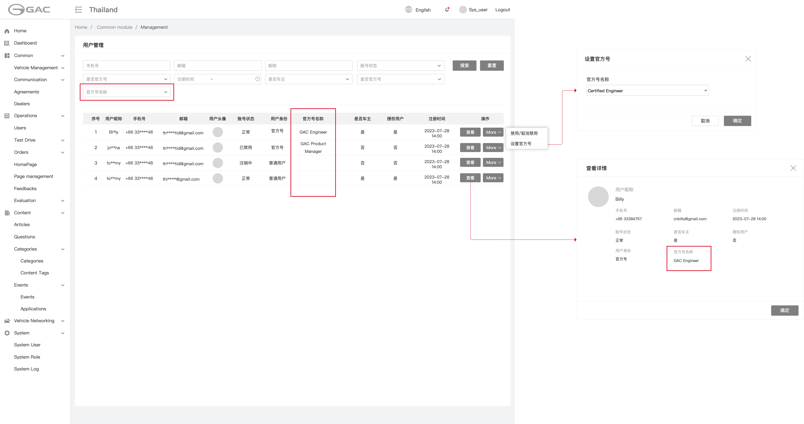
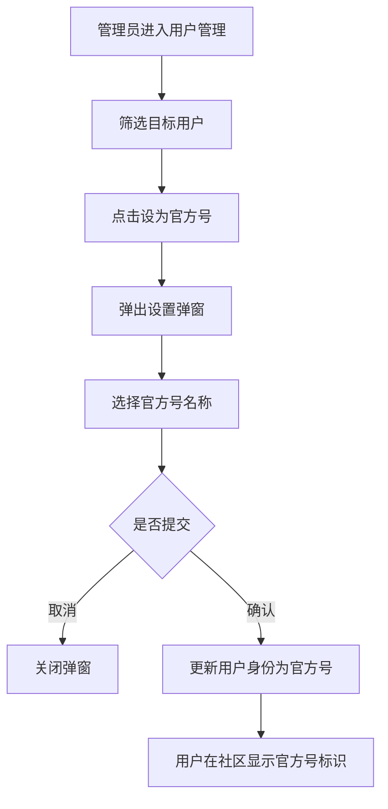
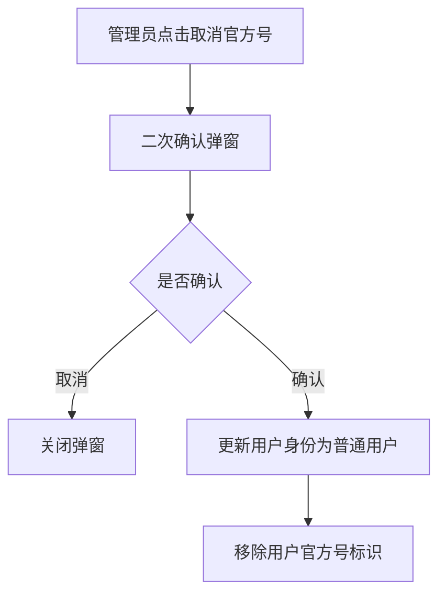
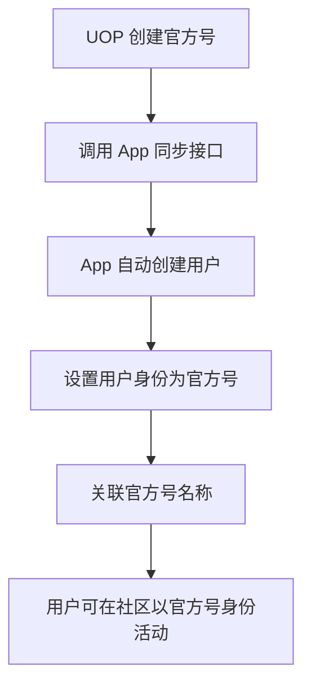
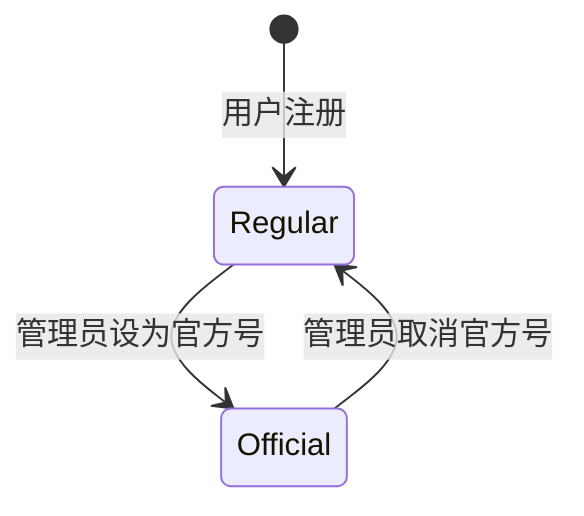

# 5.9 用户管理（后台）

> 层级：平台层 | 优先级：P0
>
> **原型**：

## 5.9.1 功能概述

| 字段 | 内容 |
|------|------|
| 功能描述 | 后台管理员查看用户列表、管理用户官方号身份，支持UOP官方号同步 |
| 用户故事 | 作为管理员，我希望查看平台用户列表，将指定用户设为官方号并分配官方号名称，以便管理社区中的官方认证账号 |
| 涉及角色 | 后台管理员 |
| 前置条件 | 管理员已登录后台管理系统 |
| 后置条件 | 设为官方号的用户在社区中显示官方号标识（GAC图标 + 官方号名称）；取消官方号后标识同步移除 |
| 优先级 | P0 |
| 实现技术 | 运营管理后台（Vue 3 + Ant Design Vue） |
| 依赖功能 | 5.1 圈子管理 |
| 原型链接 | [用户管理](../../asset/prototype/用户管理.png) |

---

## 5.9.2 页面/界面描述

### 页面：用户管理列表页

**页面元素清单 — 筛选区**：

| 编号   | 元素名称  | 类型     | 默认值 | 约束/校验规则  | 交互行为 | 说明                       |
| ---- | ----- | ------ | --- | -------- | ---- | ------------------------ |
| E-01 | 用户ID  | 文本输入   | 空   | 数字       | 筛选列表 | 精确匹配                     |
| E-02 | 昵称    | 文本输入   | 空   | -        | 筛选列表 | 模糊匹配                     |
| E-03 | 手机号   | 文本输入   | 空   | -        | 筛选列表 | 精确匹配，脱敏显示                |
| E-04 | 邮箱    | 文本输入   | 空   | -        | 筛选列表 | 精确匹配，脱敏显示                |
| E-05 | 官方号名称 | 单选下拉   | 全部  | -        | 筛选列表 | 读取字典 OfficialAccountName |
| E-06 | 用户身份  | 单选下拉   | 全部  | 普通用户/官方号 | 筛选列表 | -                        |
| E-07 | 注册时间  | 日期范围选择 | 空   | -        | 筛选列表 | 起止时间                     |
| E-08 | 搜索按钮  | 按钮     | -   | -        | 提交表单 | -                        |
| E-09 | 重置按钮  | 按钮     | -   | -        | 提交表单 | 清空条件                     |

**页面元素清单 — 数据表格**：

| 列名 | 类型 | 说明 |
|------|------|------|
| 用户ID | 数字 | - |
| 头像 | 缩略图 | 头像缩略图 |
| 昵称 | 文本 | - |
| 手机号 | 文本 | 脱敏显示 |
| 邮箱 | 文本 | 脱敏显示 |
| 用户身份 | 状态标签 | 普通用户 / 官方号 |
| 官方号名称 | 文本 | 仅官方号用户显示，读取字典 OfficialAccountName |
| 注册时间 | 日期时间 | - |
| 操作 | 按钮组 | 查看详情 / 设为官方号 / 取消官方号 |

---

## 5.9.3 交互逻辑

**设为官方号流程**：



**取消官方号流程**：



**UOP 官方号同步流程**：



---

## 5.9.4 业务规则

- BR-5.9-01: 用户列表默认按注册时间倒序排列
- BR-5.9-02: 官方号名称读取字典 `OfficialAccountName`，管理员不可随意输入
- BR-5.9-03: 设为官方号时必须选择官方号名称，不可为空
- BR-5.9-04: 取消官方号需二次确认，操作不可撤销（但可重新设为官方号）
- BR-5.9-05: UOP 同步创建的官方号用户，自动关联对应官方号名称
- BR-5.9-06: 用户身份变更后，历史内容（问题/回答）中的官方号标识同步更新
- BR-5.9-07: 所有管理操作记录操作日志
- BR-5.9-08: 手机号/邮箱脱敏显示，仅保留前三位和后四位，中间用 * 替代

---

## 5.9.5 边界与异常处理

| 编号 | 场景 | 触发条件 | 系统行为 | 用户提示 | 恢复方式 |
|------|------|----------|----------|----------|----------|
| EX-5.9-01 | 官方号名称字典为空 | 字典未配置 | 禁止设为官方号操作 | "请先配置官方号名称字典" | 联系系统管理员配置字典 |
| EX-5.9-02 | UOP 同步用户已存在 | oneID 已存在于 App | 更新现有用户为官方号 | - | - |
| EX-5.9-03 | 取消官方号后内容影响 | 用户已有官方号内容 | 取消后内容中的官方号标识同步移除 | "取消官方号将移除该用户所有官方号标识，是否确认？" | - |

---

## 5.9.6 数据对象

### User（扩展字段）

复用现有 User 实体，新增/调整字段：

| 字段 | 英文名 | 类型 | 必填 | 说明 |
|------|--------|------|------|------|
| 用户身份 | user_type | enum | 是 | `REGULAR` / `OFFICIAL` |
| 官方号名称编码 | official_name_code | string | 否 | 关联字典 OfficialAccountName 的编码值 |
| oneID | one_id | string | 否 | UOP 体系用户唯一标识 |

### OfficialAccount（UOP 同步）

| 字段 | 英文名 | 类型 | 必填 | 说明 |
|------|--------|------|------|------|
| oneID | one_id | string | 是 | UOP 用户唯一标识 |
| 昵称 | nickname | string | 是 | - |
| 手机号 | phone | string | 否 | - |
| 邮箱 | email | string | 否 | - |
| 头像 | avatar | string | 否 | CDN URL |
| 官方号名称编码 | official_name_code | string | 是 | 关联字典 |

---

## 5.9.7 状态机

### 用户身份状态机（`user_type`）



| 当前状态 | 目标状态 | 触发动作 | 允许角色 | 副作用 |
|----------|----------|----------|----------|--------|
| - | Regular | 用户注册 / UOP 同步非官方号 | 系统 | 默认身份 |
| Regular | Official | 管理员点击"设为官方号"并选择名称 | 管理员 | 用户内容同步显示官方号标识 |
| Official | Regular | 管理员点击"取消官方号" | 管理员 | 用户内容同步移除官方号标识 |

---

## 5.9.8 通知/消息触发

| 触发事件 | 接收人 | 通知方式 | 通知内容模板 | 延迟 |
|----------|--------|----------|-------------|------|
| 设为官方号 | 用户 | 站内通知 | "Your account has been verified as an official account" | 实时 |
| 取消官方号 | 用户 | 站内通知 | "Your official account status has been revoked" | 实时 |

---

## 5.9.9 验收标准

**正常流程：**
- AC-5.9-01: **Given** 管理员查看用户列表 **When** 筛选官方号名称 **Then** 列表正确显示匹配的用户
- AC-5.9-02: **Given** 普通用户 **When** 管理员点击设为官方号并选择名称 **Then** 用户身份变为官方号，列表显示官方号名称
- AC-5.9-03: **Given** UOP 新建官方号 **When** 同步到 App **Then** App 自动创建用户并设置为官方号

**异常流程：**
- AC-5.9-04: **Given** 字典 OfficialAccountName 为空 **When** 管理员点击设为官方号 **Then** 提示"请先配置官方号名称字典"
- AC-5.9-05: **Given** 官方号用户已有内容 **When** 管理员取消官方号 **Then** 二次确认后移除标识，历史内容同步更新

---

## 5.9.10 API 契约

> 管理后台接口，需 `@SaCheckPermission("user:manage:any")` 或 `@SaCheckRole("ADMIN")` 鉴权

| 接口 | 方法 | 路径 | 主要参数 | 返回 | 说明 |
|------|------|------|----------|------|------|
| 用户列表 | GET | /api/v1/admin/users | userId, nickname, phone, email, officialNameCode, userType, startDate, endDate, page, pageSize | PageResult<AdminUserVO> | 手机/邮箱脱敏 |
| 用户详情 | GET | /api/v1/admin/users/{id} | - | AdminUserDetailVO | 含官方号名称 |
| 设为官方号 | PUT | /api/v1/admin/users/{id}/official | { officialNameCode: string } | - | officialNameCode 必填 |
| 取消官方号 | DELETE | /api/v1/admin/users/{id}/official | - | - | 需二次确认 |
| UOP 同步官方号 | POST | /api/v1/admin/users/sync-official | OfficialAccountSyncDTO | { userId } | 内部接口，UOP 调用 |

### 5.9.10.1 API 样例

**请求：用户列表（筛选官方号）**

```http
GET /api/v1/admin/users?userType=OFFICIAL&page=1&pageSize=20
Authorization: Bearer admin-jwt
```

**响应**：

```json
{
  "code": 0,
  "data": {
    "list": [
      {
        "id": 88001,
        "nickname": "Wayne",
        "avatar": "https://cdn.example.com/avatar/wayne.jpg",
        "phone": "138****5678",
        "email": "wa***@example.com",
        "userType": "OFFICIAL",
        "officialNameCode": "ENGINEER_GAC",
        "officialName": "GAC Engineer",
        "createdAt": "2026-04-26T10:35:00Z"
      }
    ],
    "pagination": { "page": 1, "pageSize": 20, "total": 15, "totalPages": 1, "hasMore": false }
  },
  "traceId": "trace-adm-u-001",
  "timestamp": 1714123456789
}
```

**请求：设为官方号**

```http
PUT /api/v1/admin/users/88001/official
Authorization: Bearer admin-jwt
Content-Type: application/json

{
  "officialNameCode": "ENGINEER_GAC"
}
```

**请求：UOP 同步官方号**

```http
POST /api/v1/admin/users/sync-official
Authorization: Bearer uop-service-token
Content-Type: application/json

{
  "oneId": "uop-12345",
  "nickname": "Wayne",
  "phone": "13800135678",
  "email": "wayne@gac.com",
  "avatar": "https://cdn.example.com/avatar/wayne.jpg",
  "officialNameCode": "ENGINEER_GAC"
}
```

**响应（同步成功）**：

```json
{
  "code": 0,
  "data": { "userId": 88001 },
  "traceId": "trace-adm-u-002",
  "timestamp": 1714123466789
}
```

**响应（字典不存在）**：

```json
{
  "code": 5005,
  "message": "官方号名称不存在",
  "data": { "officialNameCode": "UNKNOWN_CODE" },
  "traceId": "trace-adm-u-003",
  "timestamp": 1714123476789
}
```
