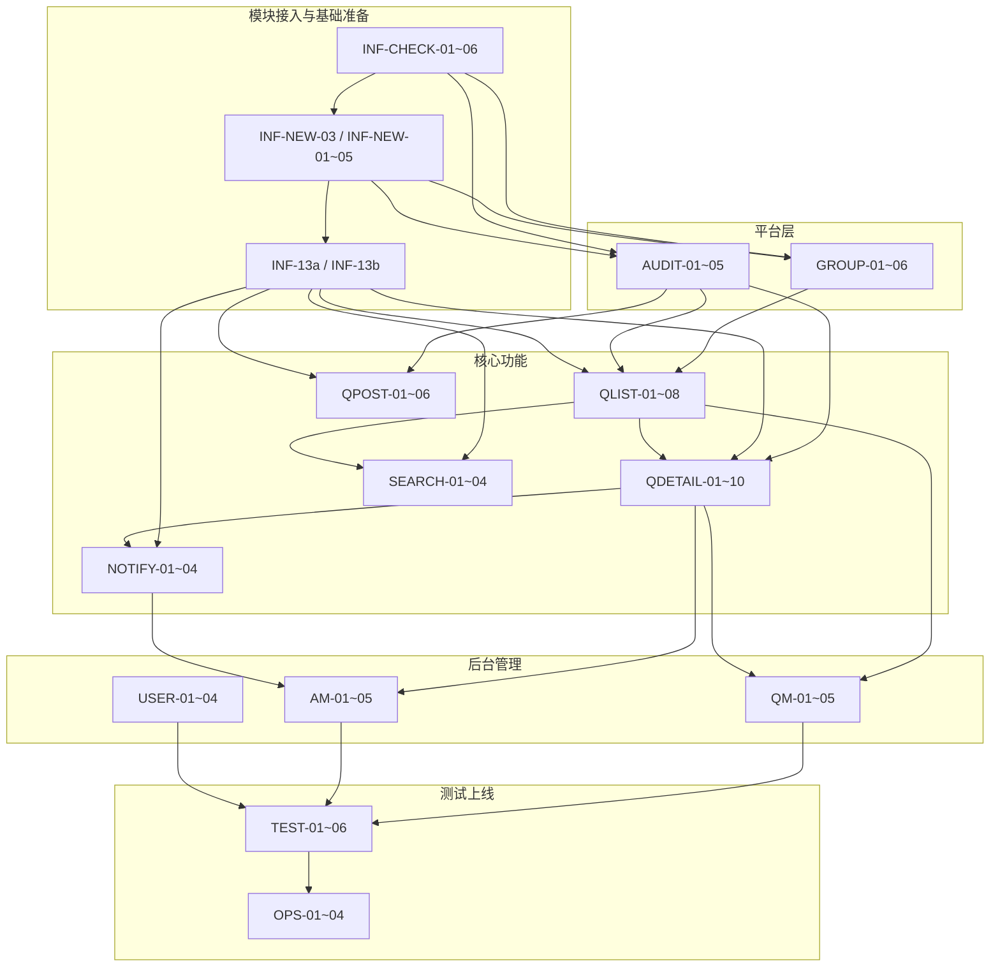

# Engineer Online — 开放任务清单

> **文档版本**: 1.4.1
> **更新日期**: 2026-05-13
> **关联文档**: `requirement/00-需求总览.md`, `standard/技术架构.md`, `standard/UI设计规范.md`, `requirement/modules/05.01~05.09`, `requirement/多语言文本.md`, `tasks/追溯矩阵.csv`, `.kiro/skills/*`
> **任务状态**: 🔴 未开始 / 🟡 进行中 / 🟢 已完成 / ⚪ 阻塞中
> **优先级**: P0(阻塞发布) / P1(重要功能) / P2(体验优化) / P3(未来版本)
>
> **Spec Coding 用法**：推荐按以下顺序工作：先在本表找到自己的任务，再打开对应 PRD 模块和支撑文档理解需求，最后在 Kiro 中用 `#` 选择对应角色 Skill 触发 AI 生成代码。
>
> **路径说明**：本表”输入文档”列若未显式带前缀，按以下规则解析：以 `global/` 开头或写成 `技术架构.md` / `UI设计规范.md` 的，映射到 `standard/`；写成 `05.xx-xxx.md` 的，映射到 `requirement/modules/`；其余默认相对于 `requirement/` 解析。给 AI 下达任务时，建议改写成仓库根目录路径。例如：`05.04-5.4.2节` = `requirement/modules/05.04-问题详情.md` 第 5.4.2 节，`global/技术架构.md 3.1节` = `standard/技术架构.md` 第 3.1 节，`UI设计规范.md4.6节` = `standard/UI设计规范.md` 第 4.6 节。
>
### 推荐执行步骤

1. 在本表找到任务编号、角色、依赖、输入文档和验收标准。
2. 打开对应模块 PRD，重点看页面描述、交互逻辑、业务规则、异常处理、数据对象、验收标准。
3. 回看 `00-需求总览.md`、`技术方案.md`、`技术架构.md`、`UI设计规范.md`、`多语言文本.md` 中与当前任务相关的章节。
4. 在 Kiro 中用 `#` 选择对应角色 Skill。
5. 将任务编号、目标模块、关键 BR / EX / AC、输出工件、自检要求整理成 prompt，交给 AI 生成首版代码或方案。

### 输入文档别名速查

| 简写 | 实际文件 |
|------|---------|
| `00-总览` | `requirement/00-需求总览.md` |
| `05.01` | `requirement/modules/05.01-圈子管理(管理后台).md` |
| `05.02` | `requirement/modules/05.02-圈子首页.md` |
| `05.03` | `requirement/modules/05.03-问题发布.md` |
| `05.04` | `requirement/modules/05.04-问题详情.md` |
| `05.05` | `requirement/modules/05.05-搜索.md` |
| `05.06` | `requirement/modules/05.06-消息通知.md` |
| `05.07` | `requirement/modules/05.07-问题管理（管理后台）.md` |
| `05.08` | `requirement/modules/05.08-回答管理（管理后台）.md` |
| `05.09` | `requirement/modules/05.09-用户管理（管理后台）.md` |
| `技术架构.md` | `standard/技术架构.md` |
| `UI设计规范.md` | `standard/UI设计规范.md` |
| `多语言文本.md` | `requirement/多语言文本.md` |
| `需求追溯.md` | `tasks/追溯矩阵.csv` |

### 按角色补读建议

| 角色 | 至少补读文档 |
|------|-------------|
| Flutter 前端 | `00-需求总览.md`（1.4 / 1.5 / 6）、`技术方案.md`（5）、`技术架构.md`（3.1 / 5 / 8 / 9）、`UI设计规范.md` 对应页面节、`多语言文本.md` |
| H5 前端 | `00-需求总览.md`（1.4 / 1.5 / 6）、`技术方案.md`（5）、`技术架构.md`（3.2 / 5 / 8 / 9）、`UI设计规范.md`（4.3 / 5）、`多语言文本.md` |
| 后台前端 | `00-需求总览.md`（1.5 / 6）、`技术方案.md`（5）、`技术架构.md`（3.3 / 5 / 10.2）、`UI设计规范.md`（4.6）、`多语言文本.md` 第 7 节 |
| 后端 / 数据库 | `00-需求总览.md`、`技术方案.md`、`技术架构.md`、必要时补看 `追溯矩阵.csv` |
| 测试 | `00-需求总览.md`、对应模块 PRD、`技术架构.md`（错误码 / 性能 / 安全）、必要时补看 `多语言文本.md` |

---

## 任务总览

| 模块 | 任务数 | 状态统计 | 说明 |
|------|--------|---------|------|
| 模块接入与基础准备 | 14 | 🔴14 | 已有能力确认 6 + 新服务/模块骨架 6 + 业务组件 2 |
| 平台层-圈子管理 | 6 | 🔴6 | 运营管理后台 + 移动端配置读取 |
| 平台层-内容审核 | 5 | 🔴5 | 审核流程 + 后台审核管理 |
| 在线工程师层-圈子首页 | 8 | 🔴8 | Flutter 首页 + 问题列表 + 统计 |
| 在线工程师层-问题发布 | 6 | 🔴6 | Flutter 提问页 + 图片上传 |
| 在线工程师层-问题详情 | 10 | 🔴10 | H5 详情页 + 回答 + 投票 + 采纳 |
| 在线工程师层-搜索 | 4 | 🔴4 | Flutter 搜索页 + 结果高亮 |
| 在线工程师层-消息通知 | 4 | 🔴4 | Flutter 消息列表 + 推送对接 |
| 后台管理-问题管理 | 5 | 🔴5 | 问题列表 + 审核 + 批量操作 |
| 后台管理-回答管理 | 5 | 🔴5 | 回答列表 + 审核 + 推送管理 |
| 后台管理-用户管理 | 4 | 🔴4 | 用户列表 + 官方号设置 + UOP同步 |
| 集成测试 | 6 | 🔴6 | E2E + 性能 + 安全 |
| 上线准备 | 4 | 🔴4 | 生产配置 + Checklist |
| 工具与自动化 | 6 | 🔴6 | i18n / Traceability / Mock / Permission Code |
| **合计** | **87** | **🔴87** | |

---

## 阶段一：模块接入与基础准备（Week 1）

> **目标**: 在已有 GAC APP / 运营管理后台 / 后端微服务体系上，接入 engineer-online 模块。已有基础设施（登录/网络层/Design Token/原子组件/通用组件）**不重复建设**，只需确认覆盖度或做适配。
>
> **前提假设**：GAC APP（Flutter）、运营管理后台（Vue 3 + Ant Design Vue）、后端微服务（Spring Cloud）、H5 页面体系均已上线运行。

### 1.1 已有能力确认（⚡ 无需从零开发，仅确认/适配）

> 以下任务均为**确认现有能力是否覆盖 engineer-online 需求**，若已覆盖则跳过，若需微调则记录偏差。

| 编号 | 任务 | 角色 | 优先级 | 输入文档 | 验收标准 | 预估工时 |
|------|------|------|--------|---------|---------|---------|
| INF-CHECK-01 | 确认 Flutter 工程模块接入点（确认 `features/` 目录规范、路由注册方式、Riverpod 状态管理可用性） | Flutter前端 | P0 | global/技术架构.md 3.1节 | 明确 engineer-online 模块目录结构和路由注册方式 | 1h |
| INF-CHECK-02 | 确认 H5 页面接入点（确认现有 H5 工程是否支持新增路由 `/question/[id]`、JSBridge 协议覆盖 5.4 所需方法） | H5前端 | P0 | global/技术架构.md 3.2节 + 第8章 | Bridge 协议覆盖 getToken/getVehicleInfo/openImagePreview/setTitle/goBack | 1h |
| INF-CHECK-03 | 确认管理后台菜单/路由接入方式 | 后台前端 | P0 | global/技术架构.md 3.3节 | 明确新增菜单配置方式和权限接入点 | 1h |
| INF-CHECK-04 | 确认后端服务接入点（统一返回结构/错误码/Sa-Token/全局异常处理是否已覆盖） | 后端 | P0 | global/技术架构.md 5.2节 + 5.3节 + 10.1节 | community-service 可直接复用现有拦截器、鉴权注解、错误码体系 | 2h |
| INF-CHECK-05 | 确认 Flutter 现有组件库覆盖度（核对 AppButton/AppInput/AppToast/AppSkeleton/AppEmpty/AppTag 是否已存在且满足 5.2/5.3/5.5/5.6 需求） | Flutter前端 | P0 | global/UI设计规范.md 第2章 | 列出已有组件清单和缺失项（如有） | 2h |
| INF-CHECK-06 | 确认后台通用组件覆盖度（核对 DataTable/AuditModal/PermissionGuard/SearchForm/DrawerForm 是否已存在） | 后台前端 | P0 | global/UI设计规范.md 4.6节 | 列出已有组件清单和缺失项（如有） | 2h |

### 1.2 新服务/模块骨架搭建（🆕 需要新建）

| 编号 | 任务 | 角色 | 优先级 | 依赖 | 输入文档 | 验收标准 | 预估工时 |
|------|------|------|--------|------|---------|---------|---------|
| INF-NEW-03 | 初始化 community-service 服务骨架（Spring Boot 3.2 + 接入现有 Spring Cloud / Nacos / Gateway） | 后端 | P0 | INF-CHECK-04 | global/技术架构.md 4.1节 + 2.1节 | 服务可启动，注册到 Nacos，Swagger UI 可访问，复用现有统一返回结构和全局异常处理 | 4h |
| INF-NEW-01 | 配置 community-service 本地开发环境（在现有 Docker Compose 中新增 MySQL community 库 + Redis DB 隔离） | 后端 | P0 | INF-NEW-03 | global/技术架构.md 12.2节 | `docker-compose up` 新增服务健康 | 1h |
| INF-NEW-02 | 配置 community-service K8s 部署清单（Deployment + Service，接入现有 Ingress/Gateway） | 后端 | P1 | INF-NEW-03 | global/技术架构.md 2.3节 | 可在 Dev 集群部署，通过 Gateway 路由访问 | 2h |
| INF-NEW-03 | 初始化 engineer-online Flutter 模块目录（`lib/features/engineer_online/` 含 home/ask/search/notifications/detail_webview/） | Flutter前端 | P0 | INF-CHECK-01 | global/技术架构.md 3.1节 | 目录结构符合规范，模块内路由注册到 GoRouter | 2h |
| INF-NEW-04 | 初始化 H5 详情页路由（在现有 H5 工程中新增 `/question/[id]` 页面及入口） | H5前端 | P0 | INF-CHECK-02 | global/技术架构.md 3.2节 | 路由可访问，页面骨架可渲染 | 2h |
| INF-NEW-05 | 初始化运营管理后台 engineer-online 菜单（圈子管理 / 问题管理 / 回答管理 / 用户管理） | 后台前端 | P0 | INF-CHECK-03 | global/技术架构.md 3.3节 | 菜单可见，路由跳转正常，权限控制生效 | 2h |

### 1.3 新模块业务组件开发（🆕 需要从零实现）

| 编号 | 任务 | 角色 | 优先级 | 依赖 | 输入文档 | 验收标准 | 预估工时 |
|------|------|------|--------|------|---------|---------|---------|
| INF-13a | Flutter 业务 widget（QuestionCard / StatsSection / TabBar / SearchResultCard / NotificationCard） | Flutter前端 | P0 | INF-NEW-03, INF-CHECK-05 | global/UI设计规范.md 第3章 | mock 数据可渲染，符合设计稿像素 | 16h |
| INF-13b | H5 业务组件（仅 5.4 详情页：QuestionHeader / AnswerCard / ReplyComposer / TranslateButton） | H5前端 | P0 | INF-NEW-04, INF-CHECK-02 | global/UI设计规范.md 第3章 + 4.3节 | 详情页所有结构组件可独立预览 | 10h |

---

## 阶段二：平台层（Week 2-3）

> **目标**: 圈子配置系统上线，内容审核流程跑通

### 2.1 圈子配置系统

| 编号       | 任务                                                          | 角色        | 优先级 | 依赖                       | 输入文档                         | 验收标准                      | 预估工时 |
| -------- | ----------------------------------------------------------- | --------- | --- | ------------------------ | ---------------------------- | ------------------------- | ---- |
| GROUP-01 | 设计圈子数据库表（t_community_group + t_community_group_translation） | 后端        | P0  | INF-NEW-03                   | 05.01-6.1节 + 技术架构.md6.1节     | 表结构符合规范，索引正确，SQL脚本可执行     | 2h   |
| GROUP-02 | 实现圈子CRUD API（创建/编辑/删除/启用停用/列表/详情）                           | 后端        | P0  | GROUP-01, INF-CHECK-04 | 05.01-5.1.3节 + 技术架构.md5.1节   | 所有接口通过Postman测试，权限控制正确    | 8h   |
| GROUP-03 | 实现圈子多语言配置（+ Lang按钮 + 翻译表管理）                                 | 后端        | P0  | GROUP-02                 | 05.01-5.1.2节                 | 支持zh/en/th三种语言切换，缺失语言回退默认 | 4h   |
| GROUP-04 | 实现圈子配置缓存（Redis + 缓存失效策略）                                    | 后端        | P0  | GROUP-02                 | 技术架构.md6.2节                  | 配置变更后10秒内缓存失效             | 2h   |
| GROUP-05 | 实现后台圈子管理页面（列表 + 筛选 + 新建/编辑抽屉 + 删除确认）                        | 后台前端      | P0  | INF-CHECK-06, GROUP-02         | 05.01-5.1.2节 + UI设计规范.md4.6节 | 完整CRUD操作，表单校验，多语言输入       | 8h   |
| GROUP-06 | 实现移动端圈子配置读取（Flutter 进入模块时获取配置，控制功能开关；H5 详情页加载时同样读取）         | Flutter前端 | P0  | INF-CHECK-02, GROUP-02         | 05.01-5.1.4节                 | 根据配置正确显示/隐藏功能入口           | 4h   |

### 2.2 内容审核系统

| 编号 | 任务 | 角色 | 优先级 | 依赖 | 输入文档 | 验收标准 | 预估工时 |
|------|------|------|--------|------|---------|---------|---------|
| AUDIT-01 | 设计审核相关表（审核状态字段 + 审核日志表或MongoDB集合） | 后端 | P0 | INF-NEW-03 | 05.07-5.7.6节 + 05.08-5.8.6节 | 支持问题和回答的审核状态追踪 | 2h |
| AUDIT-02 | 实现审核状态机（Pending → Approved/Rejected，含副作用） | 后端 | P0 | AUDIT-01 | 05.02-5.2.7节 + 05.04-5.4.6节 | 状态转换正确，触发通知和搜索索引更新 | 4h |
| AUDIT-03 | 实现RabbitMQ审核事件流（提交→审核→结果通知） | 后端 | P0 | AUDIT-02 | 技术架构.md7.1节 | 消息正确路由，消费端幂等处理 | 4h |
| AUDIT-04 | 对接 UOP 内容审核接口（敏感词校验 + 审核结果回调 + 人工审核队列） | 后端 | P0 | AUDIT-03 | 00-需求总览1.3节 | 提交时调用 UOP 敏感词接口预检；审核结果（通过/驳回）通过回调更新本地状态 | 4h |
| AUDIT-05 | 实现后台审核操作页面（单条审核 + 批量审核 + 驳回原因输入 + 操作日志） | 后台前端 | P0 | INF-CHECK-06, AUDIT-02 | 05.07-5.7.3节 + 05.08-5.8.3节 | 批量操作最多100条，操作日志完整记录 | 8h |

---

## 阶段三：在线工程师层 - 核心功能（Week 3-5）

> **目标**: 问答核心链路跑通（浏览→提问→回答→采纳）

### 3.1 圈子首页

| 编号 | 任务 | 角色 | 优先级 | 依赖 | 输入文档 | 验收标准 | 预估工时 |
|------|------|------|--------|------|---------|---------|---------|
| QLIST-01 | 设计问题表（t_community_question）及索引策略 | 后端 | P0 | GROUP-01 | 05.02-5.2.6节 + 技术架构.md6.1节 | 支持group_id+status+created_at复合查询，全文搜索预留 | 2h |
| QLIST-02 | 实现问题列表API（Hot/Newest/My Question + 分页 + 筛选） | 后端 | P0 | QLIST-01, GROUP-02, INF-CHECK-04 | 05.02-5.2.3节 | Hot排序算法正确，My Question需鉴权，分页正确 | 8h |
| QLIST-03 | 实现问题列表缓存（Redis缓存 + 缓存失效策略） | 后端 | P0 | QLIST-02 | 技术架构.md6.2节 | 列表更新后缓存失效，命中率>80% | 4h |
| QLIST-04 | 实现首页页面（品牌区 + 统计区 + Tab 切换 + 问题列表 + Ask 按钮） | **Flutter前端** | P0 | INF-13a, QLIST-02 | 05.02-5.2.2节 + UI设计规范.md4.1节 | 无限滚动加载 20 条，下拉刷新，空状态，骨架屏；点击问题卡片跳转 H5 详情 WebView | 14h |
| QLIST-05 | 实现统计数字API（累计问题/累计回复/今日发帖） | 后端 | P0 | QLIST-01 | 05.02-5.2.2节 | 数字格式化正确（k/M），今日发帖每日0点重置 | 4h |
| QLIST-06 | 实现问题卡片回答预览逻辑（优先已采纳→官方号第一条） | 后端 | P0 | QLIST-02 | 05.02-5.2.4节 BR-5.2-02 | 预览内容正确截取前3行 | 4h |
| QLIST-07 | 实现相对时间显示工具函数（min ago/hours ago/days ago/具体日期） | **Flutter前端** | P0 | INF-CHECK-05 | 05.02-5.2.4节 BR-5.2-04 | 时间边界正确（<1h/<24h/<30d/≥30d）；H5 端复用同逻辑 | 2h |
| QLIST-08 | 实现数字格式化工具函数（千分号格式） | **Flutter前端** | P0 | INF-CHECK-05 | 05.02-5.2.4节 BR-5.2-03 | 1000→1,000；1200000→1,200,000 | 1h |

### 3.2 问题发布

| 编号 | 任务 | 角色 | 优先级 | 依赖 | 输入文档 | 验收标准 | 预估工时 |
|------|------|------|--------|------|---------|---------|---------|
| QPOST-01 | 实现提问页（标题 + 描述 + 图片上传 + 车型 / 里程选择） | **Flutter前端** | P0 | INF-13a, INF-CHECK-02 | 05.03-5.3.2节 + UI设计规范.md4.2节 | 标题 5-400 字符校验，图片最多 9 张，Post 按钮状态联动 | 10h |
| QPOST-02 | 实现问题创建API（含参数校验 + 敏感词过滤 + 进入审核队列） | 后端 | P0 | QLIST-01, AUDIT-03, INF-CHECK-04 | 05.03-5.3.3节 + 05.03-5.3.4节 | 标题长度校验，图片URL校验，发布后状态PENDING | 6h |
| QPOST-03 | 实现图片上传流程（获取OSS预签名URL → 直传OSS → 回调确认） | 后端 | P0 | INF-NEW-03 | 技术架构.md6.4节 | 上传成功返回CDN URL，失败重试3次 | 4h |
| QPOST-04 | 实现车型 / 里程自动填充（Flutter 直接读用户上下文；H5 通过 JSBridge） | **Flutter前端** | P0 | INF-CHECK-02, QPOST-01 | 05.03-5.3.4节 BR-5.3-04 | 未绑定车辆时显示空，可手动输入 | 2h |
| QPOST-05 | 实现未保存内容拦截（返回时弹确认框；Flutter `WillPopScope`） | **Flutter前端** | P0 | QPOST-01 | 05.03-5.3.5节 EX-5.3-08 | 有内容时返回弹出"确定放弃编辑？" | 2h |
| QPOST-06 | 实现发布成功提示（Toast + 自动返回首页） | **Flutter前端** | P0 | QPOST-01 | UI设计规范.md2.4节 | 显示"发布成功"，2 秒后自动返回 | 1h |

### 3.3 问题详情

| 编号 | 任务 | 角色 | 优先级 | 依赖 | 输入文档 | 验收标准 | 预估工时 |
|------|------|------|--------|------|---------|---------|---------|
| QDETAIL-01 | 实现问题详情API（含问题内容 + 回答列表 + 投票状态 + 是否作者） | 后端 | P0 | QLIST-01, INF-CHECK-04 | 05.04-5.4.6节 | 回答按时间正序，投票状态按用户返回，作者标识正确 | 8h |
| QDETAIL-02 | 实现回答提交API（含审核队列 + 官方号回答触发 UOP 同步事件） | 后端 | P0 | QLIST-01, AUDIT-03 | 05.04-5.4.6节 + 05.04-5.4.8节 | 回答进入审核，官方号回答发送MQ推送事件 | 6h |
| QDETAIL-03 | 实现投票API（赞/踩互斥 + 取消投票 + 计数更新） | 后端 | P0 | QLIST-01, INF-CHECK-04 | 05.04-5.4.6节 Vote表 | 同一用户同一回答只能投一种，再次点击取消 | 4h |
| QDETAIL-04 | 实现采纳API（标记is_accepted + 通知回答者） | 后端 | P0 | QLIST-01, INF-CHECK-04 | 05.04-5.4.4节 BR-5.4-03 | 仅问题作者可操作，仅可采纳1条，采纳后关闭追问入口，触发通知 | 4h |
| QDETAIL-05 | 实现 5.4 详情页 H5 视图（问题区 + 操作栏 + 回答列表 + 嵌套回复） | H5前端 | P0 | INF-13b, QDETAIL-01 | 05.04-5.4.2节 + UI设计规范.md4.3节 | 翻译按钮切换原文/译文，删除二次确认，分享弹窗 | 16h |
| QDETAIL-06 | 实现 5.4 详情页回答操作（Reply 展开输入框 + Vote 按钮状态 + Accept 按钮显隐） | H5前端 | P0 | QDETAIL-05, QDETAIL-03 | 05.04-5.4.3节 | 未登录跳转登录，投票即时反馈，Accept 仅作者可见 | 8h |
| QDETAIL-07 | 实现嵌套回复（A ▸ B 格式 + Author 红色标签 + 回复输入框） | H5前端 | P0 | QDETAIL-05 | 05.04-5.4.2节 E-01~E-08 | 回复关系正确显示，Author 标签仅问题作者 | 6h |
| QDETAIL-08 | 实现翻译功能（点击 Translate → 调用 API → 缓存结果 → 切换显示） | H5前端 | P0 | QDETAIL-05 | 05.04-5.4.4节 BR-5.4-07 | 翻译失败保持原文，再次点击恢复原文 | 4h |
| QDETAIL-09 | 实现图片预览（H5 端通过 JSBridge 调原生预览） | H5前端 | P1 | QDETAIL-05, INF-CHECK-02 | UI设计规范.md2.4节 | 调用 `openImagePreview` Bridge 命令 | 3h |
| QDETAIL-10 | 实现视频播放（H5 video + 全屏控制） | H5前端 | P1 | QDETAIL-05 | 00-需求总览6.6节 GR-CONTENT-03 | 视频格式 mp4，大小 ≤50MB，时长 ≤60s | 4h |

### 3.4 搜索

| 编号 | 任务 | 角色 | 优先级 | 依赖 | 输入文档 | 验收标准 | 预估工时 |
|------|------|------|--------|------|---------|---------|---------|
| SEARCH-01 | 实现搜索API（标题+内容全文检索 + 关键词高亮 + 相关性排序） | 后端 | P1 | QLIST-01 | 05.05-5.5.4节 | 仅搜索APPROVED状态问题，关键词高亮标签返回 | 8h |
| SEARCH-02 | 集成Elasticsearch（问题索引 + 增量更新 + 搜索降级） | 后端 | P1 | SEARCH-01 | 技术架构.md6.3节 | ES故障时降级MySQL LIKE查询 | 8h |
| SEARCH-03 | 实现搜索页（搜索输入框 + 结果列表 + 空状态 + 关键词高亮） | **Flutter前端** | P1 | INF-13a, SEARCH-01 | 05.05-5.5.2节 + UI设计规范.md4.4节 | 自动聚焦，回车触发，关键词红色高亮；点击结果跳 H5 详情 WebView | 8h |
| SEARCH-04 | 实现搜索历史/热词（本地存储 + 清除历史） | **Flutter前端** | P2 | SEARCH-03 | - | 显示最近 5 条搜索历史，可一键清除 | 2h |

### 3.5 消息通知

| 编号 | 任务 | 角色 | 优先级 | 依赖 | 输入文档 | 验收标准 | 预估工时 |
|------|------|------|--------|------|---------|---------|---------|
| NOTIFY-01 | 设计通知表（t_community_notification） | 后端 | P1 | INF-NEW-03 | 05.06-5.6.6节 | 支持系统消息类型，已读状态，关联对象 | 2h |
| NOTIFY-02 | 实现通知生成（官方号回答审核通过 → 生成系统消息通知 + FCM推送） | 后端 | P1 | AUDIT-03, QDETAIL-02 | 05.06-5.6.8节 | 官方号回答审核通过后触发，推送失败标记状态 | 6h |
| NOTIFY-03 | 实现通知列表API（按用户分页 + 已读/未读筛选 + 标记已读） | 后端 | P1 | NOTIFY-01, INF-CHECK-04 | 05.06-5.6.3节 | 未读消息数正确，点击后标记已读 | 4h |
| NOTIFY-04 | 实现消息通知页（列表 + 未读红点 + 清空确认 + 跳转详情） | **Flutter前端** | P1 | INF-13a, NOTIFY-03 | 05.06-5.6.2节 + UI设计规范.md4.5节 | 未读显示红点，点击跳转对应问题详情（H5 WebView） | 7h |

---

## 阶段四：后台管理（Week 4-6）

> **目标**: 运营后台完整上线，支持内容审核、数据管理

### 4.1 问题管理（管理后台）

| 编号 | 任务 | 角色 | 优先级 | 依赖 | 输入文档 | 验收标准 | 预估工时 |
|------|------|------|--------|------|---------|---------|---------|
| QM-01 | 实现问题管理列表API（复杂筛选 + 分页 + 排序 + 脱敏） | 后端 | P0 | QLIST-01, INF-CHECK-04 | 05.07-5.7.2节 | 支持所有筛选条件，手机号/邮箱脱敏，分页正确 | 8h |
| QM-02 | 实现问题批量操作API（批量审核通过/驳回/删除，最多100条） | 后端 | P0 | AUDIT-02, QM-01 | 05.07-5.7.4节 BR-5.7-09 | 事务处理，部分失败返回明细，操作日志记录 | 6h |
| QM-03 | 实现问题热门/公开/删除操作API（设为热门/取消热门/设为公开/取消公开/删除） | 后端 | P0 | QLIST-01, INF-CHECK-04 | 05.07-5.7.4节 BR-5.7-03~05 | 操作后立即生效，操作日志完整 | 4h |
| QM-04 | 实现问题管理列表页（筛选区 + 表格 + 分页 + 批量操作栏） | 后台前端 | P0 | INF-CHECK-06, QM-01 | 05.07-5.7.2节 + UI设计规范.md4.6节 | 所有筛选条件可用，表格列自定义，批量操作最多100条 | 12h |
| QM-05 | 实现问题详情查看（查看 + 审核操作 + 查看回复弹窗） | 后台前端 | P0 | INF-CHECK-06, QM-01 | 05.07-5.7.2节 页面C | 回复面板显示嵌套审核操作 | 8h |

### 4.2 回答管理（管理后台）

| 编号 | 任务 | 角色 | 优先级 | 依赖 | 输入文档 | 验收标准 | 预估工时 |
|------|------|------|--------|------|---------|---------|---------|
| AM-01 | 实现回答管理列表API（复杂筛选 + 分页 + UOP 同步状态） | 后端 | P0 | QLIST-01, INF-CHECK-04 | 05.08-5.8.2节 | 支持按推送状态筛选，回复人身份显示 | 6h |
| AM-02 | 实现回答批量操作API（批量审核通过/驳回/删除/推送UOP） | 后端 | P0 | AUDIT-02, AM-01 | 05.08-5.8.4节 BR-5.8-08 | 同问题批量操作规范，新增推送UOP | 4h |
| AM-03 | 实现重新同步API（同步失败 → 手动重试 → 更新状态） | 后端 | P0 | NOTIFY-02, AM-01 | 05.08-5.8.3节 | 重试成功后更新推送状态，失败保留失败状态 | 4h |
| AM-04 | 实现回答管理列表页（筛选区 + 表格 + 分页 + 批量操作） | 后台前端 | P0 | INF-CHECK-06, AM-01 | 05.08-5.8.2节 + UI设计规范.md4.6节 | UOP 同步状态列显示，可筛选同步失败项，批量操作含推送UOP | 10h |
| AM-05 | 实现回答审核 + 推送重试操作（单条/批量） | 后台前端 | P0 | AM-04, AM-03 | 05.08-5.8.3节 | 审核通过官方号回答自动触发 UOP 同步，失败可重试 | 6h |

### 4.3 用户管理（管理后台）（5.9 新增）

| 编号 | 任务 | 角色 | 优先级 | 依赖 | 输入文档 | 验收标准 | 预估工时 |
|------|------|------|--------|------|---------|---------|---------|
| USER-01 | 实现用户列表API（新增官方号名称字段 + 筛选） | 后端 | P0 | INF-CHECK-04 | 05.09-用户管理节 | 支持按官方号名称筛选，列表返回官方号名称 | 4h |
| USER-02 | 实现用户详情API（新增官方号名称字段） | 后端 | P0 | USER-01 | 05.09-用户管理节 | 详情返回官方号名称 | 2h |
| USER-03 | 实现设为官方号功能（弹窗选择官方号名称，读取字典 OfficialAccountName） | 后端 | P0 | USER-01 | 05.09-用户管理节 | 设置成功后用户角色变为官方号，关联官方号名称 | 4h |
| USER-04 | 实现用户管理列表页（新增官方号名称列/筛选 + 设为官方号弹窗） | 后台前端 | P0 | INF-CHECK-06, USER-01 | 05.09-用户管理节 + UI设计规范.md4.6节 | 官方号名称列显示正确，设为官方号弹窗可搜索字典 | 6h |

---

## 阶段五：集成与测试（Week 5-7）

> **目标**: 全链路联调，性能达标，安全合规

### 5.1 集成测试

| 编号 | 任务 | 角色 | 优先级 | 依赖 | 输入文档 | 验收标准 | 预估工时 |
|------|------|------|--------|------|---------|---------|---------|
| TEST-01 | 编写H5 E2E测试（Playwright：首页→提问→详情→回答→采纳全链路） | 测试 | P0 | QLIST-04, QPOST-01, QDETAIL-05 | 05.02~05.04 AC验收标准 | 覆盖AC-5.2-01~AC-5.4-10 | 16h |
| TEST-02 | 编写后端单元测试（QuestionService/AnswerService/VoteService核心逻辑） | 测试 | P0 | QLIST-02, QDETAIL-02, QDETAIL-03 | 技术架构.md11.1节 | 覆盖率>80%，核心分支覆盖 | 16h |
| TEST-03 | 编写API集成测试（Postman/Newman：所有P0接口） | 测试 | P0 | 所有后端API完成 | 技术架构.md5.1节 | 所有P0接口通过，边界条件覆盖 | 12h |
| TEST-04 | 性能测试（k6：首页加载P95<2s，API响应P95<200ms） | 测试 | P0 | 所有核心功能完成 | 技术架构.md11.1节 | 100并发1分钟，达标率>99% | 8h |
| TEST-05 | 安全测试（JWT鉴权/XSS/SQL注入/文件上传/越权访问） | 测试 | P0 | 所有功能完成 | 技术架构.md第10章 | 无高危漏洞，中危漏洞24h内修复 | 8h |
| TEST-06 | 多语言测试（zh/en/th切换 + 翻译功能 + 缺失语言回退） | 测试 | P1 | 所有前端页面完成 | 技术架构.md第9章 | 所有页面文本正确切换，翻译API降级正常 | 4h |

### 5.2 上线准备

| 编号 | 任务 | 角色 | 优先级 | 依赖 | 输入文档 | 验收标准 | 预估工时 |
|------|------|------|--------|------|---------|---------|---------|
| OPS-01 | 配置 community-service 生产环境（在现有 MySQL 主从 + Redis 集群 + RabbitMQ 集群中新增库/队列/Topic） | 后端 | P1 | INF-NEW-02 | 技术架构.md11.2节 | community-service 可接入现有生产环境，监控告警就绪 | 4h |
| OPS-02 | 配置CDN和OSS生产环境（域名 + HTTPS + 缓存策略） | 后端 | P1 | QPOST-03 | 技术架构.md6.4节 | 图片加载P95<300ms | 4h |
| OPS-03 | 配置FCM推送生产环境（证书 + 消息模板 + 失败重试） | 后端 | P1 | NOTIFY-02 | 00-需求总览1.3节 | 推送到达率>95% | 4h |
| OPS-04 | 编写上线Checklist（数据库迁移 + 配置变更 + 回滚方案） | 后端 | P1 | 所有开发完成 | - | 回滚时间<30分钟 | 4h |

### 5.3 工具与自动化（v1.1.0 新增）

| 编号 | 任务 | 角色 | 优先级 | 依赖 | 输入文档 | 验收标准 | 预估工时 |
|------|------|------|--------|------|---------|---------|---------|
| TOOL-01 | i18n 提取脚本（从 `多语言文本.md` 同步到 Flutter ARB + H5 / 运营管理后台 JSON） | Flutter前端 + H5前端 | P1 | INF-NEW-03, INF-NEW-04 | requirement/多语言文本.md | 三套 i18n 资源完整生成；CI 校验缺 key 报错 | 6h |
| TOOL-02 | Traceability CI 校验（每条 BR 至少关联 1 个 AC） | 测试 | P2 | - | tasks/追溯矩阵.csv | PR 修改 BR 但未更新 traceability 报错 | 4h |
| TOOL-03 | API Mock Server 搭建（Flutter / H5 共用，基于 MSW + sample payload） | Flutter前端 + H5前端 | P1 | INF-NEW-03, INF-NEW-04 | requirement/modules/05.x 5.x.10.1节 + .kiro/skills/spec-writer.md | 移动端可离线开发 | 8h |
| TOOL-04 | Permission Code 生成 TypeScript / Dart / Java 常量 | 后端 + Flutter前端 + H5前端 | P1 | INF-NEW-03, INF-CHECK-04 | requirement/00-需求总览.md 3.4节 | 编译时校验 code 是否合法 | 5h |
| TOOL-05 | 文档站点（VuePress / Docusaurus）渲染 PRD/Mermaid/Markmap | DevOps | P2 | - | requirement/ 全部 | docs.engineer-online.internal 可访问 | 8h |
| TOOL-06 | 状态机生成单测桩（基于 Mermaid stateDiagram） | 后端 | P2 | INF-NEW-03 | requirement/modules/05.02-5.2.7, requirement/modules/05.08-5.8.7 | 自动生成转换路径单测 | 6h |

---

## 任务依赖关系图

---

## Spec Coding 任务分配建议

> v2.2.0 起，推荐使用 `.kiro/skills/` 中的角色 Skill（flutter-dev / h5-dev / admin-dev / backend-dev / db-design / test-qa）。每个 Skill 自带"上下文加载策略 / 输出契约 / 自检清单"。

### 适合AI独立完成的 tasks（上下文完整，规则明确）

| 任务编号 | AI Prompt 示例 |
|---------|---------------|
| INF-NEW-03 | "基于 standard/技术架构.md 3.1 节，在现有 GAC APP 工程中初始化 engineer-online 模块目录结构" |
| INF-NEW-04 | "基于 standard/技术架构.md 3.2 节，在现有 H5 工程中新增 `/question/[id]` 路由和页面骨架" |
| INF-CHECK-05 | "基于 standard/UI设计规范.md 第2章，列出现有 Flutter 原子组件覆盖度清单" |
| QLIST-07 | "基于PRD 05.2.4节BR-5.2-04，实现相对时间格式化函数，支持min/hours/days ago和具体日期" |
| QLIST-08 | "基于PRD 05.2.4节BR-5.2-03，实现数字格式化函数千分号格式" |
| GROUP-01 | "基于 requirement/modules/05.01-圈子管理(管理后台).md 5.1.6 节 + standard/技术架构.md 6.1 节，设计圈子表 SQL，包含索引策略" |
| QLIST-01 | "基于 requirement/modules/05.02-圈子首页.md 5.2.6 节 + standard/技术架构.md 6.1 节，设计问题表 SQL，包含所有字段、索引、注释" |
| TEST-02 | "基于 standard/技术架构.md 11.1 节，为 QuestionService 编写单元测试，覆盖所有业务规则和边界情况" |

### 需要人工+AI协作的 tasks（需要业务判断或设计决策）

| 任务编号 | 协作方式 |
|---------|---------|
| INF-13 | AI生成基础结构，人工调整QuestionCard回答预览区的实际数据流 |
| QLIST-04 | AI生成页面骨架，人工联调API数据格式和边界状态 |
| QDETAIL-05 | AI生成组件，人工处理翻译API的异常降级和Loading态 |
| QM-04 | AI生成表格和筛选，人工确认所有筛选条件的交互细节 |
| TEST-01 | AI生成测试用例框架，人工补充业务场景断言 |

### 建议人工主导的 tasks（涉及外部系统或复杂架构）

| 任务编号      | 原因                           |
| --------- | ---------------------------- |
| INF-NEW-03    | 需要与现有微服务架构对齐（Nacos注册/Gateway路由/Sa-Token接入） |
| INF-CHECK-02 | 需要与Flutter团队确认JSBridge协议是否覆盖5.4所需方法 |
| AUDIT-04  | 需要与内容审核系统团队联调                |
| SEARCH-02 | Elasticsearch集群配置和索引策略需要运维参与 |
| OPS-01~04 | 生产环境配置，需要运维和安全团队             |

---

## 任务状态跟踪表（模板）

| 编号 | 任务 | 负责人 | 状态 | 开始日期 | 完成日期 | 阻塞原因 | 备注 |
|------|------|--------|------|---------|---------|---------|------|
| INF-CHECK-01 | 确认Flutter模块接入点 | - | 🔴 | - | - | - | - |
| INF-NEW-03 | 初始化engineer-online Flutter模块 | - | 🔴 | - | - | - | - |
| ... | ... | - | 🔴 | - | - | - | - |

> **使用方式**: 复制此表到项目管理工具（Jira/Notion/飞书），每周更新状态
